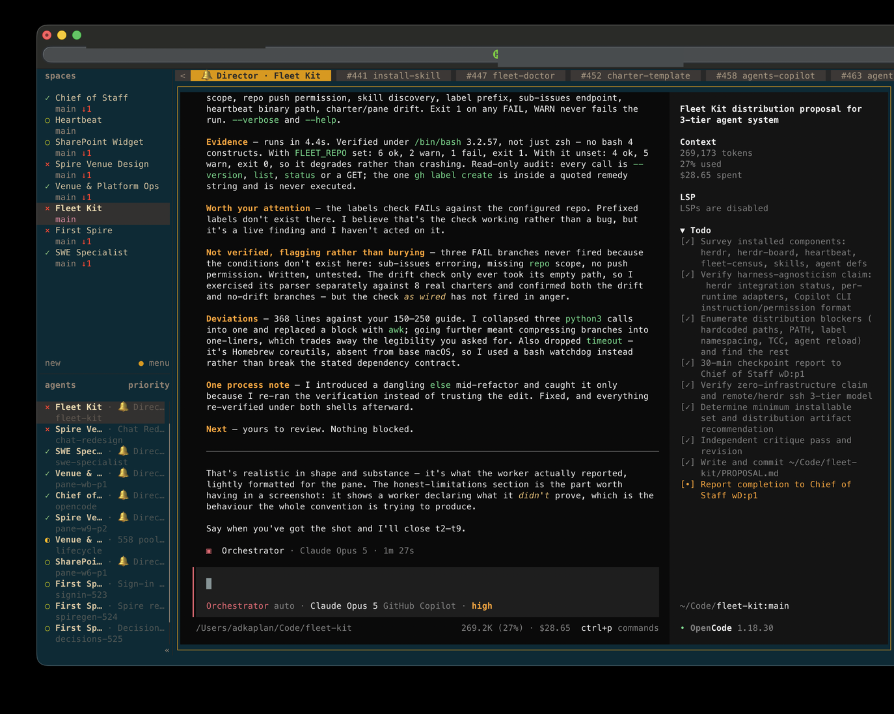
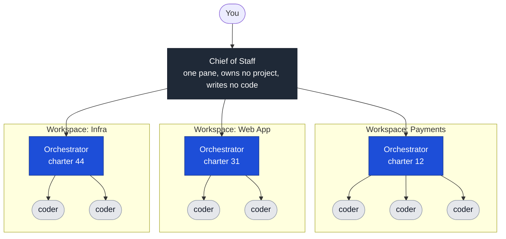
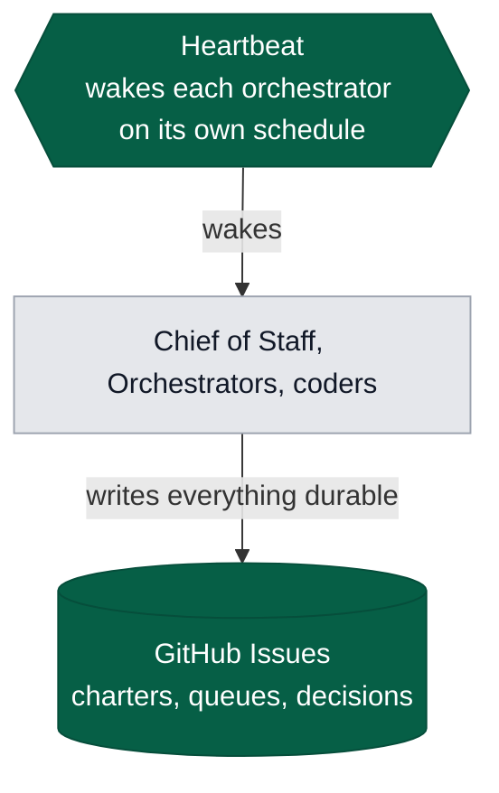

# Fleet Kit

### tl;dr

```bash
copilot -i "Clone https://github.com/dw-aura/fleet-kit.git into ~/Code/fleet-kit and follow its INSTALL.md."
```

---

Coding agents are cheap and getting cheaper. Your attention is not, and never
will be. Fleet Kit is how you run thirty agents at once without paying thirty
times the attention.

It works by moving everything that normally competes for your focus — status,
progress, what finished, who is stuck, what happens next — into structure that
handles it without you. What reaches you is the one thing no agent can do for
you: **judgement.** The calls that need taste, context, or your authority.

Everything else is noise, and noise is what this removes.

There is nothing to deploy. It is an **org chart made of agents**, plus the two
things that hold it together: GitHub for memory, and a heartbeat for a pulse.

**If you want to run 30 agents at once, this is the way.**

---



One orchestrator and eight coders, mid-flight. The tab bar is the queue — each
worker tab is a GitHub issue someone was dispatched against. Down the left is one
workspace per project, which is the row of the org chart you are about to read
about. The pane in the middle is a worker reporting back.

---

## The org chart



One workspace per project on the middle row. One Chief of Staff above them all.
Coders come and go underneath. Add workspaces and the chart gets wider, not
deeper — and your side of it does not change at all.

Read down the chart and the rule is the same at every level: **the layer above
never does the work of the layer below.** That is what makes it scale. An
orchestrator that starts editing files has stopped orchestrating, and nobody is
watching its coders anymore.

### Underneath it all



**GitHub is the memory.** Panes die, laptops reboot, agents get replaced. Every
charter, every assignment and every decision is a GitHub issue, so none of that
loses work. This is also why the fleet can grow — nothing important is held in
anyone's head or anyone's scrollback.

**The heartbeat is the pulse.** A local background service wakes each
orchestrator on its own adaptive schedule — busy ones often, quiet ones rarely.
Without it, an agent that finishes a thought sits there until a human notices.
With thirty agents, that human cannot be you.

It ships here, as a `launchd` service. It is optional and it is the difference
between a fleet you supervise and one that supervises itself. An orchestrator
opts in by having 🔔 in its tab label — one glyph, one rule, and nothing is woken
until you add it.

---

## Who does what

### You

Answer questions. That is the job.

You do not run commands, open dashboards, or check on anything. You talk to the
Chief of Staff:

> **"What needs me?"**

It comes back with the decisions that are actually waiting on you, and nothing
else. If there are none, it says so and you carry on with your day.

That one exchange is your whole interface to thirty agents. The rest of this
document is mostly about why the answer is trustworthy.

### Chief of Staff

One agent, one pane, always running. Owns no project. Writes no code.

It is your single interface to everything else. Ask it for status and it answers.
Give it work and it routes that to whichever orchestrator owns the area. It also
watches the other orchestrators and tells you when one is stuck, dead, or
claiming to be finished while its queue is still full.

It does not do the work. Like every role here, what it does and does not do is
defined in its agent definition.

### Workspaces

One per project. A workspace is a herdr window with its own tabs, its own working
directory, and its own orchestrator.

Workspaces are **caches, not truth.** Everything durable is in Git and GitHub. If
you lose a workspace you recreate it and nothing is gone. Treat them as
disposable and you will not be tempted to hide state in them.

### Orchestrators

One per workspace. Each owns a **charter** — a single GitHub issue that is its
identity, its scope and its queue.

An orchestrator decides what needs doing, writes the brief, dispatches a coder,
checks what comes back, and pushes blockers upward. It does not write product
code, for the same reason the Chief of Staff does not, one row down.

### Coders

Ephemeral. One per assignment.

A coder is dispatched into its own git worktree with a written brief. It works,
commits, opens a PR, and exits. It does not outlive its task, and no two coders
share a directory, so they cannot corrupt each other's tree.

---

## The charter

Everything an orchestrator is lives in one GitHub issue.

The body starts with a machine-readable block:

````markdown
```yaml
orchestrator: payments
workspace: Payments
pane: w3:p1
reports_to: your-github-handle
status: active
```
````

Below that, in prose: what it owns, what authority it has, and what it must never
do. Keep it short enough to stay true.

**`pane` is the important field.** It is the orchestrator's live address, and it
is how tooling knows the difference between an agent that is working and one that
died. A charter outlives the pane it names, so when an orchestrator is relaunched
somewhere new, updating `pane` is its first act — before it resumes work. A stale
`pane` makes a healthy orchestrator look dead. A fresh one on an abandoned
charter makes a corpse look alive. Both waste somebody's afternoon.

### The queue is sub-issues

Every assignment is a **native GitHub sub-issue** of the charter. Not a checkbox,
not a comment, not a local to-do file.

You get a progress rollup for free, and the queue is readable without anyone
scraping a terminal. This is the orchestrator's mechanics, not yours — shown so
you know where the state lives:

```bash
gh issue create --repo OWNER/REPO --title "<assignment>" --body "<brief>"

# note: sub_issue_id is the issue's DATABASE id, not its number. Fetch it.
id=$(gh api repos/OWNER/REPO/issues/<new-number> --jq .id)
gh api repos/OWNER/REPO/issues/<charter-number>/sub_issues -F sub_issue_id=$id
```

Close a sub-issue when the work is done and verified, not when it is dispatched.
An open sub-issue is a live claim that something is outstanding.

### `<user>:awaiting-user` is the only way to block you

When an orchestrator needs a decision only you can make, it applies its
`<user>:awaiting-user` label and writes a `## Decision required` section at the
top of the issue: the question, the options, its recommendation, and what stays
stopped until you answer.

**Label first, ask second.** This ordering is not a style preference. Once an
agent asks a question and blocks on it, it can no longer be reached to do
anything — including telling you it is blocked. Blocking is what removes its
ability to say it is blocked. So the label goes on before the question, every
time.

The label comes off as soon as you answer. Leave it on and you have poisoned the
one list that matters.

That label is what the Chief of Staff reads when you ask it what needs you. You
never query it yourself — but it is worth knowing that the answer you get is
assembled from something durable, not from an agent's recollection.

---

## How the Chief of Staff knows anything

It does not ask. Asking an agent whether it is alive is unreliable — a busy agent
does not answer, and a dead one cannot.

Instead it compares two sources that do not know about each other:

- **GitHub** says what the work is — which charters are active, which sub-issues
  are open, who is blocked.
- **herdr** says what is alive — which panes exist, which have an agent, what
  state that agent is in.

Join them on the `pane` field and the mismatches fall out on their own:

| Divergence | Means |
|---|---|
| Charter active, pane dead | The orchestrator died and nobody noticed |
| Pane working, no charter | Something is running that nothing durable records |
| Agent blocked, no `<user>:awaiting-user` | It is stuck and you will never hear about it |
| Reports done, queue still open | It thinks it finished; its own queue disagrees |

None of that requires polling, and none of it depends on an agent volunteering
the truth about itself.

---

## Installing it

You will need: **herdr**, an agent CLI, and **`gh`** authenticated with write
access to the repo you will use.

Installation is agent-driven. Point your agent at
[`INSTALL.md`](INSTALL.md) and it works through the steps:

```
Read INSTALL.md in this repo and work through it. After each step, run that
step's VERIFY command and paste the real output. Do not report success you
have not observed. Stop at anything marked HUMAN and hand back to me.
```

**Every step checks before it acts.** You are an engineer with a working machine,
not a fresh laptop — most of this is probably already done. A step whose
precondition is already satisfied is skipped, not re-run. Nothing here logs you
out of something you were logged into.

Every step also declares what proves it worked, so the agent confirms rather than
assumes:

```
STEP 4 — GitHub authentication
  CHECK:   gh auth status --active
           already logged in with 'repo' scope?  -> skip, nothing to do
           logged in without it?                 -> gh auth refresh --scopes repo
           not logged in?                        -> DO below
  DO:      gh auth login --scopes repo
  HUMAN:   yes — browser and device code. Stop and hand over.
  VERIFY:  gh auth status --active && gh api user --jq .login
  PROVES:  a login name comes back, and the token carries 'repo'
```

Note the middle branch. Being logged in is not the same as having the scope this
needs, and the fix for that is `gh auth refresh`, which adds the scope to your
existing session. Re-running `gh auth login` would work too, and would also drag
you through a browser you did not need to open.

Because every step checks first, the whole install is safe to re-run. If it dies
halfway, run it again — it picks up where it stopped rather than starting over.

Run `fleet-doctor` at the end. Run it again any time something feels wrong — it
is the same check either way.

### Steps that need a human

Your agent will stop at these. That is correct behaviour, not a failure:

- **`gh auth login`** — browser and device code, *if* you are not already
  authenticated. Most people are, and this step will be skipped.
- **macOS permission prompts** — the OS dialogs cannot be scripted. Your agent
  will tell you which dialog and which button.

---

## Your agent harness

The team runs **GitHub Copilot CLI**. Three things worth knowing.

**Your skills already work.** Copilot CLI reads personal skills from
`~/.agents/skills/`, which is where these live. Nothing to convert, nothing to
configure — `copilot skill list` will show them once they are on disk.

**Agent definitions need translating.** Markdown with YAML frontmatter on both
sides, but the fields differ:

| opencode | Copilot CLI |
|---|---|
| `model: github-copilot/claude-opus-5` | `model: claude-opus-5` |
| `variant: high` | `reasoningEffort: high` |
| `permission:` block | `tools:` allow-list |

Both formats ship in `agents/`. Use the one for your harness.

**Supervision is weaker on Copilot, for now.** herdr learns what an agent is
doing from a small integration hook. The opencode hook reports working, blocked
and idle directly. The Copilot hook currently reports only that a session
started, so herdr falls back to reading the terminal to guess. It mostly works.
It is less reliable, and it is the one real rough edge in the system. Fixing it
means a change in herdr itself, which is not ours.

---

## Rules that will bite you

Short list. Each of these has already cost somebody time.

**Namespace your labels, and derive the prefix — do not choose it.** Labels are
repo-wide. If two people use a shared repo and both create a label called
`active`, they are looking at each other's work.

Your prefix is your username:

```bash
whoami        # jdoe  ->  jdoe:active, jdoe:payments
```

Nobody picks it and no agent has to ask. On a corporate Mac the username is
already unique across the company and already length-capped, which is exactly
what a prefix needs to be — and `whoami` answers before `gh` is even
authenticated. Initials would be shorter and would collide the first time you
hired a second person with them.

**Every label, structural ones included.** The labels the tooling itself relies
on get the prefix too — `<user>:orchestrator`, `<user>:awaiting-user`. It is
tempting to leave those shared, since everyone means the same thing by them. Do
not, and it is worth knowing why, because the damage is not cosmetic:

- **Charter lists mix.** Your Chief of Staff reports on orchestrators that are
  not yours and that it cannot reach.
- **The pane join goes wrong silently.** A charter records its agent's address as
  `w3:p1`. Those addresses are only unique within one machine, so a colleague's
  `w3:p1` and yours are different agents wearing the same name. Your tooling will
  cheerfully match their charter to your pane and report something confident and
  false.
- **Your one trusted list stops meaning anything.** Fill it with decisions
  belonging to someone else and "nothing needs you" is no longer a sentence you
  can believe.

So: `<user>:` on everything, with no exceptions to remember.

**Filtering on two labels is an AND, not an OR.** `gh issue list --label a
--label b` returns issues carrying *both*. Adding a label to widen a search
narrows it instead, usually to nothing, and it reads as though the work
disappeared.

**Agent definitions load once per session.** Edit one and nothing currently
running picks it up — you have changed the next agent, not the ones already
working. Restart deliberately, or expect a fleet that disagrees with itself.

This is also why **doctrine that changes belongs in a skill, not an agent
definition.** Skills are re-read on use. Put the stable stuff — role boundaries,
permissions — in the agent file. Put everything you expect to revise in a skill.

**Remote works, but the whole fleet goes together.** `herdr --remote <ssh-target>`
puts the server on a remote box and attaches your laptop as a client. Panes and
running work stay on the server, so you can close the lid and nothing stops.
What does **not** work is splitting the chart — orchestrator on the laptop,
coders on a remote host. Pane addresses are only unique within one server, so two
machines can both have a `w3:p1` and the charter can no longer tell them apart.
Run the fleet on one host, attach from anywhere.

---

## Keeping it current

The doctrine lives in the skills, and the skills are symlinked out of this
checkout. So `git pull` here updates every agent on your machine at once, without
touching anything you have customised.

Agent definitions are the exception. They are copied, not linked, so a pull does
not overwrite yours — and because a definition is read once when a session
starts, a running agent will not pick up a change either way. Restart an agent
deliberately when you want it to see a new definition.

If you change something that everyone should get, it belongs in a skill and in a
pull request here. If you change something that is yours alone, it belongs in
your copy of an agent definition.

Questions, breakage, and anything that turns out to be wrong in this document:
raise an issue on this repo rather than fixing it locally and moving on. A
correction that stays on one laptop has to be discovered again by everyone else.

---

## Getting started

1. Install it, agent-driven, and get `fleet-doctor` green.
2. Open one charter, run one orchestrator, dispatch a few coders. One afternoon
   is enough to learn the shape.
3. Add a workspace per project. This is the step that scales — each one is a new
   charter and a new orchestrator, and nothing you already have changes.
4. Stand up the Chief of Staff and hand it the fleet. From then on you talk to
   one agent, not to twelve.

Scaling from here is adding rows to the chart, not adding load to you. Ten
workspaces run the same way three do: the orchestrators absorb the coordination,
the charters hold the state, and the heartbeat keeps everything moving without
anyone checking on it.

The real sign it is working is not a dashboard full of green. It is asking the
Chief of Staff what needs you, hearing "nothing right now," and believing it.
