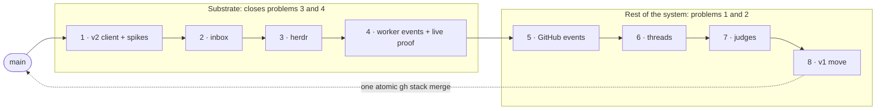
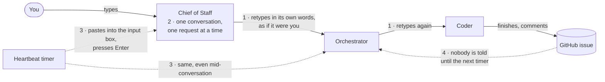
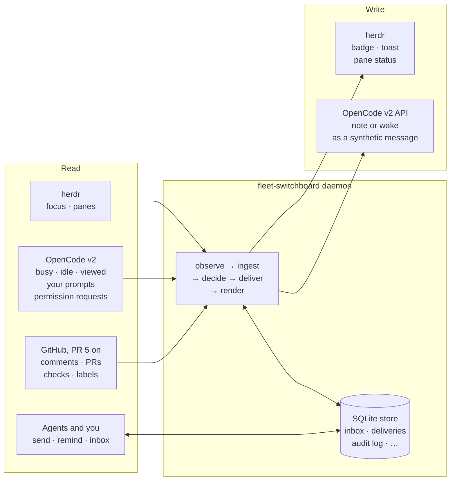
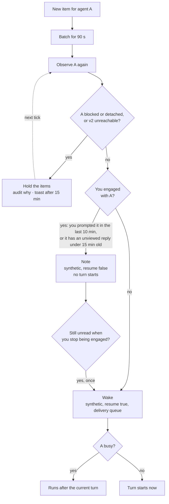
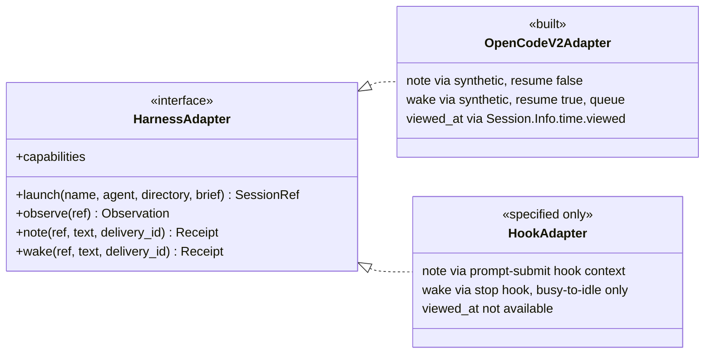
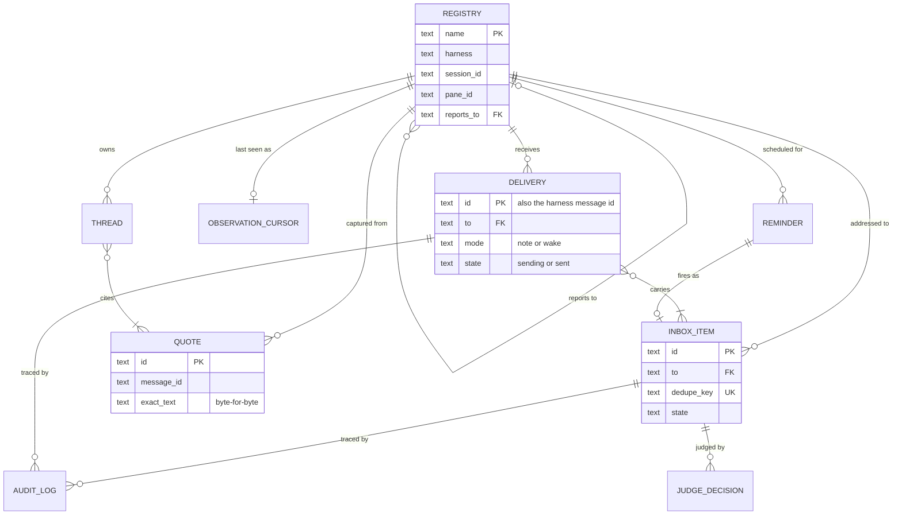
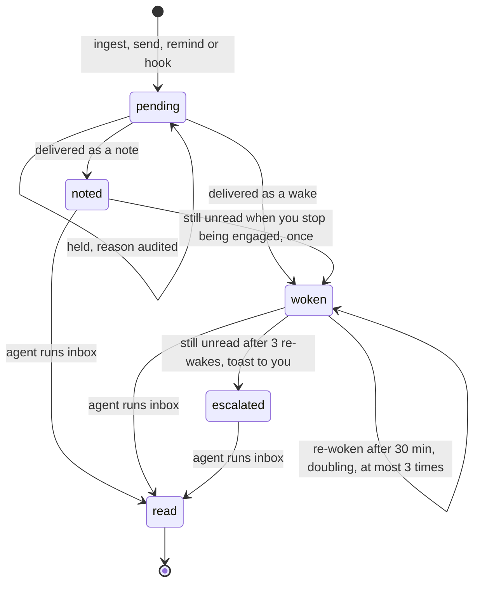
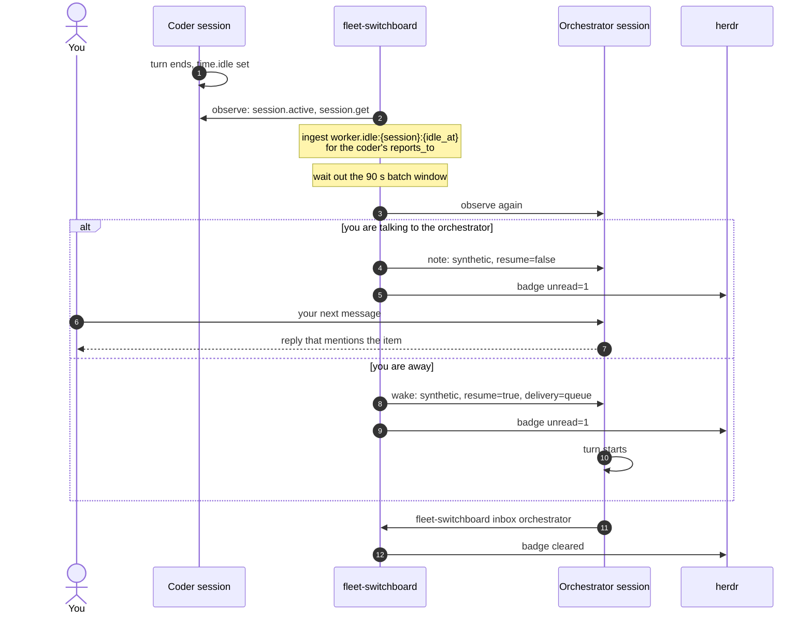
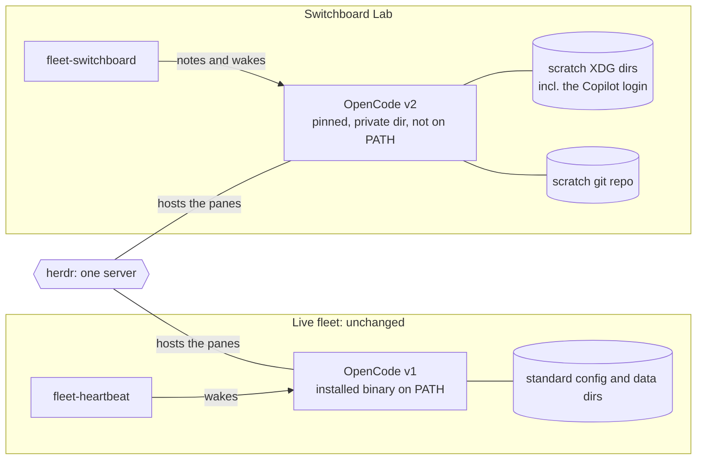

# Switchboard: tracking

> Event-driven delivery for Fleet Kit on OpenCode v2 that never interrupts.
> This plan is updated as each PR lands. Last updated 2026-10-02.
>
> It lives at `docs/switchboard.md` on the stack. After PR 1 it is edited only
> on the current top branch, so status updates never rebase lower PRs.

## Status

| PR | Branch | Scope | State |
|---|---|---|---|
| 1 | `switchboard/v2-client` | v2 client, isolated lab, spikes S1–S6 | draft [#15](https://github.com/adamkaplan/fleet-kit/pull/15) |
| 2 | `switchboard/inbox` | Inbox, notes vs. wakes, batching | planned |
| 3 | `switchboard/herdr` | `launch`, herdr plugin, badges, toasts, pane status | planned |
| 4 | `switchboard/worker-events` | Worker done or blocked → its orchestrator; live proof A–E | planned |
| 5 | `switchboard/github-events` | GitHub poller | planned |
| 6 | `switchboard/threads` | Thread ledger, relaying your exact words, Chief of Staff rewrite | planned |
| 7 | `switchboard/judges` | Cheap judges that log but don't act ("shadow mode") | planned |
| 8 | `switchboard/v1-move` | Import a v1 session into v2; cutover runbook | planned |

Each PR is opened as soon as it is ready. The whole stack merges to `main` in
one atomic `gh stack merge`, and only once the system is complete.



## Problems

1. **Telephone.** Requests pass from Chief of Staff to orchestrator to worker
   and are retyped at each hop. Nothing preserves your exact words, and text
   sent by a machine looks exactly like your typing.
2. **Serial Chief of Staff.** It has one conversation and handles one request
   at a time, so a question about B waits for A to finish.
3. **Interruptions.** Wakes are typed into the agent's input box.
   - A half-written message of yours can be submitted along with the wake,
     because the empty-box check and the send are not atomic.
   - Wakes also arrive as turns in the middle of your conversation with the
     agent.
4. **Silent completions.** A worker finishing wakes nobody. Its orchestrator
   only finds out on the next timer.

How it works today, with each problem marked where it happens:



Evidence from real use:

- An idle orchestrator spent 18 overnight wakes in a row concluding "no
  change."
- A Chief of Staff pane missed thousands of wakes because of an unsent draft.
  The only sign was a symbol on its tab.

## Decisions

| Topic | Decision |
|---|---|
| Harness | OpenCode v2 only. Other harnesses come later, as adapters. |
| Plugins | No OpenCode plugin. v2's server API already covers notes, wakes and session state. |
| Location | `bin/fleet-switchboard` (stdlib Python) plus a herdr plugin manifest, both in this repo. |
| State | One SQLite file (stdlib `sqlite3`) owned by the switchboard. The harness, herdr and GitHub stay the sources of truth; see [Data](#data). |
| Harness boundary | One adapter contract with capability flags. OpenCode v2 is the only adapter built; a hook-based adapter is specified but not built. |
| Heartbeat | `fleet-heartbeat` is unchanged and keeps serving v1 panes. A pane the switchboard manages never carries the heartbeat's opt-in bell glyph. |
| Machine text | Always a v2 `synthetic` message tagged `[switchboard]`; never typed, never sent as a user message. Whether it shows in the TUI is settled by S3. |
| Thread ledger | Kept locally, promoted to a GitHub issue once a request becomes work (PR 6). |
| Talking to orchestrators | You can talk to any orchestrator directly; the switchboard records it (PR 6). |
| v1 sessions | Imported, not restarted (PR 8). |

## Design



### Delivery rule

Items for an agent are collected for 90 s, then delivered in one of two ways.

- **You are engaged with the agent → note.** Engaged means you sent it a
  prompt in the last 10 minutes, or it has a finished reply you have not
  viewed that is less than 15 minutes old. The switchboard calls
  `session.synthetic` with `resume: false`. That starts no turn; the agent sees
  the note alongside your next message.
- **Otherwise → wake.** `session.synthetic` with `resume: true` and
  `delivery: "queue"`. It never cuts into a running turn.
- **Format.** Each delivery is one line:
  `[switchboard] 2 for <agent>: <summary> — run: fleet-switchboard inbox <agent>`.
  Reading the inbox acknowledges the items.
- **Never typed.** The switchboard never calls `herdr agent prompt` and never
  writes into a pane's input box.
- **A note is not the end.** Items delivered as a note but still unread when
  you stop being engaged become eligible for one wake.



## System design

This section is the contract the code is built against. Anything marked
**(verify Sn)** is an assumption that spike Sn must confirm before code
depends on it.

### Components

| Component | Runs as | Does |
|---|---|---|
| `fleet-switchboard run` | One long-running daemon per user, guarded by a single-instance lock. Started by herdr's `[[startup]]` hook through `fleet-switchboard ensure`. | The loop below, every 5 s and whenever it is poked |
| `fleet-switchboard <command>` | Short-lived CLI, run by you, by agents and by harness hooks | `launch`, `send`, `inbox`, `remind`, `status`, `audit`, `thread`, `hook`, `poke`. Writes records directly, then pokes the daemon |
| Harness adapter | A class inside the daemon, one per harness kind | Everything harness-specific: launch, observe, note, wake |
| herdr plugin manifest | `herdr-plugin.toml` | Starts the daemon and forwards pane events as pokes |
| State store | One SQLite file (stdlib `sqlite3`, WAL mode) under `$XDG_STATE_HOME/fleet-switchboard/`, directory mode 0700. Config is a separate `config.json`, because the kit supports Python 3.9, which has no `tomllib`. | Every record in [Data](#data) |

The daemon runs one loop with five steps:

1. **Observe.** Read the current state of every registered agent from its
   sources.
2. **Ingest.** Turn changes into inbox items. Each item carries a dedupe key
   derived from the source fact, so reading the same fact twice never creates a
   second item.
3. **Decide.** For each agent whose pending items are past the batch window,
   apply the delivery rule.
4. **Deliver.** Re-read that agent's state, then note or wake it through its
   adapter.
5. **Render.** Update herdr: unread badges, pane status, toasts for held items.

Every write outside the store is recorded in the audit log twice: the intent
before the call, and the result after it.

### Integration touch points

#### herdr

herdr is the terminal surface and an event source. It is never a delivery
channel to an agent.

| Direction | Call | Purpose |
|---|---|---|
| read | `agent list`, `agent get` | Pane id, workspace, tab, `focused`, `agent_status` |
| read | Plugin `[[events]]` on `pane.focused`, `pane.agent_status_changed`, `pane.closed`, `pane.exited` | Run `fleet-switchboard poke`. An optimisation only: the poll stays authoritative |
| write | `tab create --no-focus`, then `agent start --kind <k> --pane <p> -- <args>` | Open a pane for a launched agent without moving your focus |
| write | `pane report-agent --state …` | Pane status for harnesses herdr cannot track itself, including OpenCode v2, whose herdr integration is a v1 plugin |
| write | `pane report-metadata --token unread=<n>` | Unread count in the sidebar |
| write | `notification show` | Toast for a held item, a blocked worker, or a switchboard fault |
| never | `agent prompt`, `agent send-keys`, `pane send-text`, `pane send-keys`, `pane run`, any focus command | The switchboard never types and never moves your focus |

#### Harness adapter contract

Every harness implements one interface. The daemon and the delivery rule see
only this interface, never a harness by name.

```text
launch(name, agent, directory, brief)   -> session ref
observe(session ref)                    -> Observation
note(session ref, text, delivery id)    -> receipt   # adds context; starts no turn
wake(session ref, text, delivery id)    -> receipt   # starts a turn if idle; waits for the current turn if busy
capabilities                            -> which of the above it guarantees
```

`Observation` fields:

| Field | Meaning |
|---|---|
| `busy` | A turn is running |
| `idle_at` | When the last turn ended |
| `viewed_at` | When you last viewed the finished turn |
| `outcome` | How the last turn ended: succeeded, failed or interrupted |
| `last_human_prompt` | Message id, time and exact text of your most recent message |
| `blocked` | Waiting on a permission prompt or a question, and which one |

The switchboard chooses the `delivery id`, so a retried delivery is recognised
as a duplicate rather than delivered twice.

The delivery rule degrades by capability, not by harness:

- **No `note`.** Items wait for a wake, or for the agent to read its inbox.
- **No `wake` that avoids typing.** Badge and toast only; the agent picks the
  items up at its next turn boundary. A typed wake is not part of the
  contract.
- **No `viewed_at`.** "Engaged" falls back to your recent prompts alone.

The two adapters this document describes, side by side:



#### OpenCode v2 adapter (built)

All calls go through `opencode api <operation>`, which finds the shared service
and handles authentication. One client class owns every call.

| Contract | OpenCode v2 |
|---|---|
| launch | `session.create` (agent, title, location); a herdr tab running the TUI with `-s <session>`; then `session.prompt` with the brief and `metadata.from` |
| observe `busy` | `session.active` |
| observe `idle_at`, `viewed_at`, `outcome` | `session.get` → `Session.Info.time.idle`, `time.viewed`, `outcome` |
| observe `last_human_prompt` | `session.message.list`: user messages that carry no switchboard metadata (verify S5) |
| observe `blocked` | `permission.request.list`, `form.list` |
| note | `session.synthetic` with `resume: false` (verify S3) |
| wake | `session.synthetic` with `resume: true`, `delivery: "queue"` (verify S4) |
| delivery id | The synthetic message's client-supplied `id` (`msg_…`); a repeat with the same id is not admitted twice (verify S2) |
| retract | `session.inbox.cancel` for a note not yet delivered, when a later delivery supersedes it |
| move a v1 session | `experimental.session.import` (PR 8) |

Capabilities: all of them, if S3 and S4 pass.

#### Hook-based harness adapter (contract only; not built)

A Claude Code-style harness has no server API, but it runs configured shell
commands on lifecycle events. It plugs in through
`fleet-switchboard hook <event>`, which reads the hook's JSON on stdin, writes
to the store, and prints whatever the harness should inject. Hooks are
configuration, not a plugin.

| Contract | Hook-based harness |
|---|---|
| launch | `herdr agent start --kind <k>`; the session id arrives through the session-start hook |
| observe `busy`, `idle_at` | Prompt-submit hook sets busy; stop hook sets idle |
| observe `last_human_prompt` | Prompt-submit hook. Every prompt is yours, because the switchboard never types |
| observe `viewed_at` | Not available |
| observe `blocked` | The harness's notification hook for permission prompts, or herdr's `blocked` status |
| note | The prompt-submit hook returns pending notes as added context. They ride on your next message, so no turn is started |
| wake | Partial. The stop hook can refuse to stop while wake items are pending, which covers the busy-to-idle edge only. An agent that is already idle cannot be woken without typing, so it gets a badge and a toast |

This is why the contract has capability flags: the same rule runs safely
against a weaker harness.

#### GitHub (PR 5)

Polled with `gh api` using conditional requests (ETags), once per charter in the
registry: comments on the charter and its sub-issues, linked PRs, check runs,
reviews, and `awaiting-user` label changes. Each change becomes an inbox item
for the charter's orchestrator. The switchboard does not write to GitHub
through PR 5; PR 6 decides whether promoting a thread to an issue is done by the
switchboard or by the Chief of Staff.

#### Agents

Agents talk to the switchboard only through its CLI, from their own shell.

| Command | Who | Effect |
|---|---|---|
| `fleet-switchboard inbox <name>` | Any agent | Lists pending items in full and marks them read |
| `fleet-switchboard send <name> <text> --from <name>` | Any agent | Queues an item for another agent |
| `fleet-switchboard remind <name> <when> <text>` | Any agent | Queues an item for later |
| `fleet-switchboard thread …` | Chief of Staff (PR 6) | Reads and updates the thread ledger |

Each agent definition gains one paragraph: what a `[switchboard]` line means,
and that reading the inbox is the acknowledgement. Agents the switchboard
manages do not use `heartbeat-ack`.

#### You

| Surface | Shows |
|---|---|
| herdr sidebar | Unread count and status per pane |
| herdr toast | An item held longer than 15 minutes and why; a blocked worker; a switchboard fault |
| `fleet-switchboard status` | Every agent: harness, session, pane, latest observation, pending and held items, and why they are held |
| `fleet-switchboard audit` | The decision history for one agent or one item |
| `fleet-switchboard thread show` | Your exact words and everything sent on their behalf (PR 6) |

### Data

#### Sources of truth (read, never owned)

| Source | Owns | Switchboard's use |
|---|---|---|
| OpenCode v2 service | Sessions, transcripts, turn state, viewed state, its own delivery queue | Observed every tick; never copied as truth |
| herdr | Panes, tabs, workspaces, focus | Observed every tick; pane ids recorded at launch and re-checked |
| GitHub | Charters, issues, PRs, checks, reviews: the work record | Polled (PR 5) |

A decision about an agent is made from a fresh read of these sources, taken
immediately before the write it leads to. The switchboard's own records say
what it has seen and done, never what is true now.

#### Switchboard records

| Record | From PR | Written by | Fields | Kind |
|---|---|---|---|---|
| **Audit log** | 1 | Every component | Time, actor, event, subject, detail (JSON) | Durable, append-only |
| **Inbox items** | 2 | Daemon ingest, `send`, `remind`, hooks | Id, to, from, kind, summary, link, dedupe key, created, state (see the lifecycle below), latest delivery id, read time | Durable |
| **Deliveries** | 2 | Daemon | Id (used as the harness message id), to, mode (`note` or `wake`), item ids, rule inputs and reason, state (`sending` → `sent`), sent time, receipt | Durable |
| **Observation cursor** | 2 | Daemon | Per agent: the last observation, and the last source fact already ingested (for example the `idle_at` already turned into an item) | Cache; safe to delete |
| **Registry** | 3 | `launch`, later `adopt` | Name, harness kind, session id, pane id, workspace, role, `reports_to`, charter (optional), launched and retired times | Durable |
| **Reminders** | 4 | `remind` | Id, to, due, text, fired item id | Durable |
| **Quotes** | 6 | Daemon, from observed human prompts | Id, agent, session, message id, time, exact text | Durable, immutable |
| **Threads** | 6 | Chief of Staff, through the CLI | Id, title, quote ids, owner, status, GitHub issue once promoted, updated | Durable |
| **Judge decisions** | 7 | Daemon | Question, input hash, answer, model, cost, later outcome | Durable, append-only |

How the records relate, with the key fields:



Dedupe keys name the source fact, for example
`worker.idle:<session>:<idle_at>`, `worker.blocked:<session>:<request id>` and
`github.comment:<comment id>`.

#### Inbox item lifecycle

An item is acknowledged only when the agent reads it. Being delivered is not
enough.



#### Invariants

1. **Ingestion is idempotent.** Dedupe keys are unique, so re-reading a source
   never creates a second item.
2. **Delivery happens at most once (verify S2).** A delivery row is written in
   the `sending` state, in the same transaction that claims its items. The
   harness is then called with the delivery id, and the row moves to `sent`.
   After a crash, `sending` rows are retried with the same id, which the
   harness admits only once.
3. **Re-check before every write.** The agent is observed again immediately
   before a note or wake; if the decision no longer holds, the items stay
   pending.
4. **Every external write is audited before and after.**
5. **Your words are copied, never retyped** (PR 6). Quotes are stored
   byte-for-byte from the transcript and referred to by id.
6. **No secrets in the store or the audit log.** OpenCode authentication stays
   inside `opencode api`, GitHub authentication inside `gh`.
7. **The cache is disposable.** Deleting the observation cursor can only
   re-read facts whose dedupe keys already exist, so it creates nothing.

### Key flows

**A worker finishes.** The coder's turn ends, and what happens next depends on
whether you are talking to its orchestrator.



Every write in this flow is audited before and after. If the item is still
unread when you stop being engaged, a note becomes eligible for one wake.

**A delivery is held.** The v2 service is unreachable, or the agent is
blocked: items stay pending, every hold is audited with its reason, and after
15 minutes you get a toast.

### Failure handling

| Failure | Behaviour |
|---|---|
| v2 service down | No deliveries; items accumulate; toast after 15 minutes; `status` shows it |
| herdr down | Deliveries continue, because they go through v2; badges and toasts resume when herdr returns |
| Daemon down | The CLI and hooks still record items, but nothing is delivered. `status` (and later `fleet-doctor`) reports a stale daemon |
| Agent never reads its inbox | Woken again after 30 minutes, doubling, at most 3 times; then a toast to you |
| Pane closed or session gone | The agent is marked detached; its items are held; toast |

## Lab: isolation from the live fleet

The live fleet stays on v1 throughout.



- **v2 binary.** A pinned version, installed into a private directory that is
  not on `PATH`. Never installed with `npm -g` or the curl installer, because
  the installer replaces the v1 binary.
- **v2 data.** Moved into a scratch directory with `XDG_*` variables. A `HOME`
  override is the fallback; XDG is preferred because it leaves git and gh
  identity intact. Checked with `opencode debug paths`.
- **Panes.** A herdr workspace called "Switchboard Lab", whose environment puts
  the private v2 first on `PATH`.
- **Switchboard config.** Names the v2 binary and its environment.
- **herdr plugin.** Linked to the single herdr server. The daemon manages only
  sessions it launched.
- **Models.** GitHub Copilot, through a one-time device login inside the
  scratch profile. Real credentials are never read or copied.
- **Work.** A local scratch git repo. No GitHub until PR 5.

## Spikes (PR 1)

| # | Spike | Passes when |
|---|---|---|
| S1 | Isolation | Every path from `debug paths` is in scratch; v1 is unchanged; no v1 or v2 state appears outside scratch; the kit's agent files load under v2 with the intended permissions |
| S2 | Access | Python can call `opencode api` for create, get and active. A synthetic sent twice with the same client-supplied `id` is admitted once. Also measured: latency; whether `GET /api/event` or `session.log` can stream; whether calling HTTP directly is practical |
| S3 | Note | `resume: false` starts no turn, and the model quotes the note after your next message. Tested with both `delivery` values; TUI visibility recorded |
| S4 | Wake | With `resume: true` and `queue`: an idle agent starts a turn; a busy agent runs it after the current turn; a draft in the TUI survives both cases |
| S5 | Observation | Your prompts can be told apart from the switchboard's; `time.idle` and `time.viewed` behave the way the delivery rule assumes |
| S6 | herdr | In the Lab: `herdr agent start --kind opencode -- -s <ses>` works and herdr detects the agent; `report-agent` sets status; plugin link and `[[startup]]` work. Also records which metadata appears in the sidebar |

**Stop rule.** If S3 or S4 fails, work stops and we decide together before
PR 2. No fallback is built ahead of time.

## Live proof (PR 4)

`bin/proof-switchboard live` runs in the Lab, not in CI. It simulates your
actions by typing into Lab panes, and you also do one manual pass.

| | Scenario | Must hold |
|---|---|---|
| A | A draft is in the orchestrator's input box when an item arrives | The draft is intact |
| B | You are mid-conversation with the orchestrator when the coder finishes | Only a note is delivered, no machine turn starts, and the orchestrator's next reply mentions it |
| C | You are away when the coder finishes | The orchestrator is woken within about 2 minutes and runs `inbox` once |
| D | An item arrives in the middle of a turn | It runs after that turn |
| E | 2 hours with no events | Zero machine turns |

A check only counts once we have seen it fail with its safeguard switched off.

## Repo and PR conventions

- Work happens in a git worktree of the existing checkout; no second clone.
  The stack's trunk is `main` at `9d22be4`.
- The push remote is `fork` (adamkaplan/fleet-kit), set with
  `git config gh-stack.remote fork` and passed explicitly as `--remote fork`.
  No other remote is pushed, and `main` is never pushed.
- Every `gh stack` command also runs with `GH_REPO=adamkaplan/fleet-kit`.
  `gh stack` picks the repo for PRs from the `origin` remote, which in this
  checkout is a different, private repository, and ignores
  `gh repo set-default`. `gh repo set-default adamkaplan/fleet-kit` still
  covers plain `gh` commands.
- GitHub operations authenticate as the repo owner, one command at a time,
  with `GH_TOKEN` from `gh auth token --user …`. The machine's active gh
  account is never switched.
- This document is edited only on the current top branch of the stack. Each PR
  updates its own row in Status and adds to the Log.
- Commit messages follow the repo's style (`fleet-switchboard: …`,
  `README: …`, `CI: …`, `docs: …`). Tests pass at every commit.
- `bin/test-switchboard` runs in CI from PR 1. It is stdlib only, uses fakes
  for herdr and `opencode api`, and includes the hygiene checks.
- Docs land in the same PR as the feature they describe. Each PR links this
  document and carries its own evidence.

## Risks

- **v2 is still 2.0.x, and its HTTP API is marked experimental.** We pin the
  version and keep all v2 calls in one client class.
- **v2's event names are not documented.** The switchboard polls first and
  switches to streaming only if S2 shows it works.
- **herdr has no status hook for v2 panes.** The switchboard reports their
  status instead.
- **Stacked PRs are reviewed bottom-up.** A fix to a lower PR cascades upward
  through `gh stack rebase`, and every push re-runs CI.
- **The real cutover (PR 8).** A v2 install outside the Lab shares v1's config
  and data directories and migrates v1 history on its own. The runbook has to
  plan for this.

## Out of scope for now

Building any adapter other than OpenCode v2 (the hook-based adapter is
specified in [System design](#system-design) but not built); injecting context
into individual model calls; changes to `fleet-heartbeat`.

## Open questions

- S3: are synthetic notes visible in the v2 TUI? If they are, either accept
  visible, labelled notes or revisit the design.
- S2: if a repeated client-supplied `id` is admitted twice, invariant 2 needs
  another way to detect duplicates, such as reading `session.inbox.list`
  before retrying.
- How long are the audit log and read items kept? Proposed: 30 days,
  configurable.
- PR 6: does the switchboard or the Chief of Staff promote a thread to a GitHub
  issue?
- Who reviews the stack?
- Should this document stay in `main` after the final merge? Precedent: the
  kit's earlier `PROPOSAL.md` was deleted once its work landed. Until we decide
  at merge time, this stays a tracking document.

## Log

- 2026-10-02: plan agreed; this document committed as the first commit of
  PR 1.
- 2026-10-02: draft PR [#15](https://github.com/adamkaplan/fleet-kit/pull/15)
  opened. The first `gh stack submit` aimed the PR at the `origin` remote's
  repository and failed with nothing created there; pinning `GH_REPO` fixed
  it.
- 2026-10-02: added System design: components, integration touch points
  (herdr, the harness adapter contract, OpenCode v2, a hook-based harness,
  GitHub, agents, you), data sources and records, invariants, key flows and
  failure handling.
- 2026-10-02: added nine Mermaid diagrams: the stack, today's problems, the
  overview, the delivery rule, the adapter contract, the record model, the inbox
  item lifecycle, the worker-finishes sequence, and the Lab's isolation. Each
  one renders with mermaid-cli 12. Inbox items now track their latest delivery,
  since a note can be followed by one wake.
