# Switchboard: tracking

> Event-driven delivery for Fleet Kit on OpenCode v2 that never interrupts.
> This plan is updated as each PR lands. Last updated 2026-10-02.
>
> It lives at `docs/switchboard.md` on the stack. After PR 1 it is edited only
> on the current top branch, so status updates never rebase lower PRs.

## Status

| PR | Branch | Scope | State |
|---|---|---|---|
| 1 | `switchboard/v2-client` | v2 client, isolated lab, spikes S1–S6 | draft [#15](https://github.com/adamkaplan/fleet-kit/pull/15) |
| 2 | `switchboard/delivery` | Delivery rule: pending derived from sources, notes vs. wakes, batching, `send` | planned |
| 3 | `switchboard/herdr` | `launch`, herdr's OpenCode integration, status-change events, badges, toasts | planned |
| 4 | `switchboard/worker-events` | Worker done or blocked → its orchestrator; live proof A–F | planned |
| 5 | `switchboard/github-events` | GitHub events via `gh webhook forward`; catch-up read after gaps | planned |
| 6 | `switchboard/intent` | Asks with Intent and Done-when; every message names its ask; `intents`; changes surfaced; Chief of Staff and charter rules | planned |
| 7 | `switchboard/judges` | Cheap judges that log but don't act ("shadow mode") | planned |
| 8 | `switchboard/foreground` | Chief of Staff moves unrelated work to the background and turns to you; spikes F1–F3 | planned |
| 9 | `switchboard/v1-move` | Import a v1 session into v2; cutover runbook | planned |

Each PR is opened as soon as it is ready. The whole stack merges to `main` in
one atomic `gh stack merge`, and only once the system is complete.

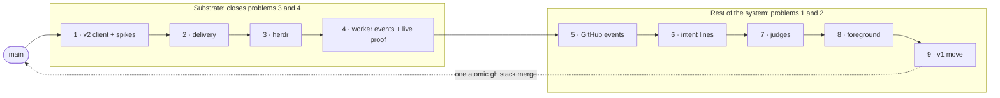

## Problems

The fleet is a fan-out: you talk to a Chief of Staff, which hands work to
orchestrators, which dispatch workers. You mostly talk to the Chief of Staff,
not to the agents below it.

1. **Telephone, mostly on the way back.** Your intent travels down through the
   Chief of Staff and progress travels back up the same way. The drift happens
   mostly on the way up: an orchestrator reports in its own framing, the Chief
   of Staff adopts it, and both its next ask and its summary to you follow that
   framing instead of what you asked. Nothing keeps your original intent and
   success criteria in front of the Chief of Staff when a report arrives. Also,
   text the Chief of Staff types into an orchestrator's pane looks exactly like
   your typing.
2. **Serial Chief of Staff.** You think of things to discuss faster than the
   Chief of Staff can carry them out. It has one conversation and works on one
   thing at a time, so a question about B waits for A to finish or gets mixed
   into A, and machine wakes take turns in the middle of your conversation
   with it.
3. **Interruptions.** Wakes are typed into the agent's input box.
   - A half-written message of yours can be submitted along with the wake,
     because the empty-box check and the send are not atomic.
   - Wakes also arrive as turns in the middle of your conversation with the
     agent.
4. **Silent completions.** A worker finishing wakes nobody. Its orchestrator
   only finds out on the next timer.

How it works today, with each problem marked where it happens:


Evidence from real use:

- An idle orchestrator spent 18 overnight wakes in a row concluding "no
  change."
- A Chief of Staff pane missed thousands of wakes because of an unsent draft.
  The only sign was a symbol on its tab.
- A Chief of Staff gave its principal a status picture built from
  orchestrators' framing; two of its three facts were wrong.

## Decisions

| Topic | Decision |
|---|---|
| Harness | OpenCode v2 only. Other harnesses come later, as adapters. |
| Plugins | None of our own. herdr's own OpenCode integration (installed with `herdr integration install opencode`) reports status; v2's server API covers notes, wakes and reads. |
| Location | `bin/fleet-switchboard` (stdlib Python) plus a herdr plugin manifest, both in this repo. |
| State | Almost none. An append-only audit log and a reminders file. Everything else is derived on each pass from herdr, v2 and GitHub, so there is nothing to keep in sync; see [Data](#data). |
| Status | herdr is authoritative for working, idle and blocked. Its OpenCode integration supports v2 through a pane-local TUI plugin. |
| Engagement | "You are engaged with an agent" means you prompted it in the last 10 minutes. There is no viewed state. It matters mostly for the Chief of Staff, the agent you talk to. |
| Intent | Each request handed to an orchestrator is an ask: an issue under its charter with a one-line Intent and a one-line Done-when. Every message names its ask and carries those lines, in both directions. Only you, or the Chief of Staff with your yes, change them (PR 6). |
| Chief of Staff attention | Serial by default. A new message from you that is unrelated to the current work moves that work to a background worker, and the Chief of Staff turns to you (PR 8). How is decided after spikes F1–F3. |
| Harness boundary | One adapter contract with capability flags. OpenCode v2 is the only adapter built; a hook-based adapter is specified but not built. |
| GitHub events | Webhooks relayed by `gh webhook forward`, supervised by the daemon. No timer-based polling; one catch-up read after each gap, because the forwarder does not replay (PR 5). |
| Heartbeat | `fleet-heartbeat` is unchanged and keeps serving v1 panes. A pane the switchboard manages never carries the heartbeat's opt-in bell glyph. |
| Machine text | Always a v2 `synthetic` message tagged `[switchboard]`; never typed, never sent as a user message. Whether it shows in the TUI is settled by S3. |
| Agent to agent | Agents message each other only with `fleet-switchboard send`, never by typing into a pane. |
| Talking to orchestrators | You can talk to any orchestrator directly. Nothing extra is recorded; the issue already carries the intent. |
| v1 sessions | Imported, not restarted (PR 9). |

## Design

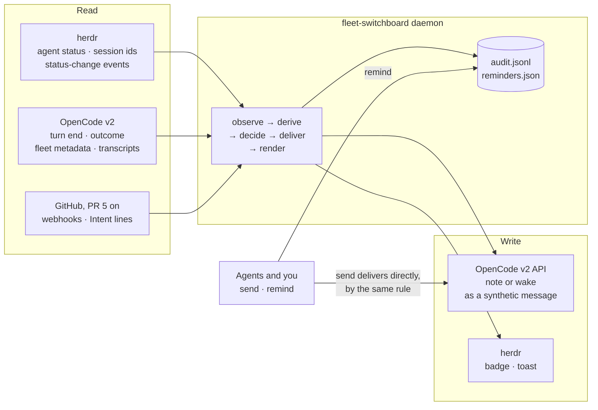

### Delivery rule

Items for an agent are collected for 90 s, so a burst of events becomes one
message. A `send` from another agent skips the batch.

- **You are engaged with the agent → note.** Engaged means you prompted it in
  the last 10 minutes: the newest user message in its transcript that the
  fleet did not send. The switchboard calls `session.synthetic` with
  `resume: false`. That starts no turn; the agent sees the note alongside your
  next message.
- **Otherwise → wake.** `session.synthetic` with `resume: true` and
  `delivery: "queue"`. It never cuts into a running turn.
- **The message is the delivery.** It contains the items themselves, grouped
  by issue, each group headed by that issue's Intent and Done-when lines (PR 6).
  There is nothing to fetch and nothing to acknowledge: once the message is in
  the agent's transcript, it has been delivered. Messages are capped in length;
  overflow is listed by `fleet-switchboard pending <agent>`.
- **Never typed.** The switchboard never calls `herdr agent prompt` and never
  writes into a pane's input box.
- **A note that outlives your attention.** If 10 minutes pass with no prompt
  from you and a note is still waiting in v2's inbox, it is switched to
  `steer`, which starts a turn (verify S3).

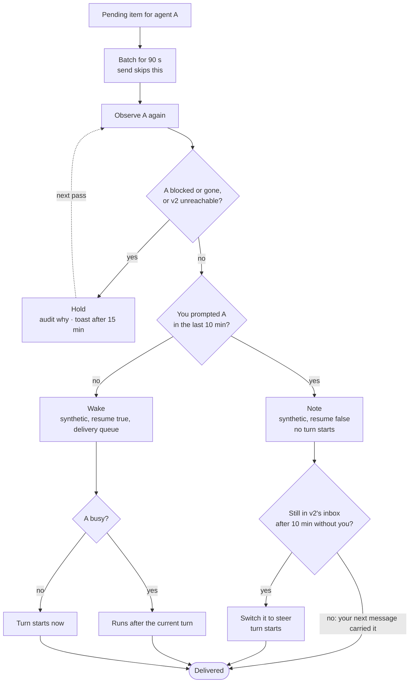

## System design

This section is the contract the code is built against. Anything marked
**(verify Sn)** is an assumption that spike Sn must confirm before code
depends on it.

### Components

| Component | Runs as | Does |
|---|---|---|
| `fleet-switchboard run` | One long-running daemon per user, guarded by a single-instance lock. Started by herdr's `[[startup]]` hook through `fleet-switchboard ensure`. | The loop below, on every herdr status event and at least every 60 s |
| `fleet-switchboard <command>` | Short-lived CLI, run by you and by agents | `launch`, `send`, `remind`, `intent`, `pending`, `status`, `audit`, `poke`. `send` applies the delivery rule and delivers itself; it does not need the daemon |
| Harness adapter | A class shared by the daemon and the CLI, one per harness kind | Everything harness-specific: launch, observe, note, wake |
| herdr plugin manifest | `herdr-plugin.toml` | Starts the daemon; turns herdr events into pokes |
| Files | `$XDG_STATE_HOME/fleet-switchboard/` (mode 0700): `audit.jsonl`, `reminders.json`, the lock. Config in `$XDG_CONFIG_HOME/fleet-switchboard/config.json`, because the kit supports Python 3.9, which has no `tomllib` | See [Data](#data) |
| GitHub forwarders (PR 5) | One `gh webhook forward` child process per watched repo, supervised by the daemon, which receives on a listener bound to 127.0.0.1 | Relays GitHub webhooks to the daemon |

The daemon runs one loop with five steps:

1. **Observe.** Ask herdr which panes run fleet agents and what state each is
   in. Read each agent's session from v2.
2. **Derive.** Compute the facts that hold now, such as "this worker's last
   turn ended at T," and subtract the facts already delivered, which are
   recorded in each recipient's transcript. What remains is pending.
3. **Decide.** For each agent whose pending items are past the batch window,
   apply the delivery rule.
4. **Deliver.** Observe that agent again, then note or wake it.
5. **Render.** Update herdr: unread badges, toasts for held items.

Every write to another system is recorded in the audit log twice: the intent
before the call, and the result after it.

### Integration touch points

#### herdr

herdr hosts the panes, owns agent status, and tells the switchboard when status
changes. It is never a delivery channel to an agent.

| Direction | Call | Purpose |
|---|---|---|
| setup | `herdr integration install opencode` | Installs herdr's OpenCode integration, including its v2 TUI plugin, which reports working, idle and blocked, and the session id. In the Lab it goes into the scratch config (verify S1, S6) |
| read | `agent list`, `agent get` | Pane, workspace, tab, `agent_status` (authoritative for v2 panes through the integration), `agent_session` (which v2 session the pane shows) |
| read | Plugin `[[events]]` on `pane.agent_status_changed`, `pane.created`, `pane.closed`, `pane.exited` | Run `fleet-switchboard poke`, so a status change is acted on within seconds. A 60 s pass is the backstop |
| write | `tab create --no-focus`, then `agent start --kind opencode --pane <p> -- -s <session>` | Open a pane for a launched agent without moving your focus |
| write | `pane report-metadata --token unread=<n>` | Unread count in the sidebar. Display-only; the switchboard never uses `report-agent`, which would take status authority away from the integration |
| write | `notification show` | Toast for a held item, a blocked worker, an Intent change, or a switchboard fault |
| never | `agent prompt`, `agent send-keys`, `pane send-text`, `pane send-keys`, `pane run`, any focus command | The switchboard never types and never moves your focus |

herdr's v2 status comes from the TUI plugin, so it covers agents running the
full TUI. v2's Mini and headless clients report nothing; fleet agents always
run the TUI.

#### Harness adapter contract

Every harness implements one interface. The daemon and the delivery rule see
only this interface, never a harness by name.

```text
launch(name, agent, directory, brief, fleet)   -> session ref
observe(session ref)                           -> Observation
delivered(session ref, since)                  -> keys already delivered
note(session ref, text, keys, message id)      -> receipt   # adds context; starts no turn
wake(session ref, text, keys, message id)      -> receipt   # starts a turn if idle; waits for the current turn if busy
capabilities                                   -> which of the above it guarantees
```

`Observation` fields:

| Field | Meaning | OpenCode v2 source |
|---|---|---|
| `status` | `working`, `idle` or `blocked` | herdr `agent_status` |
| `fleet` | Name, role, `reports_to`, issue | v2 session metadata, set at launch |
| `idle_at`, `outcome` | When the last turn ended, and whether it succeeded, failed or was interrupted | v2 `Session.Info.time.idle`, `outcome` |
| `blocked_on` | The pending permission request or question, by id | v2 `permission.request.list`, `form.list` |
| `last_human_prompt` | When you last prompted it | v2 transcript |

The delivery rule degrades by capability, not by harness:

- **No `note`.** Items wait for a wake.
- **No `wake` that avoids typing.** Badge and toast only; the agent gets the
  items with its next turn. A typed wake is not part of the contract.
- **No `last_human_prompt`.** Every delivery is a wake.

The two adapters this document describes, side by side:

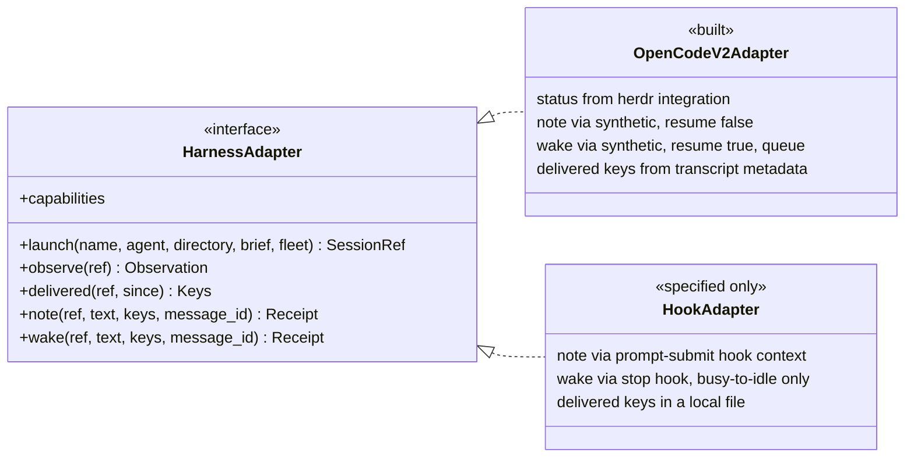

#### OpenCode v2 adapter (built)

All v2 calls go through `opencode api <operation>`, which finds the shared
service and handles authentication. One client class owns every call.

| Contract | OpenCode v2 |
|---|---|
| launch | `session.create` with the agent, title, location and `metadata.fleet = {name, role, reports_to, issue}`; a herdr tab running the TUI with `-s <session>`; then `session.prompt` with the brief, marked as sent by the fleet |
| observe `status` | herdr `agent_status` for the pane whose `agent_session` is this session (verify S6) |
| observe `fleet` | `session.get` → `metadata.fleet` (verify S5) |
| observe `idle_at`, `outcome` | `session.get` → `time.idle`, `outcome` |
| observe `blocked_on` | `permission.request.list`, `form.list` |
| observe `last_human_prompt` | `session.message.list`, newest first: the first user message without fleet metadata (verify S5) |
| delivered | Synthetic messages newer than `since`, read newest first: their `metadata.fleet.keys`. Plus `session.inbox.list`, for notes not yet delivered (verify S5) |
| note | `session.synthetic` with `resume: false` and `metadata.fleet.keys` (verify S3) |
| wake | `session.synthetic` with `resume: true`, `delivery: "queue"` and `metadata.fleet.keys` (verify S4) |
| note → wake | `session.inbox.update` with `delivery: "steer"` on a waiting note (verify S3) |
| message id | Derived from the recipient and the keys, so a retry reuses it and v2 admits it once (verify S2) |
| move a v1 session | `experimental.session.import` (PR 9) |

Capabilities: all of them, if S3 and S4 pass.

#### Hook-based harness adapter (contract only; not built)

A Claude Code-style harness has no server API, but it runs configured shell
commands on lifecycle events. It plugs in through
`fleet-switchboard hook <event>`, which reads the hook's JSON on stdin and
prints whatever the harness should inject. Hooks are configuration, not a
plugin.

| Contract | Hook-based harness |
|---|---|
| launch | `herdr agent start --kind <k>`; the session id arrives through the session-start hook |
| observe `status` | herdr's screen detection, or the harness's own hooks |
| observe `last_human_prompt` | Prompt-submit hook. Every prompt is yours, because the switchboard never types |
| delivered | No transcript API, so this adapter keeps delivered keys in a small local file: the one place it needs state |
| note | The prompt-submit hook returns pending items as added context. They ride on your next message, so no turn is started |
| wake | Partial. The stop hook can refuse to stop while items are pending, which covers the busy-to-idle edge only. An agent that is already idle cannot be woken without typing, so it gets a badge and a toast |

This is why the contract has capability flags: the same rule runs safely
against a weaker harness.

#### GitHub (PR 5)

GitHub events arrive as webhooks, relayed by the `gh webhook forward`
extension ([cli/gh-webhook](https://github.com/cli/gh-webhook)). Nothing is
polled on a timer.

- **One forwarder per watched repo,** started and supervised by the daemon as a
  child process. Watched repos are the ones holding the issues named in fleet
  agents' metadata. The forwarder runs
  `gh webhook forward --repo=<repo> --events=<list> --url=http://127.0.0.1:<port>/github --secret=<secret>`,
  where `<port>` belongs to a listener the daemon opens on localhost only.
- **Events:** `issues` (including edits and label changes such as
  `awaiting-user`), `issue_comment`, `sub_issues`, `pull_request`,
  `pull_request_review`, `check_suite` and `workflow_run`. Verify G1 for
  `sub_issues`.
- **Verification:** the daemon checks `X-Hub-Signature-256` against the secret
  before reading the body. That stops any local process from posting fake
  events.
- **Routing:** an event becomes a pending item for the orchestrator that owns
  the issue it touches. Issue events match on the issue number against the
  charter and its sub-issues. PR events match through the issues the PR
  closes. Check and workflow events match through the PRs listed in their
  payload.
- **Catching up after a gap:** the forwarder never replays what it missed. It
  reconnects 3 times, 5 s apart, then exits, and anything that happens while it
  is down is lost. So each time a forwarder starts, the daemon makes one
  catch-up read with `gh api` over a fixed look-back window (default 24 hours).
  That read fills a gap; it is not a poll. Keys come from GitHub object ids,
  not delivery ids, so an event seen both ways is delivered once.
- **Writes:** none.


**Constraints from GitHub's docs and the extension's source.** Settled by spike
G1 before PR 5 builds on them.

| Constraint | Consequence |
|---|---|
| "Webhook forwarding is only designed for use during testing and development. It is not supported for use in production environments." | Acceptable for one person's local fleet. If GitHub withdraws it, fall back to the catch-up read on a long interval |
| "Only one person can use webhook forwarding at a time for each repository and organization." A second forwarder gets `Hook already exists` | The daemon reports the conflict in `status` and a toast, and falls back to catch-up reads for that repo |
| Creating the hook requires admin on the repo; `--org` needs the `admin:org_hook` scope | `fleet-doctor` checks for admin before a repo is watched |
| `--secret` is passed on the command line, so other local users can see it in `ps` | A new secret for every forwarder start, never stored. Acceptable on a single-user machine |

| Spike | Passes when |
|---|---|
| G1 | On a scratch repo: the forwarder creates and activates the hook; events arrive signed; `sub_issues` is accepted; a second forwarder gets `Hook already exists`; after the forwarder is killed, the hook is cleaned up or left inactive, and that is recorded; events sent while it is down are absent, and the catch-up read recovers them |

#### Agents

Agents talk to the switchboard only through its CLI, from their own shell. The
CLI identifies the caller from its herdr pane (`HERDR_PANE_ID` → session →
fleet metadata), so `--from` is never typed.

| Command | Who | Effect |
|---|---|---|
| `fleet-switchboard send <name> --issue <n> <text>` | Any agent | Delivers to another agent by the delivery rule, without batching. `--issue` is required from PR 6 |
| `fleet-switchboard remind <name> <when> --issue <n> <text>` | Any agent | A message due later |
| `fleet-switchboard intent <issue>` | Any agent (PR 6) | Prints the ask's Intent and Done-when, and the work item's Intent if the issue is one |
| `fleet-switchboard intents` | Any agent (PR 6) | The caller's open asks, one line each with its Done-when |
| `fleet-switchboard pending <name>` | Anyone | What is pending for an agent, and why anything is held |

Each agent definition gains one paragraph: what a `[switchboard]` message is,
that agents message each other with `send` and never by typing into a pane,
and (PR 6) that reports are checked against the issue's Intent and Done-when.
Agents the switchboard manages do not use `heartbeat-ack`.

#### You

| Surface | Shows |
|---|---|
| herdr sidebar | Status (from herdr's integration) and an unread count per pane |
| herdr toast | An item held longer than 15 minutes and why; a blocked worker; an Intent change; a switchboard fault |
| `fleet-switchboard status` | Every fleet agent: session, pane, status, pending and held items with reasons; GitHub watches |
| `fleet-switchboard audit` | The decision history for one agent or one issue |
| `fleet-switchboard intents` | Every open ask, one line each with its Done-when (PR 6) |

### Intent lines (PR 6)

The usual pattern for agentic coding is one session per intent. Here the Chief
of Staff and each orchestrator are single long-lived sessions whose job is to
carry many intents at once: every ask they are tracking is a sub-intent of that
job. Every incoming message is a context switch between those asks, and when a
message does not say which ask it belongs to, the asks bleed into each other.
The drift in problem 1 is the visible result: a report arrives, and the session
treats it as being about whatever it was last thinking of, in the reporter's
framing.

So every message says which ask it belongs to, and carries that ask's intent
and success criteria with it, in both directions.

**Three levels.**

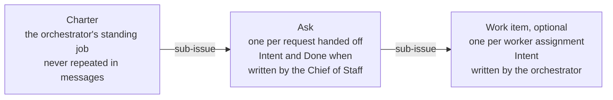

- **Ask.** Each request the Chief of Staff hands to an orchestrator becomes an
  issue under that orchestrator's charter, opening with one Intent line and one
  Done-when line. This is the unit both the Chief of Staff and the orchestrator
  are accountable for.
- **Work item.** When an orchestrator splits an ask across workers, each
  assignment is a sub-issue of the ask with its own one-line Intent. For a
  single worker the ask itself can be the work item.
- **Charter.** The orchestrator's standing job. It is the same for every
  message, so it is never repeated.

This adds the ask level to the fleet-charter skill, which today puts worker
assignments directly under the charter.

```markdown
## Intent
Fix the project agents that show "Agent unavailable" in production.
Done when: both project agents answer a chat message in production.
```

**Who writes and changes it.** The Chief of Staff writes an ask's lines at
hand-off; an orchestrator writes a work item's line when it creates one. After
that, an Intent or Done-when changes only by you, or by the Chief of Staff with
your yes. Orchestrators and workers propose a change with `send`; they never
edit it.

GitHub is the only copy. The switchboard reads the section from the issue body
and caches it in memory by ETag; `issues` webhooks invalidate the cache. It
never writes it.

**What the switchboard does with it.**

- **Every message names one issue.** A message covering several asks has one
  section per ask, never interleaved.
- **Each section is headed by its ask.** The ask's Intent and Done-when, then
  the work item's Intent if the message is about a work item under it: at most
  three lines. This covers GitHub events, a worker finishing, and every `send`,
  in both directions, so a report coming up to the Chief of Staff carries the
  same anchor its hand-off went down with.
- **Open asks at a glance.** `fleet-switchboard intents` lists the caller's
  open asks, one line each with its Done-when: every ask for the Chief of
  Staff, the asks under its charter for an orchestrator. It is derived from
  GitHub on every call.
- **Missing intent is visible.** A message about an issue without the section
  says "no intent recorded," and `status` lists those issues.
- **Changes are surfaced, never silent.** An `issues.edited` webhook that
  changes the Intent section produces an item for the Chief of Staff showing
  old → new, and a toast to you.

**The rules, in the agent definitions.** The Chief of Staff checks every
orchestrator report against its ask's Done-when before acting on it or
summarising it to you, and says so when they diverge.

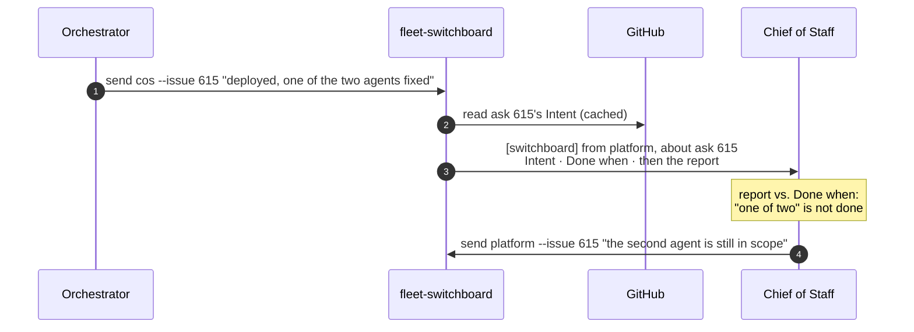

### Foreground and background (PR 8)

Notes keep machine turns out of your conversation, and intent lines let the
Chief of Staff answer from a message instead of investigating. That leaves the
rest of problem 2: you think of things faster than the Chief of Staff carries
them out.

**What it must do.** The Chief of Staff works serially by default. When a new
message from you arrives that is unrelated to what it is working on, the work
in progress continues in the background and the Chief of Staff turns its
attention to you. When the background work finishes, its result comes back to
the Chief of Staff like any other report. This applies to the Chief of Staff
only; orchestrators are driven by the fleet, not by you.

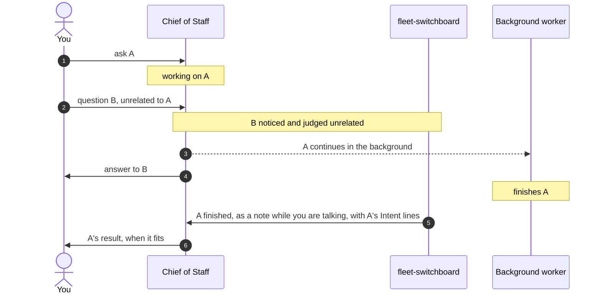

There are four parts, and more than one way to build each. They are chosen
after spikes F1–F3, not before.

| Part | The question | Options |
|---|---|---|
| Notice | How is your new message caught before it is merged into the running turn? | (a) A message sent while the Chief of Staff is busy waits in v2's inbox with `queue` delivery, where the switchboard can read it; depends on how the v2 TUI submits while busy (F1). (b) The Chief of Staff notices for itself: a steered message reaches it at the next step boundary, and its definition says what to do. (c) A small v2 plugin `prompt` hook makes your prompts to a busy Chief of Staff queue instead of steer. This would be the one plugin in the system |
| Judge | Is the new message related to the current work? | A cheap judge (PR 7, for example Jev, yes or no) given the current ask's Intent, your previous message and the new one; or the Chief of Staff's own judgement with (b) |
| Split | How does the current work go on without the foreground? | (i) Fork: `session.fork` copies the session; the copy carries on with A in the background with full context, and the original is interrupted and answers you. (ii) Hand off: interrupt, write a short brief from A's Intent and progress, and launch a fresh background worker. (iii) Background by default: the Chief of Staff starts anything longer than a short turn in a background worker from the outset, so the foreground is always free and nothing needs to be noticed or judged |
| Return | How does the result come back? | Settled already: the background worker is a fleet agent in its own herdr tab, opened without focus, whose `reports_to` is the Chief of Staff. Its finishing is a worker-done fact like any other (PR 4), delivered as a note while you are talking |

Trade-offs to weigh:

- **Fork** keeps everything, but copies a long history: for a large Chief of
  Staff session, the background worker's first turn re-reads all of it, which
  costs time and money (F3).
- **Hand off** is cheap, but loses whatever the brief leaves out.
- **Background by default** needs no noticing or judging, but you lose
  watching and steering a task in the foreground, and the Chief of Staff has to
  decide what counts as short.
- **Noticing** with (a) or (c) gives the system a fixed moment to decide; (b)
  depends on the model's judgement and on when step boundaries fall.

| Spike | Finds out |
|---|---|
| F1 | How the v2 TUI submits while the session is busy: steer or queue, which keys do which, and whether the message is visible in `session.inbox.list` before delivery, and for how long |
| F2 | How accurate a cheap judge is on pairs of (current work, new message) taken from real Chief of Staff transcripts, run in shadow mode |
| F3 | `session.fork` on a large session: the time and cost of the copy's first turn, and whether interrupting the original leaves it in a clean state |

### Data

The switchboard keeps almost nothing. Each fact lives in the system that owns
it, and is read from there each time it is needed.

#### Where each fact lives

| Fact | Lives in | Read with |
|---|---|---|
| Which panes run fleet agents, their status, and their session ids | herdr | `agent list` |
| Who an agent is: name, role, `reports_to`, issue | v2 session metadata, set at launch | `session.get` |
| Whether a worker's turn ended, when, and how | v2 `Session.Info` | `session.get` |
| What a blocked worker is waiting on | v2 | `permission.request.list`, `form.list` |
| When you last prompted an agent | v2 transcript | `session.message.list` |
| What has already been delivered | v2 transcript (synthetic messages' `metadata.fleet.keys`) and v2's inbox | `session.message.list`, `session.inbox.list` |
| Intent and Done-when | GitHub issue body | `gh api`, cached in memory |
| Charters, sub-issues, PRs, checks, reviews | GitHub | Webhooks, plus a catch-up read after gaps |
| Reminders not yet due | Switchboard file `reminders.json` | |
| What the switchboard did and why | Switchboard file `audit.jsonl` | |

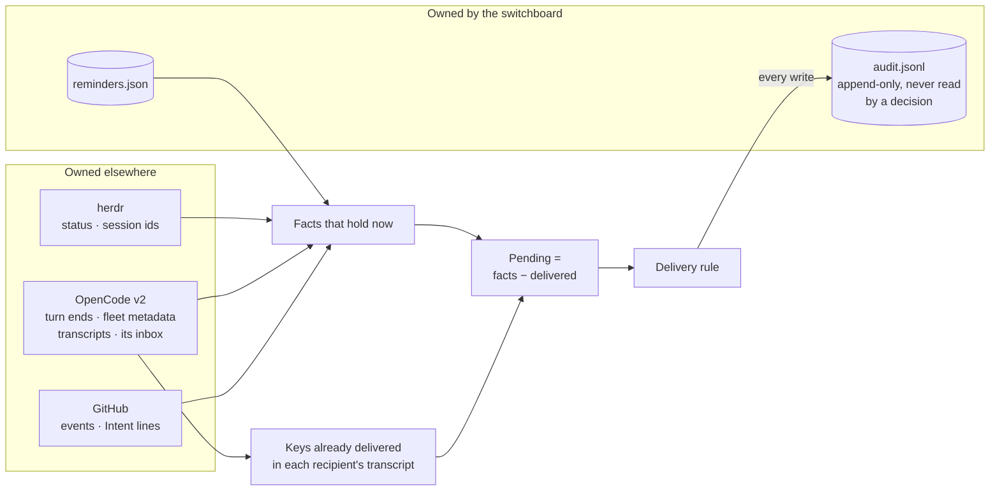

In memory only, and rebuilt after a restart: batch timers, the Intent cache,
and the state of the GitHub forwarders.

Keys name the fact, for example `worker.idle:<session>:<idle_at>`,
`worker.blocked:<session>:<request id>`, `github.comment:<comment id>` and
`reminder:<id>`. Every switchboard message lists, in its metadata, the keys it
covers. To find what is already delivered, the switchboard reads only the
recipient's synthetic messages newer than the oldest candidate fact, so each
read is short.

#### A message's life

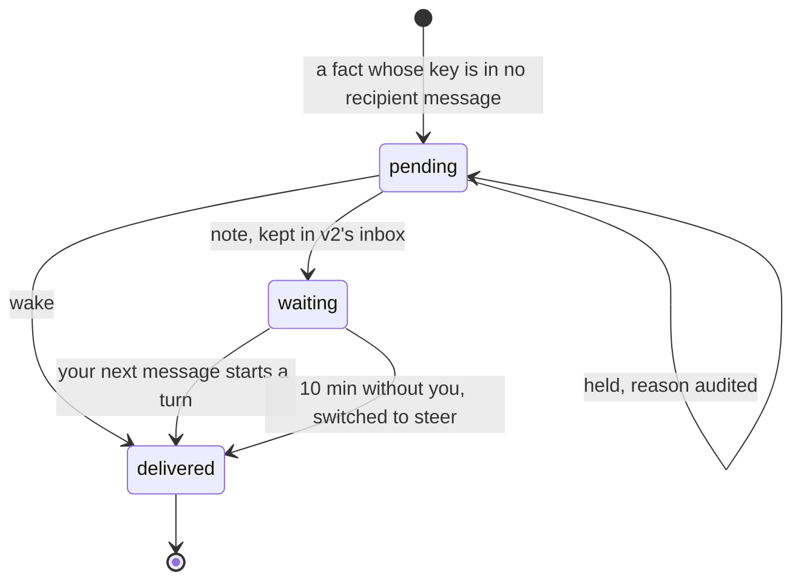

Delivered means in the recipient's transcript. Its keys are never sent again.

#### Invariants

1. **Derived, not stored.** Pending items are recomputed on every pass from
   herdr, v2, GitHub and the reminders file. Events only make a pass happen
   sooner; a missed event delays a delivery, it never loses one (except GitHub
   events older than the look-back window).
2. **Delivered is a fact in the recipient's history.** A key found in the
   recipient's transcript or v2 inbox is never delivered again.
3. **At most once (verify S2).** The message id is derived from the recipient
   and the keys, so a retry after a crash reuses it and v2 admits it once.
4. **Re-check before every write.** The agent is observed again immediately
   before a note or wake; if the decision no longer holds, nothing is sent.
5. **Every external write is audited before and after.**
6. **Intent is read, never written** (PR 6). Changes to it are surfaced, never
   made by the switchboard.
7. **No secrets in either file.** OpenCode authentication stays inside
   `opencode api`, GitHub authentication inside `gh`. The webhook secret (PR 5)
   lives only in the daemon's memory and the forwarder's arguments, and a new
   one is made for every forwarder start.
8. **Deleting the state directory is safe.** It loses the audit history and
   reminders not yet due. Nothing else changes.

### Key flows

**A worker finishes.** The coder's turn ends, and what happens next depends on
whether you are talking to its orchestrator.

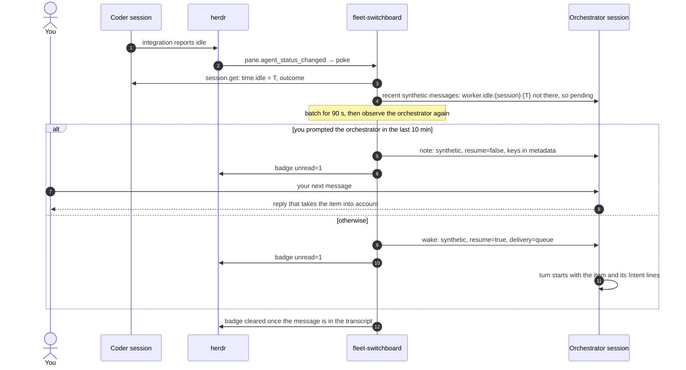

Every write in this flow is audited before and after.

**A delivery is held.** v2 is unreachable, or the agent is blocked or gone:
nothing is sent, every hold is audited with its reason, and after 15 minutes
you get a toast.

### Failure handling

| Failure | Behaviour |
|---|---|
| v2 service down | No deliveries; facts stay derivable; toast after 15 minutes; `status` shows it |
| herdr down | No status events and no status for v2 panes. Turn ends are still seen through v2 on the 60 s pass; badges and toasts resume when herdr returns |
| Daemon down | `send` still works, because it delivers itself. Worker and reminder facts are delivered after the restart, because they are derived from state. GitHub events older than the look-back window are lost, and `status` says so |
| GitHub forwarder exits | Restarted with backoff, then one catch-up read covers the gap. Repeated failure shows in `status`, with a toast |
| `Hook already exists` (someone else is forwarding that repo) | Watch marked as a conflict; catch-up reads on a long interval until it clears; toast |
| Pane closed or session gone | The agent drops out of herdr's list; items for it are held; toast |

## Lab: isolation from the live fleet

The live fleet stays on v1 throughout.

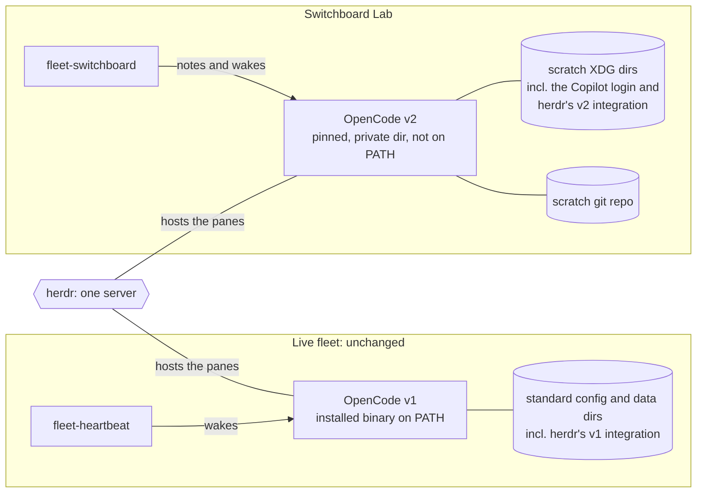

- **v2 binary.** A pinned version, installed into a private directory that is
  not on `PATH`. Never installed with `npm -g` or the curl installer, because
  the installer replaces the v1 binary. Pinned to a version herdr's
  integration works with (S6).
- **v2 data.** Moved into a scratch directory with `XDG_*` variables. A `HOME`
  override is the fallback; XDG is preferred because it leaves git and gh
  identity intact. Checked with `opencode debug paths`.
- **herdr's OpenCode integration.** Installed into the scratch config only.
  The live fleet's integration is not upgraded as a side effect.
- **Panes.** A herdr workspace called "Switchboard Lab", whose environment puts
  the private v2 first on `PATH`.
- **Switchboard config.** Names the v2 binary and its environment.
- **herdr plugin.** Linked to the single herdr server. The switchboard only
  manages sessions that carry fleet metadata.
- **Models.** GitHub Copilot, through a one-time device login inside the
  scratch profile. Real credentials are never read or copied.
- **Work.** A local scratch git repo. No GitHub until PR 5.

## Spikes (PR 1)

| # | Spike | Passes when |
|---|---|---|
| S1 | Isolation | Every path from `debug paths` is in scratch; v1 is unchanged; no v1 or v2 state appears outside scratch; herdr's integration installs into the scratch config, not the live one; the kit's agent files load under v2 with the intended permissions |
| S2 | Access | Python can call `opencode api` for create, get, message list and synthetic. A synthetic sent twice with the same derived `id` is admitted once. Also measured: latency; whether `GET /api/event` can stream; whether calling HTTP directly is practical |
| S3 | Note | `resume: false` starts no turn, and the model quotes the note after your next message. Tested with both `delivery` values; TUI visibility recorded. A waiting note switched to `steer` with `session.inbox.update` starts a turn |
| S4 | Wake | With `resume: true` and `queue`: an idle agent starts a turn; a busy agent runs it after the current turn; a draft in the TUI survives both cases |
| S5 | Reading back | Session metadata set at create is returned by `session.get`; a synthetic message's metadata is returned by `session.message.list`; your prompts can be told apart from fleet messages; messages can be read newest first and the read stopped early; a waiting note appears in `session.inbox.list`; `time.idle` and `outcome` are set when a turn ends |
| S6 | herdr | In the Lab: `herdr agent start --kind opencode -- -s <ses>` works; herdr's v2 integration reports working, idle and blocked (forced with a permission prompt) correctly; `agent_session` names the session; the `unread` token shows in the sidebar; plugin link and `[[startup]]` work |

**Stop rule.** If S3 or S4 fails, work stops and we decide together before
PR 2. No fallback is built ahead of time.

## Live proof (PR 4)

`bin/proof-switchboard live` runs in the Lab, not in CI. It simulates your
actions by typing into Lab panes, and you also do one manual pass.

| | Scenario | Must hold |
|---|---|---|
| A | A draft is in the orchestrator's input box when an item arrives | The draft is intact |
| B | You are mid-conversation with the orchestrator when the coder finishes | Only a note is delivered, no machine turn starts, and the orchestrator's next reply takes it into account |
| C | You are away when the coder finishes | The orchestrator is woken within about 2 minutes, with the item in the message |
| D | An item arrives in the middle of a turn | It runs after that turn |
| E | 2 hours with no events | Zero machine turns |
| F | The daemon is killed while the coder finishes, then restarted | The item is delivered exactly once |

A check only counts once we have seen it fail with its safeguard switched off.

## Repo and PR conventions

- Work happens in a git worktree of the existing checkout; no second clone.
  The stack's trunk is `main` at `9d22be4`.
- The push remote is `fork` (adamkaplan/fleet-kit), set with
  `git config gh-stack.remote fork` and passed explicitly as `--remote fork`.
  No other remote is pushed, and `main` is never pushed.
- Every `gh stack` command also runs with `GH_REPO=adamkaplan/fleet-kit`.
  `gh stack` picks the repo for PRs from the `origin` remote, which in this
  checkout is a different, private repository, and ignores
  `gh repo set-default`. `gh repo set-default adamkaplan/fleet-kit` still
  covers plain `gh` commands.
- GitHub operations authenticate as the repo owner, one command at a time,
  with `GH_TOKEN` from `gh auth token --user …`. The machine's active gh
  account is never switched.
- This document is edited only on the current top branch of the stack. Each PR
  updates its own row in Status and adds to the Log.
- Commit messages follow the repo's style (`fleet-switchboard: …`,
  `README: …`, `CI: …`, `docs: …`). Tests pass at every commit.
- `bin/test-switchboard` runs in CI from PR 1. It is stdlib only, uses fakes
  for herdr and `opencode api`, and includes the hygiene checks.
- Docs land in the same PR as the feature they describe. Each PR links this
  document and carries its own evidence.

## Risks

- **v2 is still 2.0.x, and its HTTP API is marked experimental.** We pin the
  version and keep all v2 calls in one client class.
- **herdr's v2 integration was tested by herdr against one v2 beta.** S6 pins
  a v2 version it works with; a v2 upgrade re-runs S6.
- **Status depends on the TUI plugin.** An agent running v2's Mini or headless
  client reports no status. Fleet agents always run the TUI.
- **GitHub webhook forwarding is documented as testing-only,** and allows one
  forwarder per repo or org. See [GitHub (PR 5)](#github-pr-5) for the
  fallback.
- **Stacked PRs are reviewed bottom-up.** A fix to a lower PR cascades upward
  through `gh stack rebase`, and every push re-runs CI.
- **Moving work to the background could cost more than it saves.** Forking a
  large session re-reads its whole history; a wrong "unrelated" judgement
  splits work that should have stayed together. F2 and F3 measure both before
  PR 8 picks an option.
- **The real cutover (PR 9).** A v2 install outside the Lab shares v1's config
  and data directories and migrates v1 history on its own. The runbook has to
  plan for this, including upgrading herdr's integration for the live fleet.

## Out of scope for now

Building any adapter other than OpenCode v2 (the hook-based adapter is
specified in [System design](#system-design) but not built); injecting context
into individual model calls; changes to `fleet-heartbeat`.

## Open questions

- S3: are synthetic notes visible in the v2 TUI? If they are, either accept
  visible, labelled notes or revisit the design.
- S2: if a repeated message id is admitted twice, the crash window between a
  write and its read-back needs another guard. Derived pending already covers
  every other case.
- Who may change an Intent? Decided: you, or the Chief of Staff with your
  yes. Orchestrators and workers propose; every change is surfaced.
- Does an ask-level header actually reduce drift and dilution in a session
  carrying many asks? PR 7's judges can score orchestrator reports and the
  Chief of Staff's summaries against Done-when, before and after PR 6.
- Should a message ever cover more than one ask, or should each ask get its
  own message, at the cost of more wakes?
- PR 8: which notice, judge and split options? Decided after F1–F3.
- How long is the audit log kept? Proposed: 30 days, configurable.
- PR 5: one forwarder per repo, or one per org with `--org`? Per org covers
  every charter repo with a single hook, but needs the `admin:org_hook` scope
  and blocks anyone else in the org from forwarding.
- Who reviews the stack?
- Should this document stay in `main` after the final merge? Precedent: the
  kit's earlier `PROPOSAL.md` was deleted once its work landed. Until we decide
  at merge time, this stays a tracking document.

## Log

- 2026-10-02: plan agreed; this document committed as the first commit of
  PR 1.
- 2026-10-02: draft PR [#15](https://github.com/adamkaplan/fleet-kit/pull/15)
  opened. The first `gh stack submit` aimed the PR at the `origin` remote's
  repository and failed with nothing created there; pinning `GH_REPO` fixed
  it.
- 2026-10-02: added System design: components, integration touch points
  (herdr, the harness adapter contract, OpenCode v2, a hook-based harness,
  GitHub, agents, you), data sources and records, invariants, key flows and
  failure handling.
- 2026-10-02: added nine Mermaid diagrams: the stack, today's problems, the
  overview, the delivery rule, the adapter contract, the record model, the inbox
  item lifecycle, the worker-finishes sequence, and the Lab's isolation. Each
  one renders with mermaid-cli 12.
- 2026-10-02: GitHub (PR 5) switched from polling to webhooks through
  `gh webhook forward`. The extension never replays missed events (3
  reconnects, then exit), so each forwarder start is followed by one catch-up
  read. Added spike G1, the constraints from GitHub's docs, and the failure
  rows.
- 2026-10-02: redesign after review.
  - **Status from herdr.** herdr 0.9.3's OpenCode integration supports v2
    through a pane-local TUI plugin, so herdr is authoritative for working,
    idle and blocked, and names each pane's session. The switchboard no longer
    reports status itself.
  - **No viewed state.** The fleet is a fan-out you mostly drive through the
    Chief of Staff; engagement is now only "you prompted it in the last 10
    minutes."
  - **Almost no store.** The SQLite store is gone. Pending items are derived
    on each pass; delivered keys live in the recipient's transcript; agent
    identity lives in v2 session metadata. What remains is an audit log and a
    reminders file. Messages carry their items in full, so there is no inbox
    to read and nothing to acknowledge. Live proof F added.
  - **Intent lines replace quotes and threads.** Telephone drift happens
    mostly on the way back up, from orchestrator reports. Quotes captured only
    one side of a conversation, and threads duplicated what a GitHub issue
    already is. Instead, each issue carries a one-line Intent and Done-when,
    every message about it carries those lines in both directions, and changes
    to them are surfaced. PR 6 is now `switchboard/intent`; PR 2 is now
    `switchboard/delivery`.
- 2026-10-02: second review.
  - **Who changes an Intent:** you, or the Chief of Staff with your yes.
  - **Intent is about many asks in one session.** The Chief of Staff and each
    orchestrator are single sessions carrying many asks, so every message names
    its ask and carries that ask's lines. Added the ask level (charter → ask →
    work item) and `fleet-switchboard intents`. The top-level-parent header is
    gone: the charter is never repeated.
  - **Foreground and background is a new PR 8.** The Chief of Staff stays
    serial until an unrelated message from you arrives; then the current work
    continues in the background and it turns to you. The requirement is
    written down; the options for noticing, judging and splitting are left
    open until spikes F1–F3. The v1 move is now PR 9.
